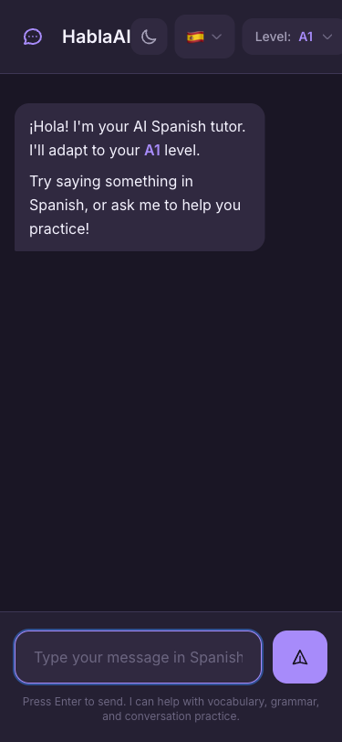
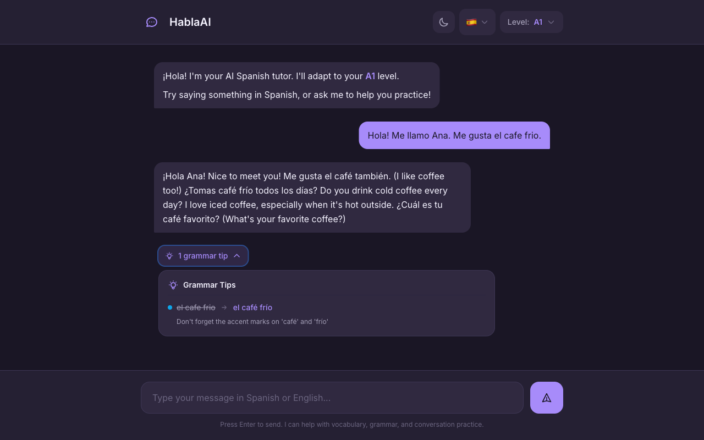
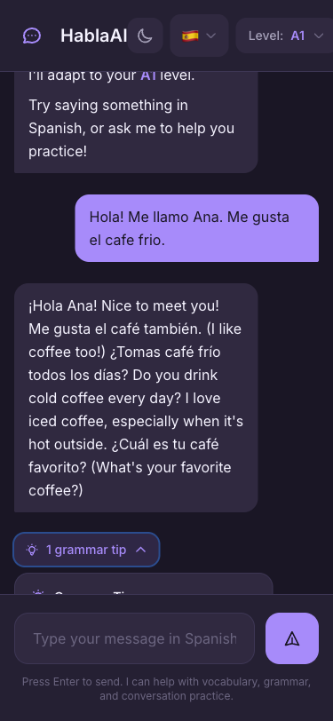

# HablaAI

**Learn Spanish or German through conversation, not flashcards.**

An AI conversation partner that takes absolute beginners to confident speakers. Start talking from day one with intelligent scaffolding that adapts to your level.

<p align="center">
  
  
  
</p>

---

## Why HablaAI?

**Conversation confidence comes from conversation practice.**

Most language apps drill vocabulary in isolation. You memorize words, ace flashcards, but freeze when someone actually speaks to you.

HablaAI is different:
- **Talk from day one** — Even complete beginners have real conversations
- **Level-adaptive AI** — Adjusts vocabulary, grammar complexity, and scaffolding to your level
- **Gentle corrections** — Grammar feedback that doesn't interrupt your flow
- **No gamification guilt** — No streaks, XP, or leaderboards. Just learning.

---

## Features

### Conversation with Grammar Feedback

<p align="center">
  
</p>

Chat naturally and get contextual grammar tips. The AI models correct form in its responses (like a native speaker would), with optional expandable feedback for deeper learning.

### Four Proficiency Levels (A0 → B1)

| Level | Experience | AI Behavior |
|-------|------------|-------------|
| **A0** Complete Beginner | Just starting | 80% English, celebrates every attempt |
| **A1** Beginner | Basic phrases | 50/50 mix, translation toggles |
| **A2** Elementary | Simple conversations | 80% target language, past tense |
| **B1** Intermediate | Real discussions | 95%+ target language, natural flow |

### Three Beautiful Themes

<p align="center">
  
</p>

- **Dark** — Purple noir with violet accents (perfect for evening study)
- **Light** — Warm sand with sage green accents
- **Ocean** — Midnight blue with golden sand accents

### Two Languages

- 🇪🇸 **Spanish** — Full support from A0 to B1
- 🇩🇪 **German** — Full support from A0 to B1

---

## Quick Start

### Prerequisites

- Python 3.11+
- [uv](https://docs.astral.sh/uv/) (recommended) or pip
- Anthropic API key

### Installation

```bash
# Clone the repository
git clone https://github.com/darth-dodo/habla-ai.git
cd habla-ai

# Install dependencies
make install

# Set up environment
cp .env.example .env
# Edit .env and add your ANTHROPIC_API_KEY

# Run development server
make dev
```

Open [http://localhost:8000](http://localhost:8000) and start learning!

---

## How It Works

HablaAI uses **Communicative Language Teaching** — learning by doing, not by studying rules.

### The "Gentle Nudge" Pattern

Instead of interrupting with corrections:

```
You:  "Yo soy cansado"
AI:   "Ah, ¿estás cansado? Yo también después del trabajo."
      (Models correct form naturally)

      💡 Quick tip: For feelings like tired or hungry,
         Spanish uses "estar" not "ser".
```

### Scaffolding That Fades

| Level | Support |
|-------|---------|
| A0 | Word banks, sentence templates, translations everywhere |
| A1 | Hints on tap, translation toggles |
| A2 | Occasional hints, grammar tips contextual |
| B1 | Minimal scaffolding, just natural conversation |

---

## Tech Stack

| Component | Technology |
|-----------|------------|
| **Backend** | FastAPI + Python 3.11 |
| **Frontend** | HTMX + Jinja2 + Tailwind CSS |
| **AI Agent** | LangGraph (StateGraph with analyze node) |
| **LLM** | Claude API via langchain-anthropic |
| **Testing** | pytest (328 tests) + Playwright E2E |

---

## Development

```bash
make dev        # Start development server
make test       # Run all tests
make check      # Run lint + typecheck + format check
make lint       # Run Ruff linter
make typecheck  # Run MyPy
```

### Project Structure

```
habla-ai/
├── src/
│   ├── agent/          # LangGraph nodes (respond, analyze)
│   ├── api/            # FastAPI routes and config
│   ├── templates/      # Jinja2 HTML templates
│   └── static/         # CSS, JavaScript
├── tests/              # 328 pytest tests
└── docs/               # Product spec, architecture, screenshots
```

---

## Roadmap

| Phase | Status | Focus |
|-------|--------|-------|
| 1. Basic Chat | ✅ Complete | StateGraph, respond node, HTMX UI |
| 2. Grammar Feedback | ✅ Complete | Analyze node, collapsible feedback UI |
| 3. Scaffolding | 🔜 Next | Word banks, sentence templates, conditional routing |
| 4. Persistence | Planned | Conversation history, vocabulary tracking |
| 5. Micro-lessons | Planned | 2-3 min focused lessons |

---

## Documentation

- [Product Specification](docs/product.md) — Vision, pedagogy, feature details
- [Technical Architecture](docs/architecture.md) — LangGraph design, API endpoints
- [E2E Test Results](docs/playwright-e2e.md) — Playwright test documentation

---

## License

MIT

---

<p align="center">
  <strong>Start speaking today, not someday.</strong>
</p>
