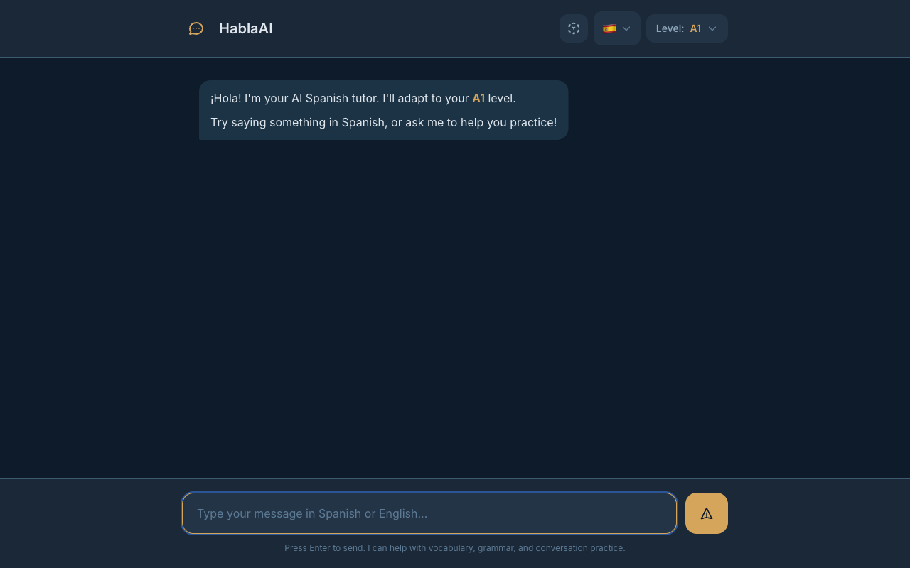
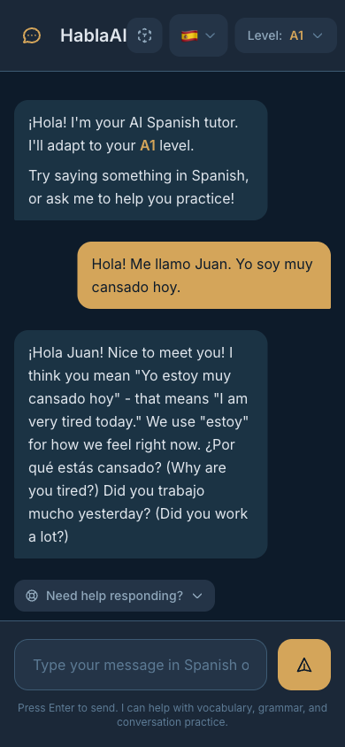
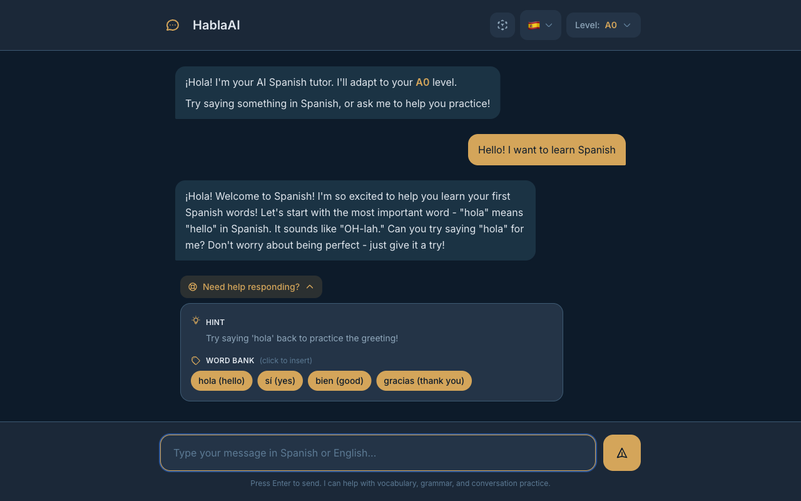
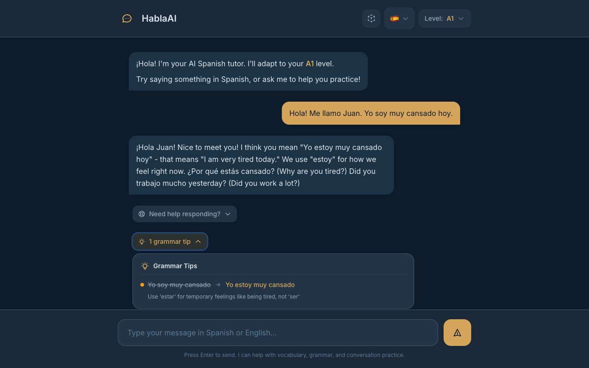
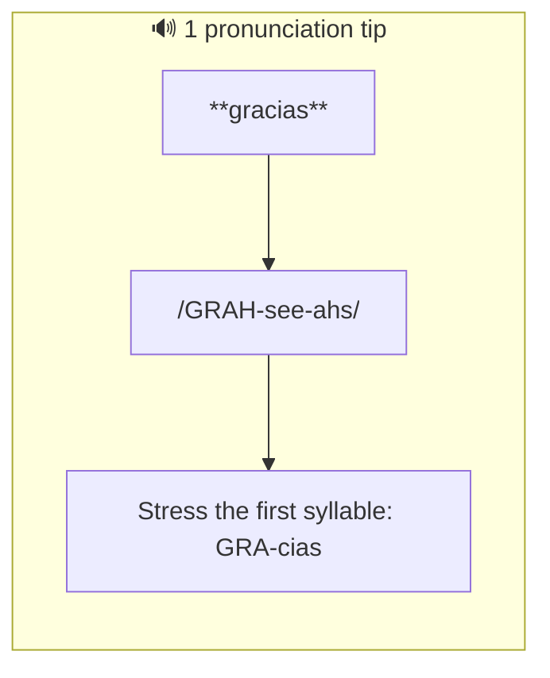

# Habla Hermano

**Learn Spanish, German, or French through conversation, not flashcards.**

Meet Hermano - your friendly, laid-back language buddy who takes absolute beginners to confident speakers. Start talking from day one with intelligent scaffolding that fades as you improve.

<p align="center">
  
</p>

---

## The Problem with Language Apps

Most language apps drill vocabulary in isolation. You memorize words, ace flashcards, but freeze when someone actually speaks to you. **Conversation confidence comes from conversation practice.**

Habla Hermano is different:

- **Talk from day one** — Even complete beginners have real conversations with Hermano
- **Supportive big brother** — Hermano is patient, encouraging, and makes learning feel like chatting with a friend
- **Scaffolding that fades** — Word banks and hints for beginners, natural flow for intermediates
- **Gentle corrections** — Grammar feedback that doesn't interrupt your flow
- **No gamification guilt** — No streaks, XP, or leaderboards. Just learning.

---

## How It Works

### Real Conversations at Every Level

<p align="center">
  
</p>

Hermano adapts his language mix based on your level:

| Level | What You Experience |
|-------|---------------------|
| **A0** Complete Beginner | 80% English with Spanish words introduced one at a time. Hermano celebrates every attempt and shares basic pronunciation tips. |
| **A1** Beginner | 50/50 mix. Short sentences, translations when needed, natural back-and-forth with pronunciation guidance. |
| **A2** Elementary | 80% Spanish. Past tense, longer exchanges. Hermano helps you sound more natural with linking sounds and rhythm. |
| **B1** Intermediate | 95%+ Spanish. Idioms, subjunctive, real discussions. Polish your accent with subtle pronunciation coaching. |

### Scaffolding That Helps You Respond

<p align="center">
  
</p>

Stuck on what to say? Beginners get contextual help:

- **Word Bank** — Clickable vocabulary relevant to the conversation (click to insert)
- **Hints** — Simple guidance in English on how to respond
- **Sentence Starters** — Partial sentences to get you going

For A0 learners, scaffolding appears automatically. A1 learners can expand it when needed. By A2, you won't need it anymore.

### Grammar Feedback Without Interruption

<p align="center">
  
</p>

Made a mistake? Hermano models the correct form naturally in his response (like a supportive friend would), then offers an expandable grammar tip for deeper learning:

```
You:  "Yo soy cansado"
Hermano: "¿Estás cansado? Yo también después del trabajo."

         💡 Grammar tip: Use "estar" for temporary feelings like tired.
```

### Pronunciation Tips Without Interruption

After each exchange, collapsible pronunciation tips appear below Hermano's response. Like grammar feedback, these are non-intrusive and expandable when you're ready to learn:


```mermaid
flowchart LR
    subgraph tip["🔊 1 pronunciation tip"]
        word["**gracias**"]
        phonetic["/GRAH-see-ahs/"]
        guidance["Stress the first syllable: GRA-cias"]
    end
    word --> phonetic --> guidance
```

Each level gets appropriate pronunciation coaching:
- **A0**: Basic sounds, tricky letters (ñ, rr, j) — tips auto-expand with beginner encouragement
- **A1**: Stress patterns, common mistakes — tips collapsed by default
- **A2**: Linking sounds, regional variations
- **B1**: Subtle distinctions that mark fluency

---

## Quick Start

```bash
# Clone and install
git clone https://github.com/darth-dodo/habla-hermano.git
cd habla-hermano
make install

# Configure
cp .env.example .env
# Add your ANTHROPIC_API_KEY to .env

# Run
make dev
```

Open [http://localhost:8000](http://localhost:8000) and start your first conversation.

**Requirements:** Python 3.11+, [uv](https://docs.astral.sh/uv/) or pip, Anthropic API key

---

## Features at a Glance

| Feature | Description |
|---------|-------------|
| **Hermano Personality** | Friendly big brother who makes learning feel like chatting with a friend |
| **4 Proficiency Levels** | A0 → B1 with adaptive behavior from Hermano |
| **Intelligent Scaffolding** | Word banks, hints, sentence starters for beginners |
| **Grammar Feedback** | Gentle corrections with expandable explanations |
| **Micro-Lessons** | Structured lessons with vocabulary, exercises, and completion tracking |
| **Progress Dashboard** | Track vocabulary learned, session history, learning streaks, and accuracy trends with Chart.js visualizations |
| **Guest Access** | Try chatting with Hermano immediately — no sign-up required |
| **Pronunciation Tips** | Collapsible pronunciation guidance with level-based auto-expand (A0 auto-expands) |
| **Spaced Repetition** | SM-2 algorithm with intelligent chat weaving and dedicated review mode |
| **3 Languages** | Spanish, German, and French — 60 lessons across all levels A0-B1 |
| **Beautiful Themes** | Nordic Minimal (light/dark/ocean) with clean, modern aesthetic |
| **Mobile-First** | Safe areas, dynamic viewport, touch-optimized for phone, tablet, and desktop |

---

## Micro-Lessons

Beyond freeform conversation, Hermano offers **structured micro-lessons** — bite-sized units that teach vocabulary and grammar through interactive exercises.

Each lesson includes:
- **Vocabulary steps** with translations and example sentences
- **Exercises** — multiple choice, fill-in-the-blank, and translation
- **Completion tracking** with score and vocabulary count
- **Chat handoff** — finish a lesson and jump into conversation to practice what you learned

**60 lessons** are available across all languages and levels:

| Language | A0 | A1 | A2 | B1 | Total |
|----------|----|----|----|----|-------|
| 🇪🇸 Spanish | 5 | 5 | 5 | 5 | 20 |
| 🇩🇪 German | 5 | 5 | 5 | 5 | 20 |
| 🇫🇷 French | 5 | 5 | 5 | 5 | 20 |

Each level covers 5 categories: greetings, introductions, numbers, colors, and family. Lessons require a free account to track progress and completion.

---

## Documentation

- [Product Vision](docs/product.md) — Pedagogy and feature philosophy
- [Architecture](docs/architecture.md) — Technical design and LangGraph implementation
- [API Reference](docs/api.md) — Endpoints and data structures
- [Testing](docs/testing.md) — 1440+ tests, 86%+ coverage, test strategy
- [E2E Tests](docs/playwright-e2e.md) — Playwright browser test documentation
- [Codebase Summary](docs/codebase-summary.md) — Full crash course for onboarding
- [Phase 6 Design](docs/design/phase6-micro-lessons.md) — Micro-lessons design document
- [Phase 12 Design](docs/design/phase12-spaced-repetition.md) — Spaced repetition design document
- [Phase 13 Design](docs/design/phase13-mobile-responsive.md) — Mobile responsive design document
- [Changelog](CHANGELOG.md) — Release history

---

## Built With

FastAPI • HTMX • Alpine.js • Tailwind CSS • LangGraph • Claude API • Supabase Auth • PostgreSQL

---

<p align="center">
  <strong>Start speaking today, not someday.</strong>
</p>
