# Habla Hermano

> Your AI conversation partner for Spanish, German, and French.

[](https://github.com/darth-dodo/habla-hermano/actions/workflows/ci.yml)
[](https://codecov.io/gh/darth-dodo/habla-hermano)
[](https://github.com/astral-sh/ruff)
[](https://mypy-lang.org/)
[](https://www.python.org/downloads/)
[](https://fastapi.tiangolo.com)
[](https://langchain-ai.github.io/langgraph/)
[](https://claude.ai)


An AI language tutor that gets you talking from day one. Built with FastAPI, LangGraph, and Claude -featuring real-time voice, adaptive scaffolding, 60 structured lessons, encrypted conversations, conversation threads, and five culture-inspired themes.

<p align="center">
  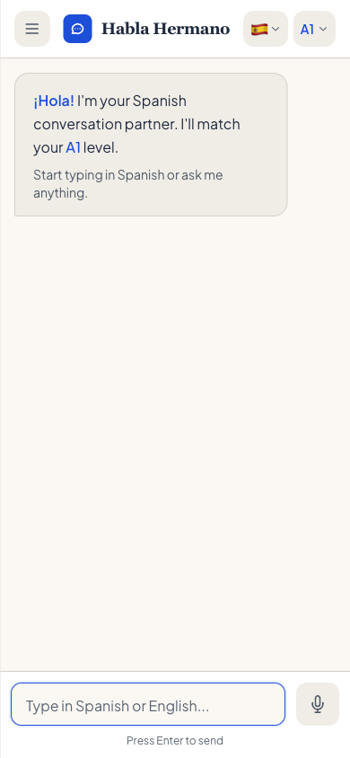
  &nbsp;&nbsp;
  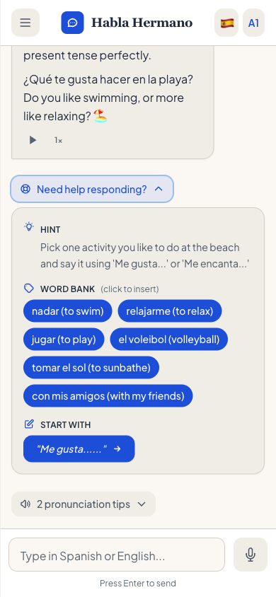
</p>

---

## The Problem

Most language apps optimize for engagement (streaks, XP, leaderboards) while teaching vocabulary in isolation. Users ace flashcards but freeze in real conversations.

**Habla Hermano inverts this.** You have real conversations from message one, even as a complete beginner. The AI adapts its language mix from 80% English (A0) to 95%+ target language (B1), with scaffolding that fades as you improve.

The pedagogical model is [Communicative Language Teaching](docs/product.md#pedagogical-approach): meaning over form, implicit correction over explicit grammar drills, contextual vocabulary over decontextualized memorization.

---

## How It Works

### Conversations That Adapt

| Level | Experience |
|-------|-----------|
| **A0** Complete Beginner | 80% English, target words introduced one at a time. Hermano celebrates every attempt. |
| **A1** Beginner | 50/50 mix. Short sentences, translations when needed. |
| **A2** Elementary | 80% target language. Past tense, longer exchanges. |
| **B1** Intermediate | 95%+ target language. Idioms, subjunctive, real discussions. |

### Scaffolding That Fades

<p align="center">
  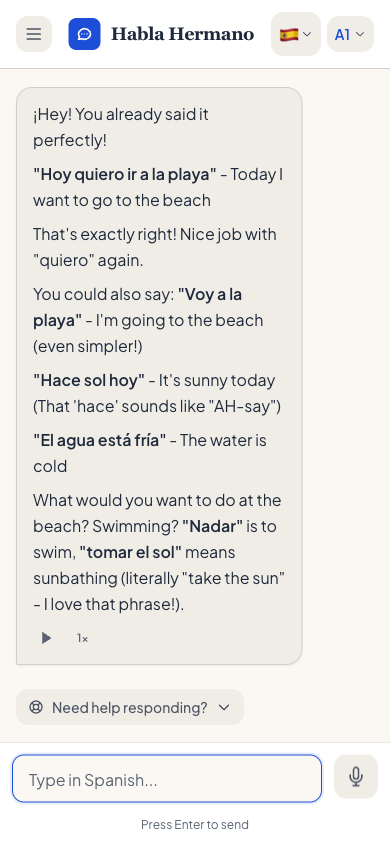
  &nbsp;&nbsp;
  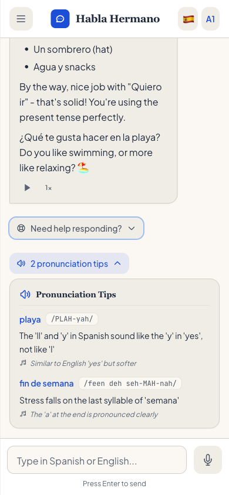
</p>

Stuck? Beginners get contextual help: **hints**, **word banks** (tap to insert), and **sentence starters**. Made a mistake? Hermano recasts it naturally, then offers expandable grammar and pronunciation tips.

For A0, scaffolding appears automatically. By A2, you won't need it.

### Voice Conversations

Type or tap the microphone to speak. Hermano understands both.

- **Speech-to-text** via Deepgram Nova-3 with code-switching (mix English and target language naturally)
- **Text-to-speech** -tap the play button on any response to hear native pronunciation
- **Per-message speed control** -0.75x to 1.5x, with CEFR-aware defaults (slower for beginners)

### 60 Structured Lessons

Beyond freeform chat, Hermano teaches bite-sized lessons through natural conversation. Lessons open directly in the chat interface -no separate player, just a guided dialogue.

<p align="center">
  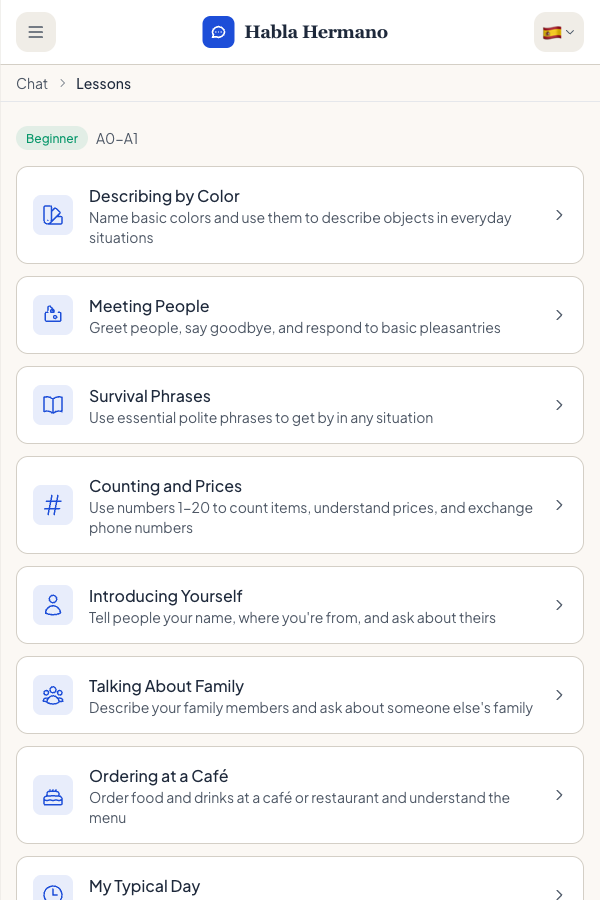
</p>

- 3 languages &times; 4 CEFR levels &times; 5 lessons each
- Multiple choice, fill-in-the-blank, and translation exercises
- LLM-evaluated answers with accent-preserving normalization
- Checkpoint-aware resume -pick up where you left off

### Conversation Threads

Authenticated users can maintain multiple independent conversations with Hermano.

<p align="center">
  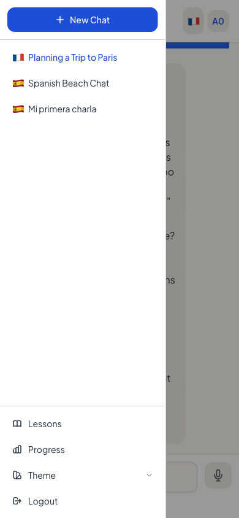
</p>

- A sidebar drawer opens via the hamburger icon (available on all screen sizes)
- Each thread is auto-titled by Claude Haiku after the first exchange, so your history is readable at a glance
- Rename or delete any thread inline from the sidebar
- Switching between threads happens client-side with no page reload
- Guests use a single session; thread management requires an account

### Learning Paths & Spaced Repetition

Structured paths guide you from beginner to intermediate with clear progression through CEFR levels. The SM-2 spaced repetition algorithm tracks every word you learn and weaves due vocabulary back into conversations at optimal intervals -no flashcard decks, just natural reinforcement during chat.

### Five Themes

Five culture-inspired themes with WCAG AA contrast compliance across all color tokens:

<p align="center">
  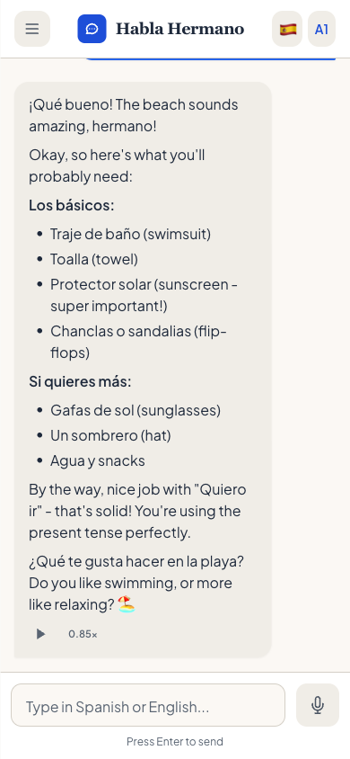
  &nbsp;
  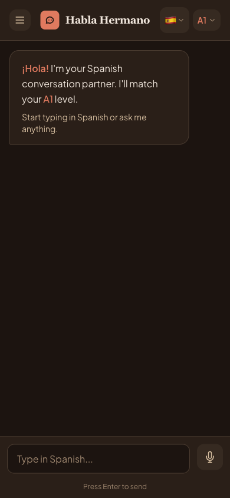
  &nbsp;
  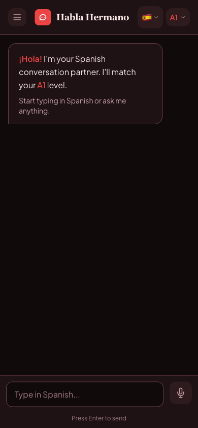
  &nbsp;
  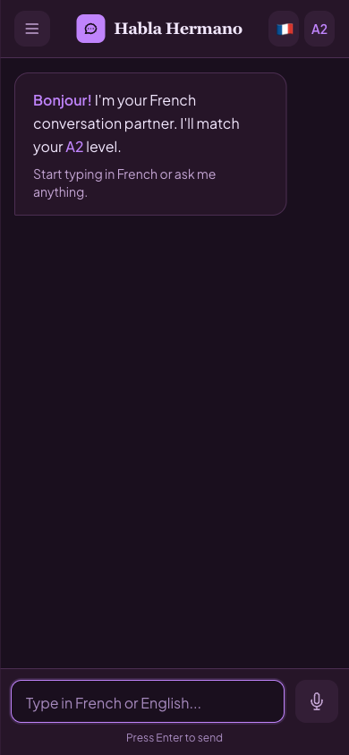
  &nbsp;
  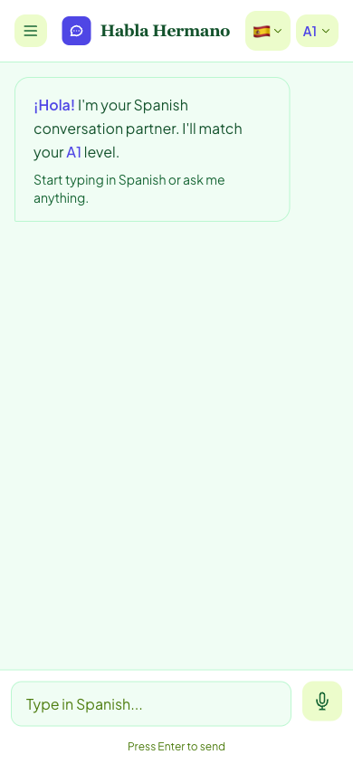
</p>

| Theme | Palette |
|-------|---------|
| **Azulejo** | Cool Mediterranean blue, warm sand backgrounds |
| **Terracotta** | Warm earth tones, dark mode default |
| **Flamenco** | Sunset reds and warm amber |
| **Sangria** | Deep berry reds, rich plum accents |
| **Jardin** | Mint green light theme for daytime learning |

### Guest Access & Accounts

No sign-up required. Start chatting immediately as a guest -full conversation with Hermano, grammar feedback, scaffolding, and voice all work out of the box.

Create an account to unlock:
- **Vocabulary tracking** -words you learn are saved and reviewed via SM-2 spaced repetition
- **Progress dashboard** -visualize your learning journey with analytics charts, language filters, and detailed stats
- **Conversation threads** -maintain multiple independent conversations with per-thread language and level
- **Password reset** -forgot your password? Reset it via email through Supabase Auth
- **Account deletion** -delete your account and all associated data (vocabulary, sessions, checkpoints)

### Privacy & Encryption

All conversations are encrypted at rest with Fernet (AES-128-CBC + HMAC-SHA256). User PII fields use field-level encryption, and LangGraph checkpoint blobs are encrypted with a dedicated cipher. Row-level security policies ensure users can only access their own data.

---

## For Developers

<details>
<summary><strong>Tech Stack & Architecture</strong></summary>

### Tech Stack

| Layer | Technology | Why |
|-------|-----------|-----|
| **Backend** | FastAPI | Async SSE streaming, Pydantic validation, WebSocket support |
| **Agent** | LangGraph | Stateful conversation graphs with conditional routing and checkpointing |
| **LLM** | Claude (Haiku 4.5) | Strong multilingual understanding, structured output for exercises |
| **Frontend** | HTMX + Alpine.js + Tailwind | Server-rendered, no SPA complexity, 11 ES modules |
| **Database** | PostgreSQL (Supabase) | Row-level security, auth, real-time. Local SQLite fallback |
| **Auth** | Supabase Auth | JWT with httponly cookies, guest sessions via signed UUIDs |
| **Voice** | Deepgram (Nova-3 STT, Aura-2 TTS) | FSM-driven WebSocket streaming with AbortController cancellation |
| **Encryption** | cryptography (Fernet) | Field-level + checkpoint blob encryption, PBKDF2 key derivation |
| **Monitoring** | Sentry | Error tracking and performance monitoring (backend + frontend) |
| **Lessons** | 60 YAML files | 3 languages &times; 4 CEFR levels &times; 5 lessons, ~6,300 lines of content |
| **Testing** | pytest + Vitest | 2,529 tests (2,291 Python + 238 JS), 97% coverage, strict mypy, ruff linting |

### System Overview

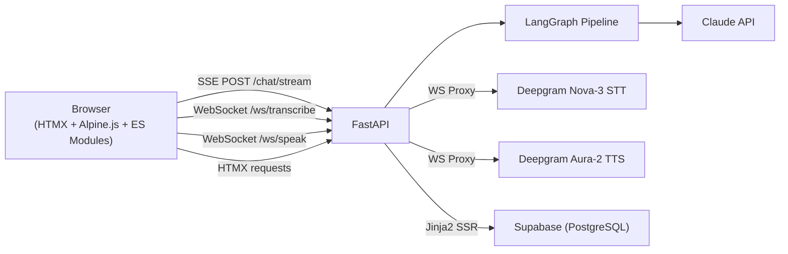
```mermaid
graph LR
    B["Browser<br/>(HTMX + Alpine.js + ES Modules)"]
    F["FastAPI"]
    LG["LangGraph Pipeline"]
    C["Claude API"]
    DG_STT["Deepgram Nova-3 STT"]
    DG_TTS["Deepgram Aura-2 TTS"]
    DB["Supabase (PostgreSQL)"]

    B -- "SSE POST /chat/stream" --> F --> LG --> C
    B -- "WebSocket /ws/transcribe" --> F -- "WS Proxy" --> DG_STT
    B -- "WebSocket /ws/speak" --> F -- "WS Proxy" --> DG_TTS
    B -- "HTMX requests" --> F -- "Jinja2 SSR" --> DB
```

### LangGraph Conversation Engine

The core is a **stateful LangGraph pipeline** with conditional routing. Each user message traverses a graph that decides what feedback to generate:

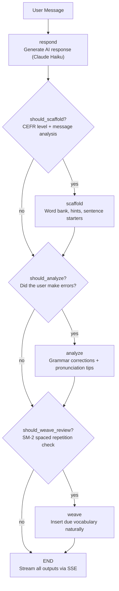
```mermaid
graph TD
    A["User Message"] --> R["respond<br/>Generate AI response (Claude Haiku)"]
    R --> S{"should_scaffold?<br/>CEFR level + message analysis"}
    S -- yes --> SC["scaffold<br/>Word bank, hints, sentence starters"]
    S -- no --> AN
    SC --> AN{"should_analyze?<br/>Did the user make errors?"}
    AN -- yes --> AZ["analyze<br/>Grammar corrections + pronunciation tips"]
    AN -- no --> W
    AZ --> W{"should_weave_review?<br/>SM-2 spaced repetition check"}
    W -- yes --> WV["weave<br/>Insert due vocabulary naturally"]
    W -- no --> E["END<br/>Stream all outputs via SSE"]
    WV --> E
```

**Key design decisions**:
- **Conditional edges over sequential chains**: Scaffolding and analysis only run when needed, reducing latency and API costs for advanced learners
- **State as TypedDict with reducers**: `add_messages` reducer for conversation history, explicit fields for `grammar_feedback`, `scaffolding`, `new_vocabulary`
- **Separate lesson subgraph**: Conversational lessons use a dedicated LangGraph with a 5-phase state machine (intro → teaching → exercise_ask → exercise_eval → complete) with LLM-based answer evaluation
- **Checkpointing**: PostgreSQL-backed `AsyncPostgresSaver` with encrypted serialization in production, `MemorySaver` for local dev

### Streaming Architecture

Responses stream token-by-token via **Server-Sent Events** (POST to `/chat/stream`):

| SSE Event | Payload | Client Action |
|-----------|---------|---------------|
| `token` | `{content}` | Append to bubble, throttled scroll (every 3 tokens) |
| `response_complete` | `{content, rendered_html}` | Finalize bubble with server-rendered markdown |
| `scaffolding` | `{html}` | Insert collapsible help section |
| `grammar` | `{html}` | Insert grammar correction panel |
| `lesson_progress` | `{progress, phase}` | Update segmented progress indicator |
| `done` | `{}` | Re-enable input |

### Voice Pipeline

Voice is optional. The app degrades gracefully without Deepgram keys.

**STT**: Browser captures audio via `AudioWorklet` (PCM16 at 16kHz), streams over WebSocket to a FastAPI proxy forwarding to Deepgram Nova-3 with interim results and endpoint detection.

**TTS**: Per-message play button opens a WebSocket to `/ws/speak`, sends text, receives linear16 PCM chunks, decodes to Float32, plays via `AudioBufferSourceNode` on a shared `AudioContext` (reused to avoid Safari's 4-instance limit). CEFR-aware speed defaults (A0=0.75x, A1=0.85x, A2/B1=1x).

**iOS Safari**: `AudioContext.state` can report `'running'` while silently refusing output. Fix: always call `resume()` on every gesture, plus `AbortController` per session to prevent stale WebSocket handlers from corrupting active sessions.

### Design System

Five themes built on CSS custom properties with a shared token architecture:

- **Typography**: Plus Jakarta Sans (warmer than Inter, near-identical metrics)
- **Spacing tokens**: `--space-chat-gap`, `--space-bubble-pad`, `--radius-bubble`, etc.
- **Icons**: Lucide SVG icons replacing emoji indicators throughout
- **Animations**: `vocabHighlight`, `levelBadgePop`, `progressShimmer`, `confettiBurst`
- **Accessibility**: WCAG AA contrast on all themes, `aria-live` regions, focus-visible rings

### Frontend Modules

Server-rendered HTML (Jinja2 + HTMX) with 11 ES modules:

| Module | Responsibility |
|--------|---------------|
| `stream.js` | SSE client, streaming bubble management, lesson progress events |
| `voice.js` | Voice orchestrator: wires FSM services, owns mutable state, public API |
| `voice-constants.js` | Voice config: sample rates, Deepgram voice IDs, SVG icons, audio utilities |
| `voice-stt.js` | STT state machine, mic capture via AudioWorklet, WebSocket transcript streaming |
| `voice-tts.js` | TTS state machine, WebSocket PCM streaming, REST fallback, AudioContext playback |
| `voice-ui.js` | Stateless voice UI helpers: recording indicators, timers, tooltips |
| `fsm.js` | Generic finite state machine: `createMachine` + `interpret` with onChange listeners |
| `dom.js` | Scroll management, focus, message rendering, HTML escaping |
| `scaffold.js` | Click-to-insert word bank, collapsible help sections |
| `shortcuts.js` | Keyboard shortcuts (`/` to focus, `Shift+Enter` for newline) |
| `htmx-handlers.js` | HTMX lifecycle event handlers: after-swap scroll, error display |

### Project Structure

```
src/
├── agent/           LangGraph graphs, nodes, prompts (freeform + lesson subgraphs)
├── api/             FastAPI routes, auth, middleware, streaming, rate limiting
├── db/              Supabase client, repository pattern, models, encryption
├── services/        Business logic (review/SM-2, lesson completion, adaptive paths, thread management)
├── lessons/         Lesson models and YAML loader
├── templates/       Jinja2 with HTMX partials
└── static/          CSS + 11 ES modules + AudioWorklet processor

data/lessons/        60 YAML lesson files (es/, de/, fr/)
tests/               2,291 pytest + 238 Vitest tests
docs/                Architecture, API reference, design docs, ADRs
```

</details>

<details>
<summary><strong>Security</strong></summary>

| Layer | Implementation |
|-------|---------------|
| **Encryption at rest** | Fernet (AES-128-CBC + HMAC-SHA256) for PII fields + LangGraph checkpoint blobs |
| **Row-Level Security** | Checkpoint tables enforce user isolation via `checkpoint_owner()` policies |
| **CSP** | Nonce-based `script-src`, no `'unsafe-inline'` |
| **CSRF** | Custom-header pattern (`X-Requested-With` / `HX-Request`) via middleware |
| **WebSocket Auth** | JWT validated from cookies before `accept()`, reject with 4001 |
| **Rate Limiting** | Decorator-based for REST, sliding-window per-connection for WebSocket |
| **XSS** | `nh3` sanitization + `markupsafe.escape()` for all user content |
| **Cookies** | Signed with `itsdangerous`, environment-aware `Secure` flag |
| **Headers** | HSTS, X-Frame-Options, X-Content-Type-Options, `Cache-Control: no-store` on auth pages |
| **CORS** | Explicit `allow_headers` allowlist -no wildcard |
| **Thread ownership** | `thread_id` ownership verified server-side before any chat operation |
| **Password reset** | Supabase Auth email recovery with client-side token extraction and server-side session establishment |
| **Error monitoring** | Sentry integration (backend + frontend) for error tracking and performance monitoring |

See [Architecture → Security](docs/architecture.md) for the full threat model.

</details>

<details>
<summary><strong>Testing</strong></summary>

**2,291 Python tests** (pytest) + **238 JavaScript tests** (Vitest) with CI on every push.

| Domain | What's Tested |
|--------|---------------|
| Agent | LangGraph node behavior, conditional routing, state mutations, prompt injection |
| API | Every route (chat, lessons, auth, voice, progress), CSRF, rate limiting |
| Services | SM-2 algorithm, lesson completion, adaptive paths, review scheduling |
| Database | Repository pattern, encryption boundary (encrypt-on-write, decrypt-on-read) |
| JavaScript | All 11 ES modules: DOM, streaming, scaffolding, shortcuts, voice (FSM + sub-modules) |
| Security | CSP nonce injection, WebSocket auth rejection, header verification, Fernet round-trip, thread ownership, auth cache headers, password reset flow |
| Integration | Voice WebSocket transport, SSE streaming end-to-end |

</details>

<details>
<summary><strong>Quick Start</strong></summary>

**Live demo**: [habla-hermano.onrender.com](https://habla-hermano.onrender.com) — no setup needed, start chatting immediately.

**Run locally**:

```bash
git clone https://github.com/darth-dodo/habla-hermano.git
cd habla-hermano
make install

cp .env.example .env
# Add your ANTHROPIC_API_KEY to .env
# Optional: DEEPGRAM_API_KEY for voice, SUPABASE_URL + keys for auth/persistence

make dev
```

Open [http://localhost:8000](http://localhost:8000). No account required. Guest sessions work out of the box.

**Requirements**: Python 3.12+, [uv](https://docs.astral.sh/uv/)

**Development commands**: `make dev` | `make test` | `make check` (lint + typecheck) | `make clean`

</details>

<details>
<summary><strong>Documentation</strong></summary>

| Doc | Content |
|-----|---------|
| [Architecture](docs/architecture.md) | LangGraph pipeline, data flow, security model, voice architecture |
| [Product Vision](docs/product.md) | Pedagogical approach, CEFR progression, personality system |
| [API Reference](docs/api.md) | All endpoints, WebSocket protocols, SSE event spec |
| [Design System](docs/design/design-system.md) | Token architecture, typography, spacing, themes, animations |
| [Testing](docs/testing.md) | Test strategy, mock patterns, coverage targets |
| [Codebase Summary](docs/codebase-summary.md) | Onboarding guide for the full codebase |
| [Changelog](CHANGELOG.md) | Release history across 27 phases |

#### Design Documents

| Phase | Design |
|-------|--------|
| Micro-Lessons | [Phase 6](docs/design/phase6-micro-lessons.md) |
| Spaced Repetition | [Phase 12](docs/design/phase12-spaced-repetition.md) |
| Mobile Responsive | [Phase 13](docs/design/phase13-mobile-responsive.md) |
| Learning Paths | [Phase 14](docs/design/phase14-learning-paths.md) |
| SSE Streaming | [Phase 15](docs/design/phase15-sse-streaming.md) |
| ES Module Refactor | [Phase 16](docs/design/phase16-esm-refactor.md) |
| Voice Conversation | [Phase 17](docs/design/phase17-voice-deepgram.md) |
| Conversational Lessons | [Phase 19](docs/design/phase19-conversational-lessons.md) |
| Spanish Themes | [Phase 20](docs/design/phase20-spanish-themes.md) |
| Voice FSM Refactor | [Phase 21](docs/design/phase21-voice-fsm-refactor.md) |
| Message Encryption | [Phase 24](docs/design/phase24-message-encryption.md) |
| Design System Revamp | [Phase 25](docs/design/phase25-design-system-revamp.md) |
| Conversation Threads | [Phase 26](docs/design/phase26-conversation-threads.md) |
| Privacy & Security Page | [Phase 27](docs/design/phase27-privacy-security-page.md) |

</details>
