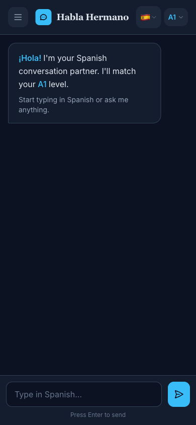
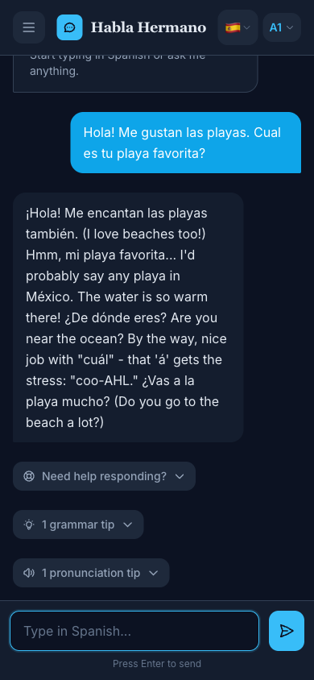
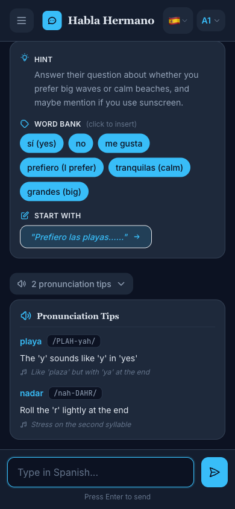
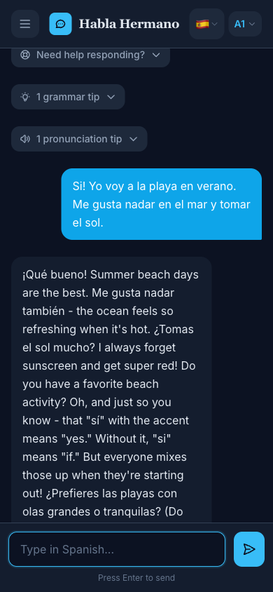
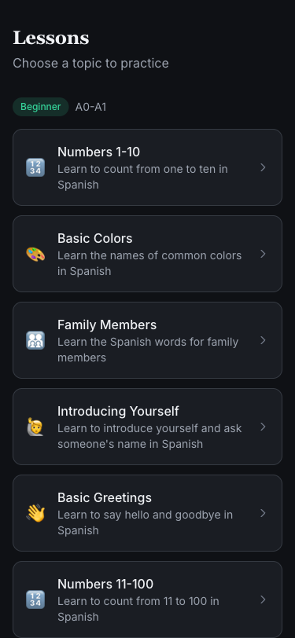
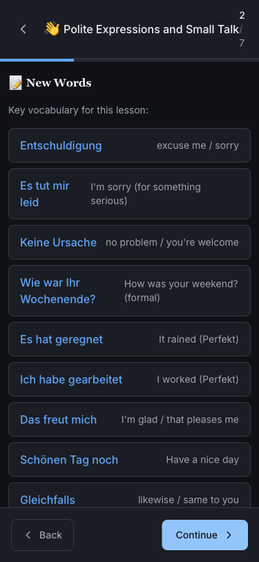
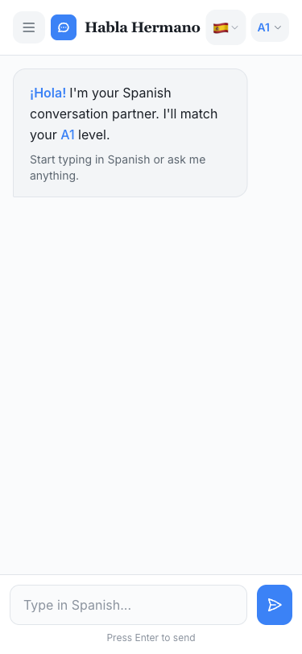

# Habla Hermano

**Learn Spanish, German, or French through conversation, not flashcards.**

Meet Hermano — your friendly, laid-back language buddy who takes absolute beginners to confident speakers. Start talking from day one with intelligent scaffolding that fades as you improve.

<p align="center">
  
</p>

---

## Why Habla Hermano?

Most language apps drill vocabulary in isolation. You memorize words, ace flashcards, but freeze when someone actually speaks to you.

**Conversation confidence comes from conversation practice.**

- **Talk from day one** — Even complete beginners have real conversations
- **Your supportive big brother** — Patient, encouraging, like chatting with a friend
- **Scaffolding that fades** — Word banks and hints for beginners, natural flow for intermediates
- **Gentle corrections** — Grammar and pronunciation feedback that doesn't interrupt your flow
- **No gamification guilt** — No streaks, XP, or leaderboards. Just learning.

---

## Conversations That Adapt to You

<p align="center">
  
</p>

Hermano adapts his language mix based on your level:

| Level | What You Experience |
|-------|---------------------|
| **A0** Complete Beginner | 80% English with target language words introduced one at a time. Hermano celebrates every attempt. |
| **A1** Beginner | 50/50 mix. Short sentences, translations when needed, natural back-and-forth. |
| **A2** Elementary | 80% target language. Past tense, longer exchanges, natural rhythm. |
| **B1** Intermediate | 95%+ target language. Idioms, subjunctive, real discussions. |

---

## Scaffolding That Helps You Respond

<p align="center">
  
</p>

Stuck on what to say? Beginners get contextual help:

- **Word Bank** — Clickable vocabulary relevant to the conversation
- **Hints** — Simple guidance in English on how to respond
- **Sentence Starters** — Partial sentences to get you going

For A0 learners, scaffolding appears automatically. A1 learners can expand it when needed. By A2, you won't need it anymore.

---

## Grammar and Pronunciation Feedback

<p align="center">
  
</p>

Made a mistake? Hermano models the correct form naturally in his response, then offers expandable tips for deeper learning:

```
You:     "Yo soy cansado"
Hermano: "¿Estás cansado? Yo también después del trabajo."

         Grammar tip: Use "estar" for temporary feelings like tired.
         Pronunciation: /ehs-TAHS/ — stress the second syllable
```

Each level gets appropriate coaching — from basic sounds and tricky letters at A0 to subtle distinctions that mark fluency at B1.

---

## 60 Structured Micro-Lessons

Beyond freeform conversation, Hermano offers bite-sized lessons that teach vocabulary and grammar through interactive exercises.

<p align="center">
  
  &nbsp;&nbsp;
  
</p>

Each lesson includes:
- **Vocabulary steps** with translations and example sentences
- **Exercises** — multiple choice, fill-in-the-blank, and translation
- **Completion tracking** with score and vocabulary count
- **Chat handoff** — finish a lesson and jump into conversation to practice what you learned

| Language | A0 | A1 | A2 | B1 | Total |
|----------|----|----|----|----|-------|
| Spanish | 5 | 5 | 5 | 5 | 20 |
| German | 5 | 5 | 5 | 5 | 20 |
| French | 5 | 5 | 5 | 5 | 20 |

---

## Learning Paths

<p align="center">
  
  &nbsp;&nbsp;
  
</p>

Don't know where to start? Each language has a structured path that guides you from absolute beginner to intermediate — 4 levels, 5 lessons each, 20 lessons total.

- **Visual timeline** — See your entire path with progress at a glance
- **Smart recommendations** — Daily suggestions based on where you left off
- **Continue flow** — Complete a lesson and jump straight to the next one
- **No rigid lock-in** — Follow the path or browse freely, your choice

---

## Spaced Repetition

Vocabulary you learn doesn't just disappear. Habla Hermano uses the SM-2 spaced repetition algorithm to weave words back into your conversations at optimal intervals — plus a dedicated review mode when you want focused practice.

---

## Voice Conversation

Talk to Hermano using your voice. Speech-to-text captures what you say, text-to-speech reads responses aloud with adjustable playback speed.

- **Speech-to-text** — Deepgram Nova-3 with code-switching support (mix English and your target language)
- **Text-to-speech** — Deepgram Aura-2 voices matched to each language
- **Speed control** — 0.75x, 1x, or 1.25x playback for comprehension practice
- **Graceful degradation** — Voice UI only appears when configured; text chat always works

---

## Three Beautiful Themes

<p align="center">
  
  &nbsp;&nbsp;
  
</p>

**Dark**, **Light**, and **Ocean** — all with a clean Nordic Minimal aesthetic. Fully responsive on phone, tablet, and desktop with safe areas for notched phones, dynamic viewport for mobile browsers, and touch-optimized controls.

---

## Guest Access

No sign-up required to start chatting. Try Hermano immediately as a guest — create a free account when you're ready to track lessons, progress, and spaced repetition.

---

## Quick Start

```bash
git clone https://github.com/darth-dodo/habla-hermano.git
cd habla-hermano
make install

cp .env.example .env
# Add your ANTHROPIC_API_KEY to .env
# Optional: Add DEEPGRAM_API_KEY for voice features

make dev
```

Open [http://localhost:8000](http://localhost:8000) and start your first conversation.

**Requirements:** Python 3.11+, [uv](https://docs.astral.sh/uv/) or pip, Anthropic API key

---

## Tech Stack

| Layer | Technology |
|-------|-----------|
| **Backend** | FastAPI, LangGraph, Claude API (Anthropic) |
| **Frontend** | HTMX, Alpine.js, Tailwind CSS |
| **Auth** | Supabase Auth (email/password + guest sessions) |
| **Database** | PostgreSQL via Supabase |
| **Testing** | pytest + Vitest (2140+ tests, 97% coverage), Playwright E2E |
| **Voice** | Deepgram (STT Nova-3, TTS Aura-2) |

### Architecture Highlights

- **LangGraph conversation engine** — Stateful graph with conditional routing for scaffolding, grammar feedback, pronunciation tips, and spaced repetition weaving
- **Server-rendered with HTMX** — No SPA complexity. Jinja2 templates with HTMX for dynamic updates and Alpine.js for client-side interactivity
- **AI-enhanced lessons** — LangGraph subgraphs generate contextual exercises and vocabulary steps
- **SM-2 spaced repetition** — Intelligent review scheduling with chat weaving and dedicated review mode
- **Voice conversation** — Deepgram STT/TTS via WebSocket proxy for speech-based practice with floating stop controls
- **ES Modules** — Modular JavaScript architecture (6 modules) with Vitest test suite (186 tests, ~90% coverage)

---

## Documentation

| Doc | Description |
|-----|-------------|
| [Product Vision](docs/product.md) | Pedagogy and feature philosophy |
| [Architecture](docs/architecture.md) | Technical design and LangGraph implementation |
| [API Reference](docs/api.md) | Endpoints and data structures |
| [Testing](docs/testing.md) | Test strategy and coverage details |
| [Codebase Summary](docs/codebase-summary.md) | Full crash course for onboarding |
| [Changelog](CHANGELOG.md) | Release history |

### Design Documents

- [Phase 6: Micro-Lessons](docs/design/phase6-micro-lessons.md)
- [Phase 12: Spaced Repetition](docs/design/phase12-spaced-repetition.md)
- [Phase 13: Mobile Responsive](docs/design/phase13-mobile-responsive.md)
- [Phase 14: Learning Paths](docs/design/phase14-learning-paths.md)
- [Phase 15: SSE Streaming](docs/design/phase15-sse-streaming.md)
- [Phase 16: ES Module Refactor](docs/design/phase16-esm-refactor.md)
- [Phase 17: Voice Conversation](docs/design/phase17-voice-deepgram.md)

---

<p align="center">
  <strong>Start speaking today, not someday.</strong>
</p>
