# Habla Hermano

> Learn Spanish, German, or French through conversation.

[](https://github.com/darth-dodo/habla-hermano/actions/workflows/ci.yml)
[](https://codecov.io/gh/darth-dodo/habla-hermano)
[](https://github.com/astral-sh/ruff)
[](https://mypy-lang.org/)
[](https://www.python.org/downloads/)
[](https://fastapi.tiangolo.com)
[](https://langchain-ai.github.io/langgraph/)
[](https://claude.ai)

An AI language tutor that gets you talking from day one. Built with FastAPI, LangGraph, and Claude, featuring real-time voice, adaptive scaffolding, and 60 structured lessons across 4 CEFR levels.

<p align="center">
  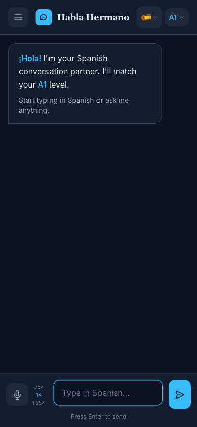
  &nbsp;&nbsp;
  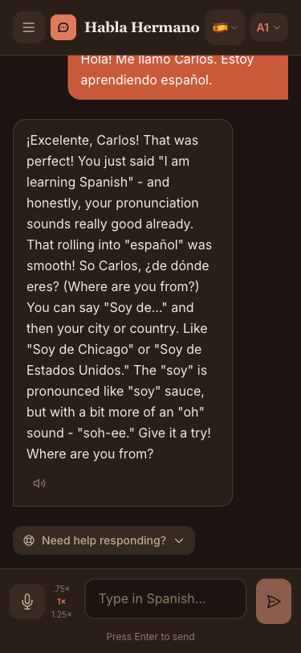
</p>

---

## The Problem

Most language apps optimize for engagement (streaks, XP, leaderboards) while teaching vocabulary in isolation. Users ace flashcards but freeze in real conversations.

**Habla Hermano inverts this.** You have real conversations from message one, even as a complete beginner. The AI adapts its language mix from 80% English (A0) to 95%+ target language (B1), with scaffolding that fades as you improve.

The pedagogical model is [Communicative Language Teaching](docs/product.md#pedagogical-approach): meaning over form, implicit correction over explicit grammar drills, contextual vocabulary over decontextualized memorization.

---

## How It Works

### Conversations That Adapt

| Level | Experience |
|-------|-----------|
| **A0** Complete Beginner | 80% English, target words introduced one at a time. Hermano celebrates every attempt. |
| **A1** Beginner | 50/50 mix. Short sentences, translations when needed. |
| **A2** Elementary | 80% target language. Past tense, longer exchanges. |
| **B1** Intermediate | 95%+ target language. Idioms, subjunctive, real discussions. |

### Scaffolding That Fades

<p align="center">
  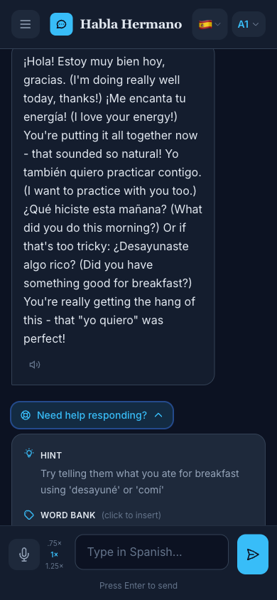
  &nbsp;&nbsp;
  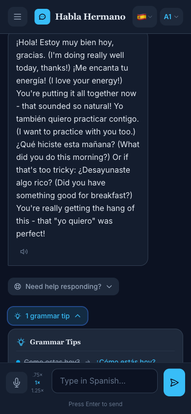
</p>

Stuck? Beginners get contextual help: **hints**, **word banks** (tap to insert), and **sentence starters**. Made a mistake? Hermano recasts it naturally, then offers expandable grammar and pronunciation tips.

For A0, scaffolding appears automatically. By A2, you won't need it.

### Voice Conversations

Type or tap the microphone to speak. Hermano understands both.

- **Speech-to-text** via Deepgram Nova-3 with code-switching (mix English and target language naturally)
- **Text-to-speech** - tap the speaker icon on any response to hear native pronunciation
- **Speed control** - 0.75x, 1x, or 1.25x for comprehension practice

<p align="center">
  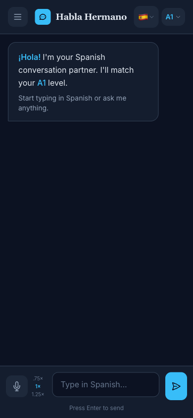
  &nbsp;&nbsp;
  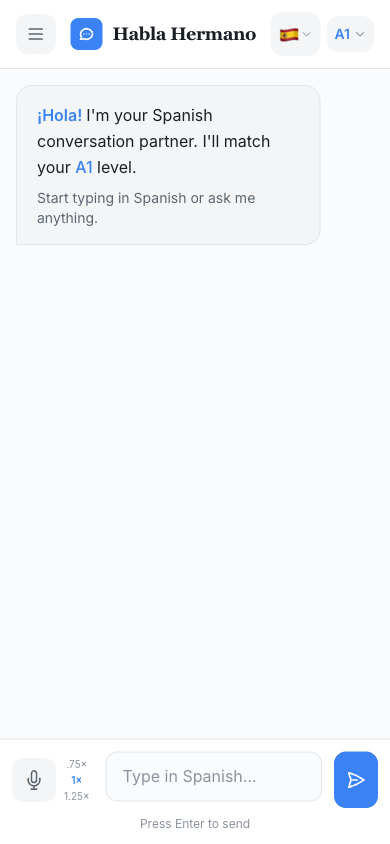
</p>

### 60 Structured Lessons

Beyond freeform chat, bite-sized lessons teach vocabulary and grammar through exercises, or conversationally through the chat interface via "Learn with Hermano."

<p align="center">
  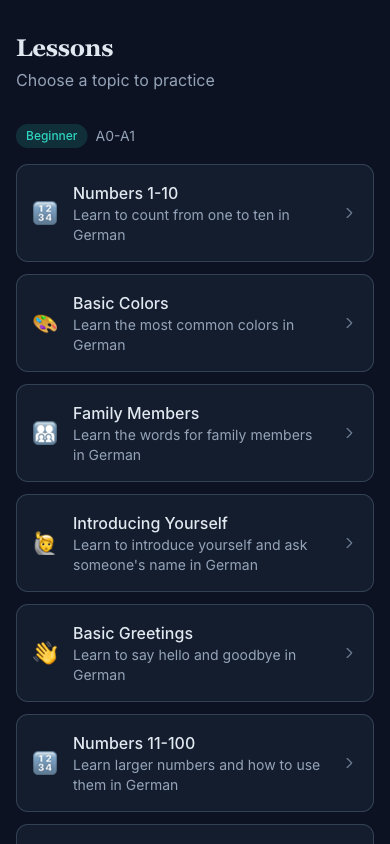
  &nbsp;&nbsp;
  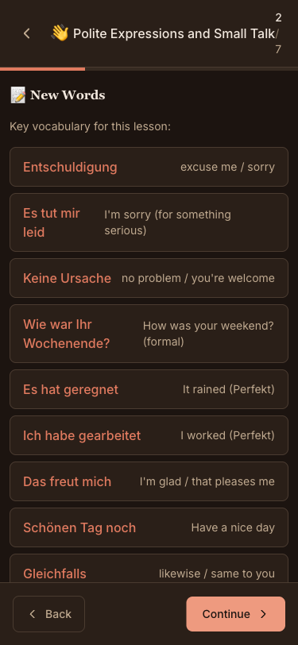
</p>

- 3 languages × 4 CEFR levels × 5 lessons each
- Multiple choice, fill-in-the-blank, and translation exercises
- Conversational lesson mode: AI teaches through dialogue with real-time progress tracking

### Learning Paths & Spaced Repetition

<p align="center">
  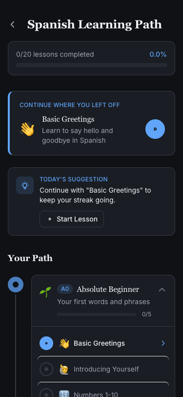
  &nbsp;&nbsp;
  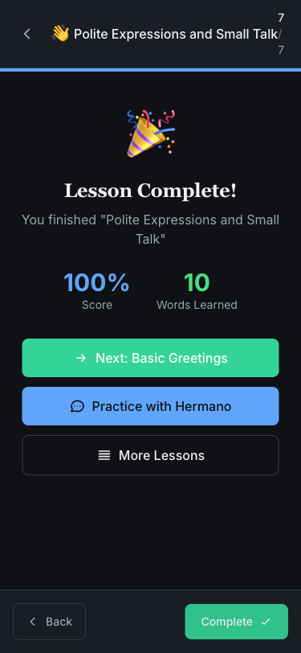
</p>

Structured paths guide you from beginner to intermediate. The SM-2 spaced repetition algorithm weaves vocabulary back into conversations at optimal intervals.

### Guest Access & Themes

No sign-up required. Start chatting immediately. Four Spanish culture-inspired themes (Azulejo, Terracotta, Flamenco, Sangria) with WCAG AA contrast.

<p align="center">
  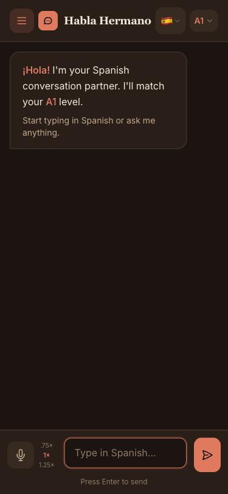
  &nbsp;&nbsp;
  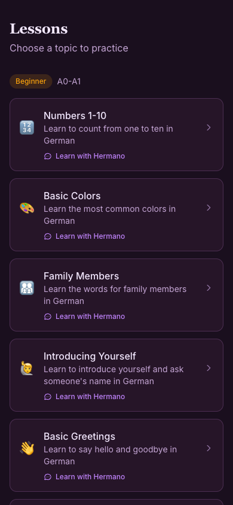
  &nbsp;&nbsp;
  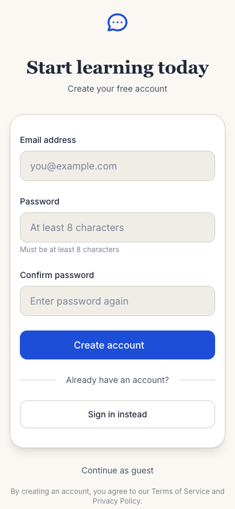
  &nbsp;&nbsp;
  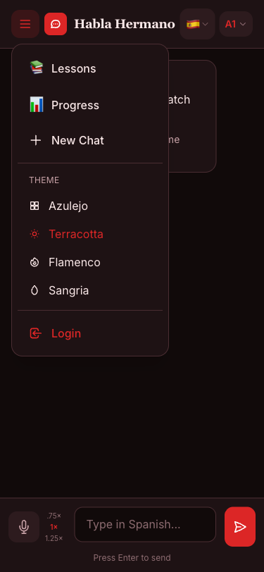
</p>

---

## For Developers

<details>
<summary><strong>Tech Stack & Architecture</strong></summary>

### Tech Stack

| Layer | Technology | Why |
|-------|-----------|-----|
| **Backend** | FastAPI | Async SSE streaming, Pydantic validation, WebSocket support |
| **Agent** | LangGraph | Stateful conversation graphs with conditional routing and checkpointing |
| **LLM** | Claude (Haiku 4.5) | Strong multilingual understanding, structured output for exercises |
| **Frontend** | HTMX + Alpine.js + Tailwind | Server-rendered, no SPA complexity, 6 ES modules |
| **Database** | PostgreSQL (Supabase) | Row-level security, auth, real-time. Local SQLite fallback |
| **Auth** | Supabase Auth | JWT with httponly cookies, guest sessions via signed UUIDs |
| **Voice** | Deepgram (Nova-3 STT, Aura-2 TTS) | Real-time WebSocket streaming, code-switching support |
| **Lessons** | 60 YAML files | 3 languages × 4 CEFR levels × 5 lessons, ~6,300 lines of content |
| **Testing** | pytest + Vitest | 2,357 tests, strict mypy, ruff linting |

### System Overview

```
Browser (HTMX + Alpine.js + ES Modules)
    │
    ├── SSE POST /chat/stream ──────────► FastAPI ──► LangGraph Pipeline ──► Claude API
    │
    ├── WebSocket /ws/transcribe ───────► WS Proxy ──► Deepgram Nova-3 STT
    │
    ├── WebSocket /ws/speak ────────────► WS Proxy ──► Deepgram Aura-2 TTS
    │
    └── HTMX requests ─────────────────► Jinja2 SSR ──► Supabase (PostgreSQL)
```

### LangGraph Conversation Engine

The core is a **stateful LangGraph pipeline** with conditional routing. Each user message traverses a graph that decides what feedback to generate:

```
User Message
    │
    ▼
[respond] ── Generate conversational AI response (Claude Haiku)
    │
    ▼
[should_scaffold?] ── Conditional edge based on CEFR level + message analysis
    │
    ├── yes ──► [scaffold] ── Generate word bank, hints, sentence starters
    │
    ▼
[should_analyze?] ── Conditional edge: did the user make errors?
    │
    ├── yes ──► [analyze] ── Grammar corrections + pronunciation tips
    │
    ▼
[should_weave_review?] ── SM-2 spaced repetition check
    │
    ├── yes ──► [weave] ── Insert due vocabulary into conversation naturally
    │
    ▼
END ── Stream all outputs via SSE
```

**Key design decisions**:
- **Conditional edges over sequential chains**: Scaffolding and analysis only run when needed, reducing latency and API costs for advanced learners
- **State as TypedDict with reducers**: `add_messages` reducer for conversation history, explicit fields for `grammar_feedback`, `scaffolding`, `new_vocabulary`
- **Separate lesson subgraph**: Conversational lessons use a dedicated LangGraph with a 5-phase state machine (intro → teaching → exercise_ask → exercise_eval → complete) rather than overloading the freeform chat graph
- **Checkpointing**: PostgreSQL-backed `PostgresSaver` in production, `MemorySaver` for local dev

### Streaming Architecture

Responses stream token-by-token via **Server-Sent Events** (POST to `/chat/stream`):

| SSE Event | Payload | Client Action |
|-----------|---------|---------------|
| `token` | `{content}` | Append to bubble, throttled scroll (every 3 tokens) |
| `response_complete` | `{content}` | Finalize bubble, add TTS speaker button |
| `scaffolding` | `{html}` | Insert collapsible help section |
| `grammar` | `{html}` | Insert grammar correction panel |
| `lesson_progress` | `{progress, phase}` | Update progress bar and phase badge |
| `done` | `{}` | Re-enable input |

### Voice Pipeline

Voice is optional. The app degrades gracefully without Deepgram keys.

**STT**: Browser captures audio via `AudioWorklet` (PCM16 at 16kHz), streams over WebSocket to a FastAPI proxy forwarding to Deepgram Nova-3 with interim results and endpoint detection.

**TTS**: Speaker icon opens a WebSocket to `/ws/speak`, sends text, receives linear16 PCM chunks, decodes to Float32, plays via `AudioBufferSourceNode` on a shared `AudioContext` (reused to avoid Safari's 4-instance limit).

**iOS Safari**: `AudioContext.state` can report `'running'` while silently refusing output. Fix: always call `resume()` on every gesture, plus a generation counter to prevent stale WebSocket `onclose` handlers from corrupting active sessions.

### Frontend Modules

Server-rendered HTML (Jinja2 + HTMX) with 6 ES modules:

| Module | Responsibility |
|--------|---------------|
| `stream.js` | SSE client, streaming bubble management, lesson progress events |
| `voice.js` | `VoiceManager` class: mic capture, STT WebSocket, TTS playback, speed control |
| `dom.js` | Scroll management, focus, message rendering, HTML escaping |
| `scaffold.js` | Click-to-insert word bank, collapsible help sections |
| `shortcuts.js` | Keyboard shortcuts (`/` to focus, `Shift+Enter` for newline) |
| `htmx-handlers.js` | HTMX lifecycle hooks (afterSwap scroll, error display) |

### Project Structure

```
src/
├── agent/           LangGraph graphs, nodes, prompts (freeform + lesson subgraphs)
├── api/             FastAPI routes, auth, middleware, streaming, rate limiting
├── db/              Supabase client, repository pattern, models
├── services/        Business logic (review/SM-2, lesson completion, adaptive paths)
├── lessons/         Lesson models and YAML loader
├── templates/       Jinja2 with HTMX partials
└── static/js/       6 ES modules + AudioWorklet processor

data/lessons/        60 YAML lesson files (es/, de/, fr/)
tests/               2,150 pytest + 207 Vitest tests
docs/                Architecture, API reference, design docs, ADRs
```

</details>

<details>
<summary><strong>Security</strong></summary>

| Layer | Implementation |
|-------|---------------|
| **CSP** | Nonce-based `script-src`, no `'unsafe-inline'` |
| **CSRF** | Custom-header pattern (`X-Requested-With` / `HX-Request`) via middleware |
| **WebSocket Auth** | JWT validated from cookies before `accept()`, reject with 1008 |
| **Rate Limiting** | Decorator-based for REST, sliding-window per-connection for WebSocket |
| **XSS** | `nh3` sanitization + `markupsafe.escape()` for all user content |
| **Cookies** | Signed with `itsdangerous`, environment-aware `Secure` flag |
| **Headers** | HSTS, X-Frame-Options, X-Content-Type-Options, Cache-Control |

See [Architecture → Security](docs/architecture.md) for the full threat model.

</details>

<details>
<summary><strong>Testing</strong></summary>

**2,150 Python tests** (pytest) + **207 JavaScript tests** (Vitest) with CI on every push.

| Domain | What's Tested |
|--------|---------------|
| Agent | LangGraph node behavior, conditional routing, state mutations, prompt injection |
| API | Every route (chat, lessons, auth, voice, progress), CSRF, rate limiting |
| Services | SM-2 algorithm, lesson completion, adaptive paths, review scheduling |
| Database | Repository pattern, Supabase query builder mocks, model validation |
| JavaScript | All 6 ES modules: DOM, streaming, scaffolding, shortcuts, HTMX handlers, voice |
| Security | CSP nonce injection, WebSocket auth rejection, header verification |
| Integration | Voice WebSocket transport, SSE streaming end-to-end |

</details>

<details>
<summary><strong>Quick Start</strong></summary>

```bash
git clone https://github.com/darth-dodo/habla-hermano.git
cd habla-hermano
make install

cp .env.example .env
# Add your ANTHROPIC_API_KEY to .env
# Optional: DEEPGRAM_API_KEY for voice, SUPABASE_URL + keys for auth/persistence

make dev
```

Open [http://localhost:8000](http://localhost:8000). No account required. Guest sessions work out of the box.

**Requirements**: Python 3.11+, [uv](https://docs.astral.sh/uv/)

**Development commands**: `make dev` | `make test` | `make check` (lint + typecheck) | `make clean`

</details>

<details>
<summary><strong>Documentation</strong></summary>

| Doc | Content |
|-----|---------|
| [Architecture](docs/architecture.md) | LangGraph pipeline, data flow, security model, voice architecture |
| [Product Vision](docs/product.md) | Pedagogical approach, CEFR progression, personality system |
| [API Reference](docs/api.md) | All endpoints, WebSocket protocols, SSE event spec |
| [Testing](docs/testing.md) | Test strategy, mock patterns, coverage targets |
| [Codebase Summary](docs/codebase-summary.md) | Onboarding guide for the full codebase |
| [Changelog](CHANGELOG.md) | Release history across 20 phases |

#### Design Documents

| Phase | Design |
|-------|--------|
| Micro-Lessons | [Phase 6](docs/design/phase6-micro-lessons.md) |
| Spaced Repetition | [Phase 12](docs/design/phase12-spaced-repetition.md) |
| Mobile Responsive | [Phase 13](docs/design/phase13-mobile-responsive.md) |
| Learning Paths | [Phase 14](docs/design/phase14-learning-paths.md) |
| SSE Streaming | [Phase 15](docs/design/phase15-sse-streaming.md) |
| ES Module Refactor | [Phase 16](docs/design/phase16-esm-refactor.md) |
| Voice Conversation | [Phase 17](docs/design/phase17-voice-deepgram.md) |
| Conversational Lessons | [Phase 19](docs/design/phase19-conversational-lessons.md) |
| Spanish Themes | [Phase 20](docs/design/phase20-spanish-themes.md) |

</details>
