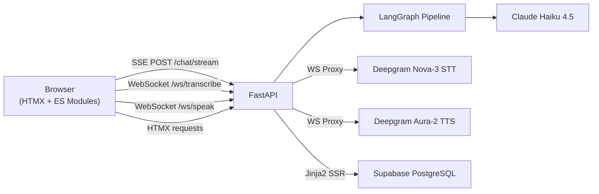
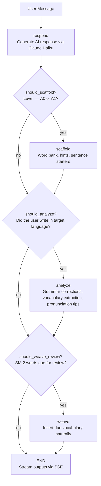
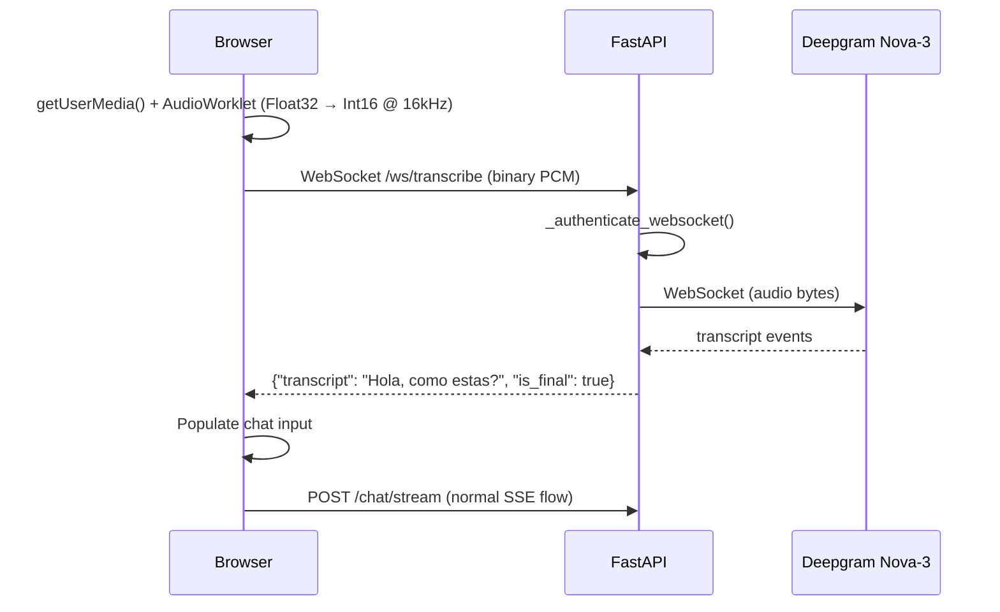
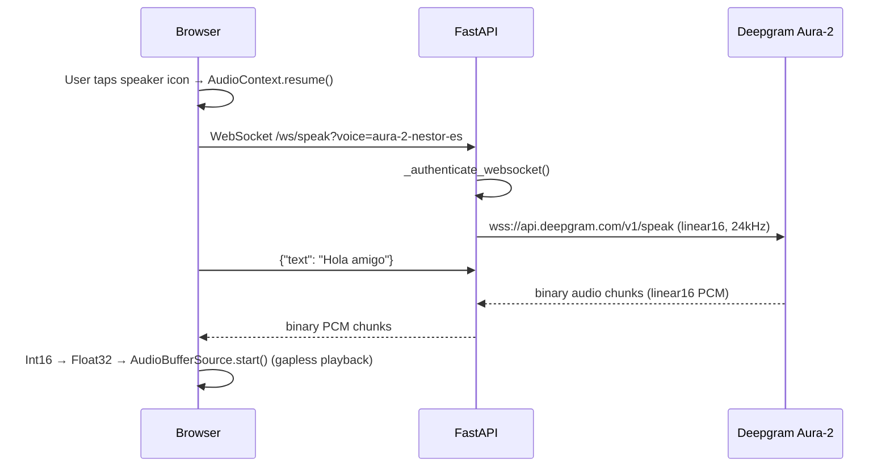
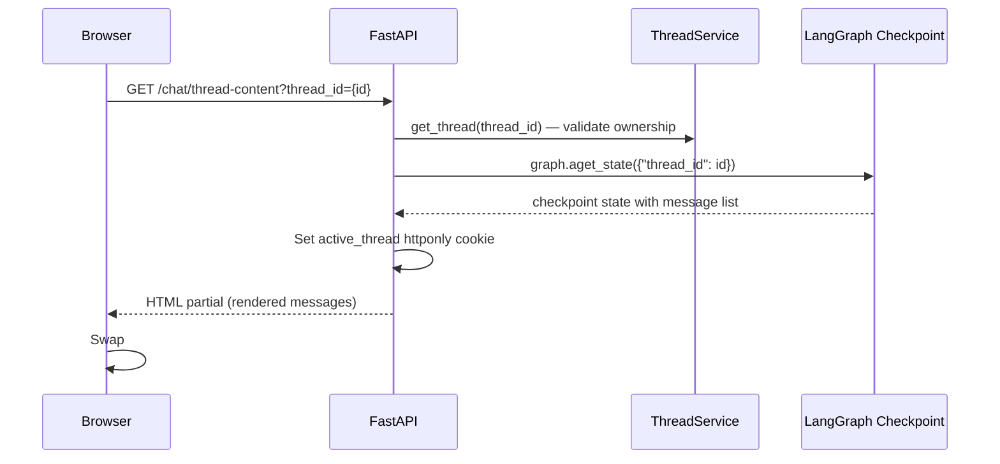

# Habla Hermano — Technical Architecture

> FastAPI + HTMX + LangGraph for conversational language learning

---

## Table of Contents

- [System Overview](#system-overview)
- [Technology Stack](#technology-stack)
- [Project Structure](#project-structure)
- [LangGraph Conversation Engine](#langgraph-conversation-engine)
- [Lesson System](#lesson-system)
- [Spaced Repetition](#spaced-repetition)
- [SSE Streaming](#sse-streaming)
- [Voice Architecture](#voice-architecture)
- [Conversation Threads](#conversation-threads)
- [Progress and Learning Paths](#progress-and-learning-paths)
- [Hermano Personality System](#hermano-personality-system)
- [API Layer](#api-layer)
- [Database Schema](#database-schema)
- [Middleware and Layer Architecture](#middleware-and-layer-architecture)
- [Security and Privacy](#security-and-privacy)
- [Frontend Architecture](#frontend-architecture)
- [Testing](#testing)

---

## System Overview

Habla Hermano is a conversational language tutor that teaches Spanish, German, and French from complete beginner (A0) to intermediate (B1). Users chat with "Hermano," an AI tutor built on a stateful LangGraph pipeline backed by Claude Haiku. The system provides grammar feedback, scaffolding for beginners, 60 structured lessons, spaced repetition, voice input/output, and encrypted persistence.



**Key design decisions:**
- **Server-rendered HTML** with HTMX for UI updates — no SPA framework, no client-side routing
- **LangGraph** for stateful conversation management with conditional routing and checkpointing
- **SSE streaming** for real-time token-by-token response delivery
- **WebSocket proxies** for voice (Deepgram) — API keys never reach the browser
- **Fernet encryption** for all user data at rest, including LangGraph checkpoint blobs
- **Row-level security** on all Supabase tables

**Test coverage:** 2,529 tests (2,291 Python + 238 JavaScript), 97% coverage, strict mypy, ruff linting.

---

## Technology Stack

| Component | Technology | Why |
|-----------|------------|-----|
| Backend | FastAPI | Async SSE streaming, Pydantic validation, WebSocket support |
| Frontend | HTMX + Jinja2 + Tailwind | Server-driven UI, minimal JS, 11 ES modules |
| Agent | LangGraph | Stateful conversation graphs with conditional routing and checkpointing |
| LLM | Claude Haiku 4.5 | Multilingual understanding, structured output for exercises |
| Database | PostgreSQL (Supabase) | Row-level security, auth, production persistence |
| Auth | Supabase Auth | JWT with httponly cookies, guest sessions via signed UUIDs |
| Voice | Deepgram (Nova-3 STT, Aura-2 TTS) | Real-time WebSocket streaming with linear16 PCM |
| Encryption | cryptography (Fernet) | Field-level + checkpoint blob encryption, PBKDF2 key derivation |
| Monitoring | Sentry | Error tracking for backend (FastAPI) and frontend (JS) |
| Testing | pytest + Vitest | 2,529 tests, parallel execution via pytest-xdist |

---

## Project Structure

```
src/
├── config.py              Settings + get_settings (canonical)
├── validation.py           VALID_LANGUAGES, VALID_LEVELS, validators (canonical)
├── api/
│   ├── main.py             FastAPI app factory, middleware registration, Sentry init
│   ├── auth.py             JWT validation, CurrentUserDep, OptionalUserDep, EffectiveUser
│   ├── middleware.py        SecurityHeadersMiddleware (CSP, HSTS) + CSRFMiddleware
│   ├── streaming.py         SSE streaming: StreamResult, stream_chat_events()
│   ├── cookies.py           Cookie signing with itsdangerous
│   ├── rate_limit.py        REST decorator + WebSocket sliding window limiter
│   └── routes/
│       ├── chat.py          GET / (freeform + lesson mode), POST /chat/stream
│       ├── auth.py          Login, signup, logout, password reset
│       ├── lessons.py       Lesson catalog endpoints
│       ├── progress.py      Dashboard stats, vocabulary, chart data
│       ├── review.py        Spaced repetition review sessions
│       ├── learn.py         Learning paths and adaptive recommendations
│       ├── threads.py       Thread CRUD (create, list, rename, delete)
│       ├── voice.py         WebSocket STT/TTS proxy + REST TTS fallback
│       └── privacy.py       Privacy info page, delete history, delete account
├── agent/
│   ├── graph.py             Freeform chat graph: respond → scaffold → analyze
│   ├── lesson_chat_graph.py Lesson chat graph: lesson_respond (phase machine)
│   ├── state.py             ConversationState TypedDict
│   ├── prompts.py           Level prompts + LANGUAGE_ADAPTER
│   ├── prompts_lesson_chat.py  Phase-specific lesson prompts + TEACHING_ADJUSTMENTS
│   ├── checkpointer.py     AsyncPostgresSaver + MemorySaver fallback
│   ├── llm.py              Claude client with zero-retention headers
│   └── nodes/
│       ├── respond.py       Generate AI response
│       ├── scaffold.py      Word bank, hints, sentence starters (A0/A1)
│       ├── analyze.py       Grammar feedback, vocabulary extraction, pronunciation tips
│       ├── lesson_chat.py   Lesson respond node with 5-phase state machine
│       ├── lesson.py        AI-enhanced lesson nodes (load, enhance, validate)
│       └── review.py        Review question generation, answer evaluation, SM-2 update
├── db/
│   ├── client.py            Supabase client factory (canonical)
│   ├── encryption.py        FieldEncryptor + FernetCipher + EncryptedSerializer
│   ├── repository.py        Repository classes for Supabase data access
│   └── models.py            Pydantic models (Vocabulary, Session, Thread, etc.)
├── services/
│   ├── review.py            ReviewService with SM-2 algorithm
│   ├── progress.py          ProgressService for dashboard aggregation
│   ├── paths.py             PathService for structured learning paths
│   ├── adaptive.py          AdaptiveService for daily recommendations
│   ├── lesson_completion.py Exercise validation, vocab upsert, persistence
│   ├── threads.py           ThreadService: CRUD for conversation_threads
│   ├── thread_titling.py    Auto-title generation via Claude Haiku
│   ├── thread_messages.py   Checkpoint message extraction for history
│   └── data_retention.py    Configurable data cleanup policies
├── lessons/
│   ├── models.py            Lesson, Step, Exercise, Progress models
│   └── service.py           YAML loader, filtering, vocabulary extraction
├── templates/               Jinja2 with HTMX (42 templates)
└── static/                  CSS + 11 ES modules + AudioWorklet processor

data/lessons/                60 YAML lessons (es/, de/, fr/ × A0-B1)
tests/                       2,291 pytest + 238 Vitest tests
docs/                        Architecture, API, design docs, ADRs
```

---

## LangGraph Conversation Engine

The core is a stateful LangGraph pipeline with conditional routing. Each user message traverses a graph that decides what feedback to generate based on the learner's level and message content.

### Freeform Chat Graph



**Flow paths:**
- **A0/A1 learners:** respond → scaffold → analyze → END
- **A2/B1 learners:** respond → analyze → END

### State Model

```python
class ConversationState(TypedDict):
    messages: Annotated[list[BaseMessage], add_messages]
    language: str           # "es" | "de" | "fr"
    level: str              # "A0" | "A1" | "A2" | "B1"
    scaffolding: ScaffoldingConfig
    grammar_feedback: list[GrammarFeedback]
    new_vocabulary: list[VocabWord]
    pronunciation_tips: list[PronunciationTip]
    review_words_offered: NotRequired[list[ReviewWordOffered]]
    review_words_used: NotRequired[list[ReviewWordUsed]]
    user_id: NotRequired[str]
    session_id: str
```

### Node Implementations

**respond** — Calls Claude with a level-specific system prompt (via `get_prompt_for_level()`). The prompt defines Hermano's personality, language mix ratio, and behavior at each CEFR level.

**scaffold** — Uses `with_structured_output(ScaffoldingConfig)` to generate contextual word banks, hints, and sentence starters based on the AI's response. Auto-expands for A0 learners.

**analyze** — Extracts grammar errors, new vocabulary, and pronunciation tips from the user's message. Only flags errors appropriate for the learner's level.

### Checkpointing

- **Production:** `AsyncPostgresSaver` backed by Supabase PostgreSQL with encrypted serialization (`EncryptedSerializer` wraps state blobs with Fernet)
- **Local dev:** `MemorySaver` (in-memory, no database required)
- **Thread isolation:** Each conversation uses a unique `thread_id` (`user:{user_id}:{uuid4}`)

---

## Lesson System

Beyond freeform chat, Hermano teaches 60 structured lessons (3 languages × 4 CEFR levels × 5 lessons) through the chat interface. Lessons open at `/?lesson={id}` and use a dedicated LangGraph graph.

### Lesson Chat Graph

```
GET /?lesson={id}  →  chat.html renders in lesson mode
POST /chat/stream with lesson_id  →  lesson_chat_graph (single node: lesson_respond)

Phase Machine (inside lesson_respond):
  intro → teaching → exercise_ask → exercise_eval → complete
```

Unlike the freeform graph's multi-node pipeline, the lesson graph uses a **single node with an internal 5-phase state machine**. This reuses the existing SSE infrastructure and chat UI while maintaining lesson state via LangGraph checkpointing.

### Phase Flow

| Phase | What Happens |
|-------|-------------|
| **intro** | Welcome, preview lesson content |
| **teaching** | Present steps in batches of 3, advance each turn |
| **exercise_ask** | Present the current exercise (MC, fill-blank, translate) |
| **exercise_eval** | Evaluate answer with LLM, record result, advance |
| **complete** | Calculate score, emit completion events |

### CEFR Teaching Adjustments

Each lesson prompt includes `{teaching_adjustments}` injected per level:

| Level | Behavior |
|-------|----------|
| A0 | One concept at a time, ~80% English, yes/no questions |
| A1 | 2-3 concepts grouped, 50/50 mix, pattern-based grammar |
| A2 | Mini-dialogues, 80% target language, insider expressions |
| B1 | Nuanced discussion, 95%+ target language, peer corrections |

### Exercise Validation

| Type | Validation |
|------|-----------|
| `multiple_choice` | `selected_index == correct_index` |
| `fill_blank` | Case-insensitive match with alternatives |
| `translate` | LLM-based evaluation with accent-preserving normalization |

### YAML Format

Lessons are defined in `data/lessons/{lang}/{level}/{category}-{num}.yaml`:

```yaml
id: greetings-001
title: Basic Greetings
language: es
level: A0
category: greetings
steps:
  - type: vocabulary
    vocabulary:
      - word: hola
        translation: hello
exercises:
  - id: ex-mc-greet-001
    type: multiple_choice
    question: "How do you say 'hello' in Spanish?"
    options: [Hola, Adios, Gracias]
    correct_index: 0
```

---

## Spaced Repetition

Conversation-first spaced repetition using the SM-2 algorithm. No flashcards — words come back through Hermano naturally.

### Two Review Channels

**Chat weaving (passive):** During normal conversation, the respond node queries due-for-review words, weaves them into Hermano's response, and the analyze node silently detects correct usage and updates SM-2 scores. The user never sees review UI.

**Dedicated review mode (active):** Conversational micro-quizzes accessed via `?mode=review`, the progress page, or a chat warmup prompt. Three question types: translate, fill-blank, recognize.

### SM-2 Algorithm

```
quality >= 3 (correct):
  repetitions += 1
  interval = 1 day (rep 1), 6 days (rep 2), previous × easiness_factor (rep 3+)

quality < 3 (incorrect):
  repetitions = 0, interval = 1 day

easiness_factor = max(1.3, EF + 0.1 - (5 - quality) × (0.08 + (5 - quality) × 0.02))
```

### Review Subgraphs

Two compiled LangGraph subgraphs handle review sessions:

1. **Question generation:** `generate_question_node` → picks type, generates with Hermano's voice → END
2. **Answer evaluation:** `evaluate_answer_node` → AI evaluates, infers quality 0-5 → `update_sm2_node` → updates scheduling → END

---

## SSE Streaming

Responses stream token-by-token via Server-Sent Events (`POST /chat/stream`). The user sees Hermano's response appear in real time rather than waiting 5-15 seconds for the full pipeline.

### Event Protocol

```
event: token           → Append to bubble (throttled scroll every 3 tokens)
event: response_complete → Finalize bubble with server-rendered markdown
event: scaffolding     → Insert collapsible help section (A0/A1 only)
event: grammar         → Insert grammar correction panel
event: pronunciation   → Insert pronunciation tips
event: lesson_progress → Update segmented progress indicator
event: done            → Re-enable input
```

### How It Works

The backend uses `graph.astream(stream_mode=["messages", "updates"])` to get both per-token message chunks and per-node state updates in a single pass. Only tokens from the `respond` node are streamed — scaffold and analyze tokens are filtered silently.

The frontend (`stream.js`) intercepts the chat form submit, POSTs via `fetch()`, and reads the SSE response via `ReadableStream`. HTMX is not used for chat submission. A 60-second `AbortController` timeout ensures safety.

After injecting feedback HTML (scaffolding, grammar, pronunciation), `Alpine.initTree()` activates the newly inserted interactive components.

---

## Voice Architecture

Voice is a progressive enhancement. The app degrades gracefully without Deepgram keys.

### Why a Server-Side Proxy

All Deepgram API calls are proxied through FastAPI. The `DEEPGRAM_API_KEY` stays server-side, matching the same pattern used for LLM calls.

### STT (Speech-to-Text)



**Deepgram STT config:** Nova-3, multilingual code-switching, linear16 @ 16kHz, interim results, 300ms endpointing, smart formatting.

### TTS (Text-to-Speech)

Two paths: WebSocket streaming (primary, ~300ms time-to-first-audio) and REST fallback.



**REST fallback:** `POST /api/speak` returns MP3 stream, played via `Audio()` element.

**Default voices:** Spanish (`aura-2-nestor-es`), German (`aura-2-julius-de`), French (`aura-2-hector-fr`) — masculine voices matching the Hermano persona.

### Client-Side Voice Modules

| Module | Responsibility |
|--------|---------------|
| `voice.js` | Orchestrator: wires FSM services, owns state, public API |
| `voice-stt.js` | STT state machine, mic capture via AudioWorklet |
| `voice-tts.js` | TTS state machine, WebSocket PCM streaming, REST fallback |
| `voice-ui.js` | Stateless UI helpers: indicators, timers, tooltips |
| `voice-constants.js` | Sample rates, voice IDs, SVG icons, audio utilities |
| `fsm.js` | Generic finite state machine: `createMachine` + `interpret` |

Each session gets its own `AbortController`. All async callbacks check `signal.aborted` to prevent stale handlers from corrupting active sessions.

### Rate Limiting

| Endpoint | Limit |
|----------|-------|
| `POST /api/speak` | 10 requests / 60s (decorator) |
| `/ws/speak` | 30 messages / 60s per connection (sliding window) |
| `/ws/transcribe` | Not message-limited (AudioWorklet fires ~375 frames/sec) |

---

## Conversation Threads

Authenticated users maintain multiple independent conversations. Each thread has its own language, level, and message history.

### Architecture

| Component | Purpose |
|-----------|---------|
| `ThreadService` | CRUD on `conversation_threads` table, scoped per user |
| `generate_thread_title()` | Claude Haiku (30-token budget) creates 3-5 word title after first exchange |
| `get_thread_messages()` | Extracts HumanMessage/AIMessage pairs from LangGraph checkpoint state |

**Thread ID format:** `user:{user_id}:{uuid4}` — embeds owner UUID so the checkpoint RLS function `checkpoint_owner()` can extract it without a lookup.

### Thread Switching Flow



### Sidebar UX

The sidebar is a fixed overlay drawer toggled by the hamburger button. It works on all screen sizes without reflowing the chat layout. The active thread is stored in an `active_thread` httponly cookie, not in the URL.

After each streaming response, the sidebar thread item's title and timestamp update in-place (no page reload).

---

## Progress and Learning Paths

### Progress Dashboard

The `ProgressService` aggregates data from three repositories:

| Repository | Data |
|------------|------|
| `VocabularyRepository` | Words learned, accuracy rates |
| `LearningSessionRepository` | Session counts, streak calculation |
| `LessonProgressRepository` | Lessons completed, scores |

All data operations use `get_supabase_for_user(sb_access_token)` so RLS works naturally. Guests see empty stats with a sign-up prompt.

### Learning Paths

Structured progression through 20 lessons per language (4 CEFR levels × 5 lessons). The `AdaptiveService` recommends what to do next based on:

| Signal | What It Checks |
|--------|---------------|
| Path progress | Next uncompleted lesson |
| Vocabulary accuracy | Categories below 70% |
| Review schedule | Words due for spaced repetition |
| Level readiness | All lessons at current level complete |

---

## Hermano Personality System

Hermano is a friendly, laid-back big brother figure defined in `src/agent/prompts.py`. His behavior adapts to the learner's level:

| Level | Language Mix | Personality |
|-------|-------------|-------------|
| A0 | 80% English, 20% target | Supportive big brother, celebrates tiny wins |
| A1 | 50/50 | Chill friend who spent a year abroad |
| A2 | 80% target, 20% English | Challenges you while keeping it fun |
| B1 | 95%+ target | Natural conversation partner, peer-to-peer |

### Language Adapter Pattern

A `LANGUAGE_ADAPTER` dictionary maps language codes to language-specific data (greetings, pronunciation guidance, stress rules). Prompt templates use `{language_name}`, `{hello}`, `{tricky_sounds}`, etc. as placeholders, resolved at runtime by `get_prompt_for_level()`.

This pattern means adding a new language requires only a dictionary entry and lesson YAML files — no prompt logic changes.

---

## API Layer

### Endpoint Categories

| Category | Routes | Auth | Guest Behavior |
|----------|--------|------|---------------|
| Chat | `GET /`, `POST /chat/stream` | Optional | Full chat, scaffolding, grammar feedback |
| Lessons | `GET /lessons/` | Optional | Full catalog access |
| Progress | `GET /progress/*` | Required for data | Empty stats with sign-up prompt |
| Review | `POST /review/*` | Required | 401 Unauthorized |
| Threads | `GET/POST/DELETE /chat/threads/*` | Required | 401 Unauthorized |
| Voice WS | `/ws/transcribe`, `/ws/speak` | Required (JWT or session cookie) | 1008 rejection |
| Voice REST | `POST /api/speak` | Optional + CSRF | Full access |
| Privacy | `GET/POST /privacy/*` | Optional | Info page only, no data actions |
| Auth | `GET/POST /auth/*` | None | Public |

### CSRF Protection

All state-changing requests require `HX-Request: true` (sent automatically by HTMX) or `X-Requested-With: XMLHttpRequest` (sent by fetch/JS). This uses the OWASP custom-header pattern — browsers enforce that cross-origin forms cannot set custom headers.

---

## Database Schema

Supabase PostgreSQL with row-level security on all tables:

```sql
-- Vocabulary (with SM-2 fields)
CREATE TABLE vocabulary (
    id SERIAL PRIMARY KEY,
    user_id UUID NOT NULL,
    word TEXT NOT NULL,
    translation TEXT NOT NULL,  -- Fernet encrypted
    language TEXT NOT NULL,
    easiness_factor FLOAT DEFAULT 2.5,
    interval_days INTEGER DEFAULT 0,
    repetition_count INTEGER DEFAULT 0,
    next_review_at TIMESTAMPTZ,
    times_seen INTEGER DEFAULT 1,
    times_correct INTEGER DEFAULT 0,
    UNIQUE(user_id, word, language)
);

-- Learning sessions
CREATE TABLE learning_sessions (
    id SERIAL PRIMARY KEY,
    user_id UUID NOT NULL,
    language TEXT NOT NULL,
    level TEXT NOT NULL,
    messages_count INTEGER DEFAULT 0,
    started_at TIMESTAMPTZ DEFAULT NOW()
);

-- Lesson completion
CREATE TABLE lesson_progress (
    user_id UUID NOT NULL,
    lesson_id TEXT NOT NULL,
    completed_at TIMESTAMPTZ,
    score INTEGER,
    PRIMARY KEY (user_id, lesson_id)
);

-- Conversation threads (Phase 26)
CREATE TABLE conversation_threads (
    id UUID PRIMARY KEY DEFAULT gen_random_uuid(),
    user_id UUID NOT NULL REFERENCES auth.users(id),
    thread_id TEXT NOT NULL UNIQUE,  -- user:{user_id}:{uuid4}
    title TEXT,
    language TEXT,
    level TEXT,
    created_at TIMESTAMPTZ DEFAULT NOW(),
    updated_at TIMESTAMPTZ DEFAULT NOW()
);
```

**RLS:** Every table has `USING (auth.uid() = user_id)` policies. Checkpoint tables use a `checkpoint_owner()` function that extracts the user UUID from the thread_id column.

**Encryption:** `vocabulary.translation` and `user_profiles.display_name` are Fernet-encrypted at the repository layer. All LangGraph checkpoint blobs are encrypted via `EncryptedSerializer`.

---

## Middleware and Layer Architecture

### Middleware Stack

Request processing order (outermost first):

```
Request → SecurityHeadersMiddleware → CSRFMiddleware → CORSMiddleware → Route Handler
```

| Middleware | Purpose |
|-----------|---------|
| **SecurityHeaders** | CSP (nonce-based), HSTS, X-Frame-Options, X-Content-Type-Options, Cache-Control |
| **CSRF** | Custom-header pattern for POST/PUT/DELETE/PATCH |
| **CORS** | Explicit allow_headers allowlist (no wildcard) |

### Layer Dependencies

Inner layers do not import from outer layers:

```
src/api/        → imports: config, validation, db, services, agent, lessons
src/services/   → imports: config, validation, db, lessons
src/agent/      → imports: config, validation, db
src/db/         → imports: config
src/lessons/    → imports: config
```

Canonical modules (`src/config.py`, `src/validation.py`, `src/db/client.py`) live at the `src/` level. The old `src/api/` locations remain as thin re-export shims.

---

## Security and Privacy

### Security Stack

| Layer | Mechanism | Module |
|-------|-----------|--------|
| Transport | HSTS, X-Frame-Options, X-Content-Type-Options | `middleware.py` |
| CSP | Nonce-based script-src | `middleware.py` |
| CSRF | Custom-header pattern (HX-Request / X-Requested-With) | `middleware.py` |
| WebSocket Auth | JWT or session cookie validated before accept, reject 1008 | `voice.py` |
| Rate Limiting | REST decorator + WebSocket sliding window | `rate_limit.py` |
| RLS | All app tables + all 4 checkpoint tables | Supabase |
| Encryption at Rest | Fernet field-level + checkpoint blob encryption | `encryption.py` |
| LLM Privacy | Anthropic zero-retention headers (`x-no-store: true`) | `llm.py` |
| XSS | nh3 sanitization + markupsafe.escape() | Templates, routes |
| Cookies | Signed with itsdangerous, environment-aware Secure flag | `cookies.py` |
| Error Monitoring | Sentry SDK (backend + frontend) | `main.py`, `base.html` |

### Encryption at Rest

Fernet symmetric encryption (AES-128-CBC + HMAC-SHA256) protects all sensitive data:

**Key derivation:** `SECRET_KEY` + `ENCRYPTION_SALT` → PBKDF2-HMAC-SHA256 (480,000 iterations) → Fernet key.

**Field-level:** `vocabulary.translation` and `user_profiles.display_name` are encrypted/decrypted transparently by the `FieldEncryptor` class.

**Checkpoint-level:** All LangGraph state blobs (conversation history, lesson progress, exercise state) are encrypted via `EncryptedSerializer`, injected at graph construction time.

### Data Retention

| Data | Setting | Default |
|------|---------|---------|
| Checkpoint blobs | `CHECKPOINT_RETENTION_DAYS` | 30 days |
| Sessions/Vocabulary | Configurable | No auto-purge |

### Password Reset

Forgot password flow via Supabase Auth email recovery. The recovery link contains a token that is extracted client-side and sent to `POST /auth/reset-password`, which establishes a Supabase auth session and updates the password.

### Account Deletion

`POST /privacy/delete-account` removes all user data: vocabulary, learning sessions, lesson progress, conversation threads, and LangGraph checkpoints.

---

## Frontend Architecture

Server-rendered HTML (Jinja2 + HTMX) with 11 ES modules:

| Module | Responsibility |
|--------|---------------|
| `stream.js` | SSE client, streaming bubble management, lesson progress events |
| `voice.js` | Voice orchestrator (imports 4 sub-modules) |
| `voice-stt.js` | STT state machine, mic capture via AudioWorklet |
| `voice-tts.js` | TTS state machine, WebSocket PCM streaming, REST fallback |
| `voice-ui.js` | Stateless voice UI helpers |
| `voice-constants.js` | Audio config, sample rates, SVG icons |
| `fsm.js` | Generic finite state machine |
| `dom.js` | Scroll management, focus, message rendering, HTML escaping |
| `scaffold.js` | Click-to-insert word bank |
| `shortcuts.js` | Keyboard shortcuts (`/` to focus, `Shift+Enter` for newline) |
| `htmx-handlers.js` | HTMX lifecycle event handlers |

### Design System

Five culture-inspired themes built on CSS custom properties:

| Theme | Palette |
|-------|---------|
| Azulejo | Cool Mediterranean blue |
| Terracotta | Warm earth tones (dark mode default) |
| Flamenco | Sunset reds and warm amber |
| Sangria | Deep berry reds |
| Jardín | Mint green light theme |

Typography: Plus Jakarta Sans. All themes comply with WCAG AA contrast requirements.

---

## Testing

**2,529 tests** (2,291 Python + 238 JavaScript) with 97% code coverage.

Tests run in parallel via `pytest-xdist`. All database calls are mocked via Supabase client fixtures. LLM calls are mocked via `get_llm` patches.

| Domain | What's Tested |
|--------|---------------|
| Agent | Node behavior, conditional routing, state mutations, prompt injection |
| API | Every route, CSRF, rate limiting, auth flows, password reset |
| Services | SM-2 algorithm, lesson completion, adaptive paths, thread management |
| Database | Repository pattern, encryption boundary (encrypt-on-write, decrypt-on-read) |
| JavaScript | All 11 ES modules: DOM, streaming, scaffolding, voice FSM |
| Security | CSP nonce, WebSocket auth rejection, headers, Fernet round-trip |

See [Testing Documentation](./testing.md) for the full test inventory.

---

## Related Documentation

| Doc | Content |
|-----|---------|
| [Product Vision](./product.md) | Pedagogical approach, CEFR progression, personality system |
| [API Reference](./api.md) | All endpoints, WebSocket protocols, SSE event spec |
| [Design System](./design/design-system.md) | Token architecture, typography, spacing, themes |
| [Testing](./testing.md) | Test strategy, mock patterns, coverage targets |
| [Codebase Summary](./codebase-summary.md) | Full onboarding guide |
| [Setup Guide](./setup.md) | Local development and deployment |
| [E2E Tests](./playwright-e2e.md) | Playwright test scenarios |

### Phase Design Documents

Each phase has a historical design document in `docs/design/`:

| Phase | Design |
|-------|--------|
| 6 | [Micro-Lessons](./design/phase6-micro-lessons.md) |
| 12 | [Spaced Repetition](./design/phase12-spaced-repetition.md) |
| 13 | [Mobile Responsive](./design/phase13-mobile-responsive.md) |
| 14 | [Learning Paths](./design/phase14-learning-paths.md) |
| 15 | [SSE Streaming](./design/phase15-sse-streaming.md) |
| 16 | [ES Module Refactor](./design/phase16-esm-refactor.md) |
| 17 | [Voice Conversation](./design/phase17-voice-deepgram.md) |
| 19 | [Conversational Lessons](./design/phase19-conversational-lessons.md) |
| 24 | [Message Encryption](./design/phase24-message-encryption.md) |
| 25 | [Design System Revamp](./design/phase25-design-system-revamp.md) |
| 26 | [Conversation Threads](./design/phase26-conversation-threads.md) |
| 27 | [Privacy & Security](./design/phase27-privacy-security-page.md) |
