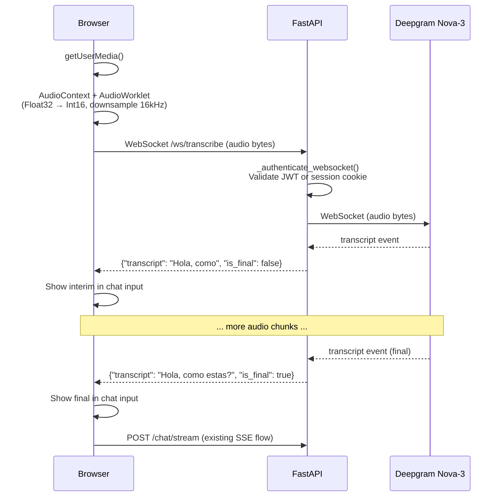
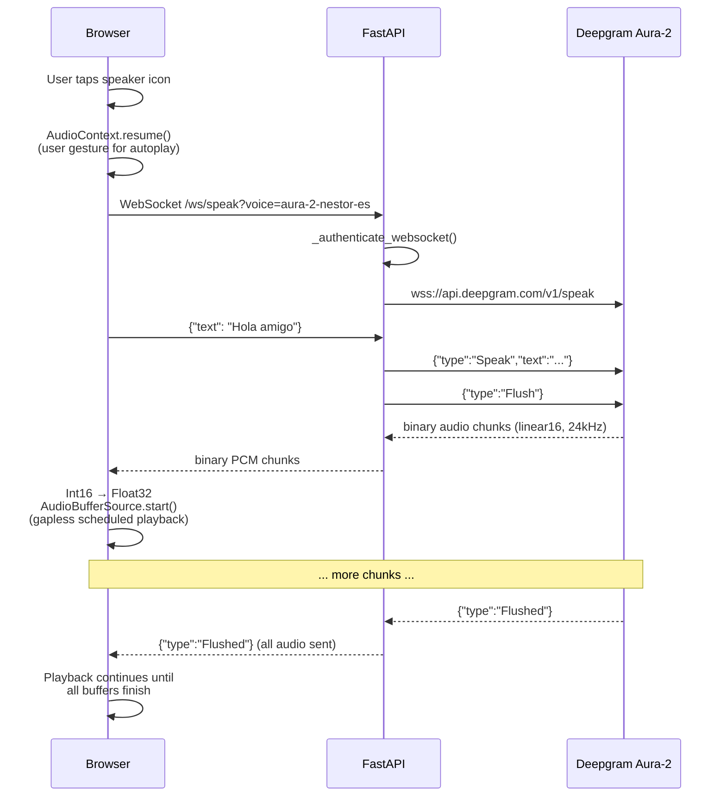
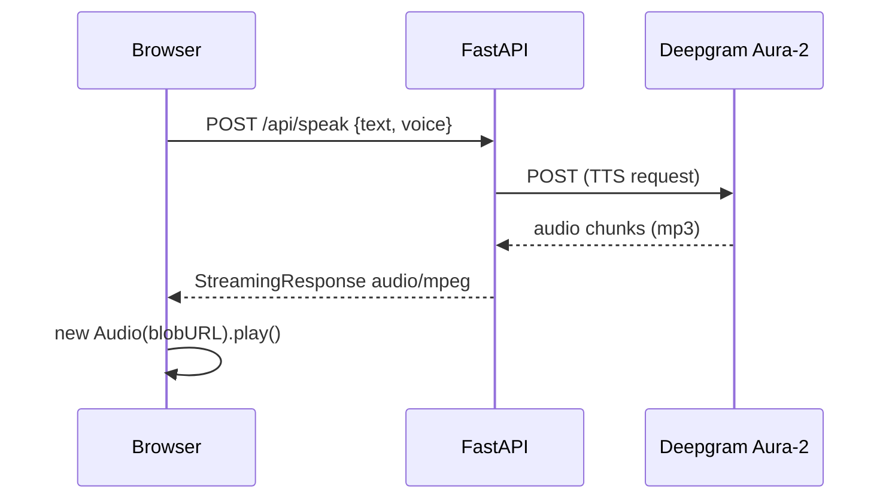
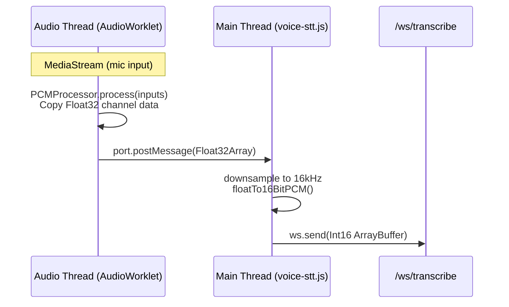
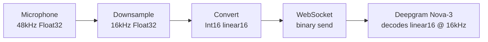
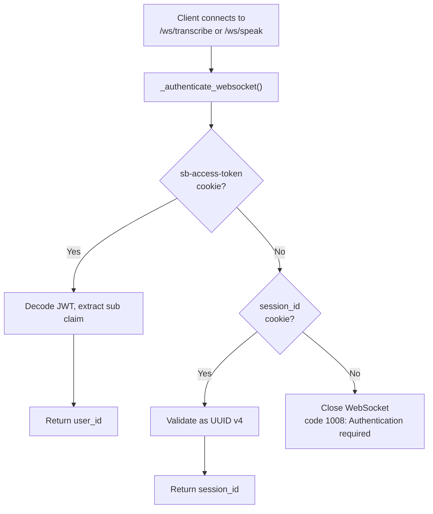
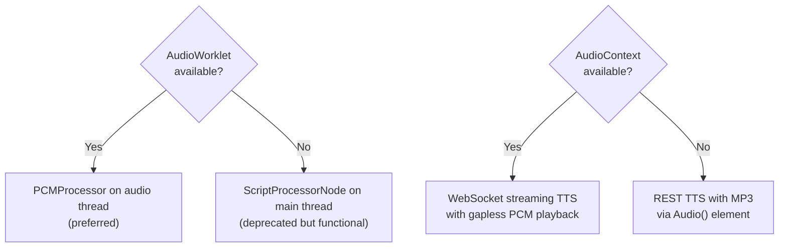

# Habla Hermano Technical Architecture

> FastAPI + HTMX + LangGraph for conversational language learning

---

## Current Implementation Status

| Phase | Description | Status |
|-------|-------------|--------|
| **Phase 1** | Minimal Graph - Basic state, single respond node | ✅ Completed |
| **Phase 2** | Analysis Node - Multi-node graphs, sequential edges | ✅ Completed |
| **Phase 3** | Conditional Routing - Branching logic, scaffolding | ✅ Completed |
| **Phase 4** | Checkpointing - PostgreSQL persistence, conversation memory | ✅ Completed |
| **Phase 5** | Authentication - Supabase Auth, multi-user support | ✅ Completed |
| **Phase 6** | Micro-Lessons - Structured lesson content, exercises, progress | ✅ Completed |
| **Phase 7** | Progress Tracking - Dashboard stats, vocabulary tracking, chart data | ✅ Completed |
| **Phase 8** | Guest Sessions - Chat-only guest access via session cookies | ✅ Completed |
| **Phase 9** | AI-Enhanced Lessons - LangGraph subgraphs for personalized lesson delivery | ✅ Completed |
| **Phase 10** | Lesson Content Expansion - 60 lessons across all languages and levels | ✅ Completed |
| **Phase 11** | Nordic Design + Pronunciation - Clean UI design, pronunciation tips in chat | ✅ Completed |
| **Phase 12** | Spaced Repetition - SM-2 algorithm, intelligent chat weaving, review mode | ✅ Completed |
| **Phase 13** | Mobile Responsive - Safe areas, dynamic viewport, touch optimization, responsive layouts | ✅ Completed |
| **Phase 14** | Learning Paths - Structured paths, adaptive recommendations, learn page | ✅ Completed |
| **Phase 15** | SSE Streaming - Real-time token streaming via POST /chat/stream and stream.js | ✅ Completed |
| **Phase 16** | ES Module Migration - JavaScript restructured into 6 ES modules with Vitest testing | ✅ Completed |
| **Phase 17** | Voice Conversation - Deepgram STT/TTS via WebSocket proxy, graceful degradation | ✅ Completed |
| **Phase 19** | Conversational Lesson Delivery - Phase machine teaches lessons through chat UI | ✅ Completed |
| **Phase 21** | Voice FSM Refactor - FSM + AbortController, split into 5 sub-modules | ✅ Completed |

**Test Coverage**: 2,377+ tests (2,150 Python + 207 JavaScript) covering agent, API, database, auth, lessons, review, and service modules. E2E testing is documented in [docs/playwright-e2e.md](./playwright-e2e.md).

---

## Learning Goals

This project is intentionally built with **LangGraph** to learn:
- State management with TypedDict and reducers
- Graph routing with conditional edges
- Checkpointing and conversation persistence
- Node composition and reusability

**Approach**: Start with minimal viable graph, add complexity as features demand it.

---

## The Hermano Personality System

Habla Hermano features "Hermano" - a friendly, laid-back big brother figure who makes language learning feel like chatting with a supportive friend.

### Personality Implementation

The Hermano personality is defined in `src/agent/prompts.py` and adapts based on learner level:

| Level | Hermano's Approach |
|-------|-------------------|
| **A0** | Supportive big brother, heavy encouragement, celebrates tiny wins |
| **A1** | Chill friend who spent a year abroad, relaxed guidance |
| **A2** | Challenges learners while keeping it fun and conversational |
| **B1** | Peer-to-peer natural conversation partner |

### Language Adapter Pattern

The system uses a dictionary adapter pattern for clean language switching, replacing the previous string replacement approach.

**LANGUAGE_ADAPTER Dictionary** (`src/agent/prompts.py`):

```python
LANGUAGE_ADAPTER: dict[str, dict[str, str]] = {
    "es": {
        "language_name": "Spanish",
        "hello": "Hola",
        "my_name_is": "Me llamo",
        "goodbye": "Adios",
        "thank_you": "Gracias",
        # Pronunciation guidance
        "tricky_sounds": "the rolled 'rr', the 'ñ' (like 'ny' in canyon), and 'j' (like English 'h')",
        "stress_rule": "the second-to-last syllable unless there's an accent mark",
        "sound_tip": "'ll' sounds like 'y' in most places, 'z' sounds like 'th' in Spain but 's' in Latin America",
    },
    "de": {
        "language_name": "German",
        "hello": "Hallo",
        "my_name_is": "Ich heisse",
        # Pronunciation guidance
        "tricky_sounds": "the 'ch' (like clearing your throat lightly), umlauts (ä, ö, ü), and the 'r' sound",
        "stress_rule": "usually the first syllable in German words",
        "sound_tip": "'w' sounds like English 'v', 'v' sounds like English 'f', and 'ie' is 'ee' while 'ei' is 'eye'",
    },
    "fr": {
        "language_name": "French",
        "hello": "Bonjour",
        "my_name_is": "Je m'appelle",
        # Pronunciation guidance
        "tricky_sounds": "the French 'r' (back of throat), nasal vowels (on, an, in), and silent final consonants",
        "stress_rule": "always the last syllable of a word or phrase",
        "sound_tip": "most final consonants are silent, 'u' is like saying 'ee' with rounded lips",
    },
}
```

**Prompt Templates** use placeholders:

```python
LEVEL_PROMPTS = {
    "A0": """
You are "Hermano" - a friendly, laid-back language buddy helping absolute beginners learn {language_name}.

PERSONALITY: Think supportive big brother who's been through this journey...

Example exchange:
You: "Hey! Let's start with the basics. '{hello}' means 'hello' - pretty easy, right?"
""",
    # ... A1, A2, B1 prompts
}
```

**Language Resolution** (`get_prompt_for_level`):

```python
def get_prompt_for_level(language: str, level: str) -> str:
    prompt = LEVEL_PROMPTS.get(level, LEVEL_PROMPTS["A1"])
    lang_data = LANGUAGE_ADAPTER.get(language, LANGUAGE_ADAPTER["es"])

    format_dict = {
        "language_name": lang_data["language_name"],
        "hello": lang_data["hello"],
        "hello_lower": lang_data["hello"].lower(),
        "my_name_is": lang_data["my_name_is"],
        # ... all language-specific values
    }

    return prompt.format(**format_dict)
```

### Benefits of the Adapter Pattern

1. **Extensibility**: Add new languages by adding dictionary entries
2. **Separation of Concerns**: Language data separate from prompt logic
3. **Type Safety**: Dictionary structure provides clear interface
4. **Maintainability**: Update phrases in one place, affects all prompts
5. **Testability**: Easy to test language resolution independently

---

## Technology Stack

| Component | Technology | Rationale |
|-----------|------------|-----------|
| **Backend** | FastAPI | Async support, SSE streaming, Pydantic validation |
| **Frontend** | HTMX + Jinja2 | Server-driven UI, minimal JS, fast iteration |
| **Agent** | LangGraph | Learning goal: stateful conversations, routing, checkpointing |
| **LLM** | Claude API | Superior language understanding, structured outputs |
| **Database** | PostgreSQL (Supabase) | Production persistence with MemorySaver fallback for dev |
| **Auth** | Supabase Auth | JWT-based authentication with httponly cookies |
| **Styling** | Tailwind CSS + CSS Variables | Nordic Minimal design with 3 themes (light/dark/ocean), mobile-responsive |
| **Voice** | Deepgram (Nova-3 STT, Aura-2 TTS) | Real-time STT/TTS via JWT-authenticated WebSocket proxy |
| **JS Testing** | Vitest + jsdom | 186 tests with ~90% coverage on ES modules |

---

## Project Structure

Legend: Implemented files are marked with a checkmark. Files without a checkmark are planned for future phases.

```
habla-hermano/
├── src/
│   ├── api/
│   │   ├── __init__.py          # [Implemented]
│   │   ├── main.py              # [Implemented] FastAPI app entry
│   │   ├── config.py            # [Implemented] Re-export shim (canonical location: src/config.py)
│   │   ├── dependencies.py      # [Implemented] DI for graph, db session
│   │   ├── auth.py              # [Implemented] JWT validation, CurrentUserDep, OptionalUserDep, EffectiveUser (legacy)
│   │   ├── session.py           # [Implemented] Thread ID management
│   │   ├── supabase_client.py   # [Implemented] Re-export shim (canonical location: src/db/client.py)
│   │   ├── streaming.py         # [Implemented] SSE streaming: StreamResult dataclass, stream_chat_events() async generator
│   │   ├── cookies.py          # [Implemented] Centralized cookie utility (signing, secure flag)
│   │   ├── middleware.py       # [Implemented] SecurityHeadersMiddleware (CSP, HSTS) + CSRFMiddleware (OWASP custom header)
│   │   ├── validation.py       # [Implemented] Re-export shim (canonical location: src/validation.py)
│   │   └── routes/
│   │       ├── __init__.py      # [Implemented]
│   │       ├── chat.py          # [Implemented] POST /chat, POST /chat/stream (SSE streaming)
│   │       ├── auth.py          # [Implemented] Login, signup, logout
│   │       ├── lessons.py       # [Implemented] Micro-lesson endpoints (routing only; completion logic in services/lesson_completion.py)
│   │       ├── progress.py      # [Implemented] Vocabulary, stats endpoints
│   │       ├── review.py        # [Implemented] Spaced repetition review endpoints
│   │       ├── learn.py         # [Implemented] Learning path and recommendation endpoints
│   │       └── voice.py         # [Implemented] WebSocket STT/TTS proxy (JWT-authenticated) + REST TTS endpoint
│   │
│   ├── config.py                  # [Implemented] Canonical Settings + get_settings (moved from api/config.py)
│   ├── validation.py              # [Implemented] Canonical VALID_LANGUAGES, VALID_LEVELS, validate_* helpers
│   │
│   ├── agent/
│   │   ├── __init__.py          # [Implemented]
│   │   ├── graph.py             # [Implemented] LangGraph: respond → scaffold (conditional) → analyze → END
│   │   ├── state.py             # [Implemented] TypedDict state with GrammarFeedback, VocabWord, ReviewWord types
│   │   ├── review_state.py      # [Implemented] ReviewState TypedDict for review subgraph
│   │   ├── review_graph.py      # [Implemented] Review session subgraph with question/feedback flow
│   │   ├── prompts.py           # [Implemented] System prompts by level
│   │   ├── checkpointer.py      # [Implemented] PostgresSaver + MemorySaver fallback
│   │   └── nodes/
│   │       ├── __init__.py      # [Implemented]
│   │       ├── respond.py       # [Implemented] Generate AI response
│   │       ├── analyze.py       # [Implemented] Grammar/vocab analysis
│   │       ├── scaffold.py      # [Implemented] Generate scaffolding (word banks, hints, sentence starters)
│   │       ├── lesson.py        # [Implemented] AI-enhanced lesson nodes (load_step, enhance_step, validate_exercise)
│   │       ├── review.py        # [Implemented] Review nodes (generate_question, evaluate_answer, update_sm2)
│   │       └── feedback.py      # [Removed] Previously planned for format corrections
│   │
│   ├── agent/
│   │   ├── lesson_state.py      # [Implemented] LessonState TypedDict for lesson subgraph
│   │   └── lesson_graph.py      # [Implemented] Lesson subgraph with AI enhancement
│   │
│   ├── lessons/
│   │   ├── __init__.py          # [Implemented] Module exports
│   │   ├── models.py            # [Implemented] Lesson, Step, Exercise, Progress models
│   │   └── service.py           # [Implemented] Lesson loading, filtering, vocabulary extraction
│   │
│   ├── db/
│   │   ├── __init__.py          # [Implemented] Module exports
│   │   ├── client.py            # [Implemented] Canonical get_supabase, get_supabase_admin (moved from api/supabase_client.py)
│   │   ├── models.py            # [Implemented] Pydantic models (Vocabulary, LearningSession, LessonProgress)
│   │   ├── repository.py        # [Implemented] Repository classes for Supabase data access
│   │   └── seed.py              # [Implemented] Initial data seeding
│   │
│   ├── services/
│   │   ├── __init__.py          # [Implemented] Module exports
│   │   ├── vocabulary.py        # [Implemented] Vocab extraction logic
│   │   ├── levels.py            # [Implemented] Level detection/adjustment
│   │   ├── progress.py          # [Implemented] ProgressService for dashboard aggregation
│   │   ├── merge.py             # [Removed] Previously GuestDataMergeService - no longer needed
│   │   ├── review.py            # [Implemented] ReviewService with SM-2 algorithm (uses VocabularyRepository)
│   │   ├── paths.py             # [Implemented] PathService for structured learning paths
│   │   ├── adaptive.py          # [Implemented] AdaptiveService for daily recommendations
│   │   └── lesson_completion.py # [Implemented] Extracted lesson completion logic (exercise validation, vocab upsert, persistence)
│   │
│   ├── templates/               # [Implemented] All template files (mobile-responsive)
│   │   ├── base.html            # [Implemented] Theme system (dark/light/ocean), CSS variables, safe areas, dynamic viewport
│   │   ├── chat.html            # [Implemented] Chat UI with hamburger menu, safe areas, virtual keyboard support
│   │   ├── lessons.html         # [Implemented] Lesson catalog with beginner/intermediate grouping
│   │   ├── lesson_player.html   # [Implemented] Interactive lesson player with step navigation
│   │   ├── progress.html        # [Implemented] Progress dashboard with stats, vocabulary, charts
│   │   ├── learn.html             # [Implemented] Learning path overview page
│   │   ├── auth/
│   │   │   ├── login.html       # [Implemented] Login page
│   │   │   └── signup.html      # [Implemented] Signup page
│   │   └── partials/
│   │       ├── message.html     # [Implemented] Message bubble styling
│   │       ├── message_pair.html # [Implemented] AI response partial (optimistic UI)
│   │       ├── lesson_step.html # [Implemented] Step content by type (instruction, vocabulary, example, tip, practice)
│   │       ├── lesson_exercise.html # [Implemented] Exercise forms (multiple choice, fill blank, translate)
│   │       ├── lesson_complete.html # [Implemented] Completion celebration with handoff to chat
│   │       ├── grammar_feedback.html # [Implemented] Collapsible grammar feedback
│   │       ├── pronunciation_tips.html # [Implemented] Collapsible pronunciation tips UI
│   │       ├── scaffold.html    # [Implemented] Word bank, hints, sentence starters UI
│   │       ├── vocab_sidebar.html
│   │       ├── progress_vocab.html  # [Implemented] Vocabulary list partial
│   │       ├── stats_summary.html   # [Implemented] Stats summary partial
│   │       ├── review_question.html # [Implemented] Review question partial
│   │       ├── review_feedback.html # [Implemented] Review answer feedback partial
│   │       ├── review_complete.html # [Implemented] Review session complete partial
│   │       ├── review_empty.html    # [Implemented] No words to review partial
│   │       ├── review_start.html    # [Implemented] Review session start UI
│   │       ├── chat_warmup.html     # [Implemented] Review warmup prompt in chat
│   │       ├── learn_unit.html        # [Implemented] Learning path unit card
│   │       └── learn_recommendation.html # [Implemented] Adaptive recommendation card
│   │
│   └── static/
│       ├── css/
│       └── js/
│           ├── main.js            # [Implemented] App entry point, module orchestration
│           ├── pcm-processor.js   # [Implemented] AudioWorklet PCM processor for mobile STT
│           └── modules/
│               ├── dom.js         # [Implemented] DOM utilities, scroll, focus, escapeHtml
│               ├── fsm.js         # [Implemented] Generic finite state machine: createMachine + interpret
│               ├── htmx-handlers.js # [Implemented] HTMX event handlers (afterSwap, scroll, errors)
│               ├── scaffold.js    # [Implemented] Click-to-insert word bank handler
│               ├── shortcuts.js   # [Implemented] Keyboard shortcuts (/, Shift+Enter)
│               ├── stream.js      # [Implemented] SSE streaming client with TTS speaker buttons
│               ├── voice.js       # [Implemented] Voice orchestrator: FSM services, state ownership, public API
│               ├── voice-constants.js # [Implemented] Voice config: sample rates, voice IDs, SVG icons, audio utils
│               ├── voice-stt.js   # [Implemented] STT state machine, mic capture, WebSocket transcript streaming
│               ├── voice-tts.js   # [Implemented] TTS state machine, WebSocket PCM streaming, REST fallback
│               └── voice-ui.js    # [Implemented] Stateless voice UI helpers: indicators, timers, tooltips
│
├── tests/
├── data/
│   ├── hermano.db
│   └── lessons/                 # [Implemented] Lesson content (YAML)
│       ├── es/                  # Spanish lessons (A0-B1)
│       ├── de/                  # German lessons (A0-B1)
│       └── fr/                  # French lessons (A0-B1)
│
├── docs/
├── pyproject.toml
├── Makefile
└── .env.example
```

---

## LangGraph Learning Progression

Build the graph incrementally, learning concepts as you go:

### Phase 1: Minimal Graph (Week 1) - IMPLEMENTED
**Learn**: Basic graph structure, state, single node

**Status**: This phase is complete and working in production. The minimal graph with a single respond node is fully operational.

```python
# Simplest possible graph - just responds
class ConversationState(TypedDict):
    messages: Annotated[list[BaseMessage], add_messages]
    level: str  # A0, A1, A2, B1
    language: str  # es, de

def build_graph():
    graph = StateGraph(ConversationState)
    graph.add_node("respond", respond_node)
    graph.set_entry_point("respond")
    graph.add_edge("respond", END)
    return graph.compile()
```

**What you'll learn**:
- StateGraph basics
- TypedDict state definition
- The `add_messages` reducer pattern
- Node functions that read/write state

### Phase 2: Add Analysis Node (Week 1-2) - IMPLEMENTED
**Learn**: Multi-node graphs, sequential edges

**Status**: This phase is complete. The graph now chains respond → analyze → END, with grammar feedback displayed in a collapsible UI.

```python
def build_graph():
    graph = StateGraph(ConversationState)

    graph.add_node("respond", respond_node)
    graph.add_node("analyze", analyze_node)  # Grammar/vocab analysis

    graph.set_entry_point("respond")
    graph.add_edge("respond", "analyze")     # Chain nodes
    graph.add_edge("analyze", END)

    return graph.compile()
```

**What you learned**:
- Chaining nodes sequentially with `add_edge()`
- State passing between nodes (analyze reads messages from respond)
- Extending state with new fields (grammar_feedback, new_vocabulary)
- Using NotRequired for optional state fields

### Phase 3: Conditional Routing (Week 2) - IMPLEMENTED
**Learn**: Conditional edges, branching logic

**Status**: This phase is complete. The graph now uses conditional routing to provide scaffolding support (word banks, hints, sentence starters) for beginner levels (A0/A1), while skipping scaffolding for intermediate levels (A2/B1).

```python
def needs_scaffold(state: ConversationState) -> str:
    """Route based on user level - beginners get scaffolding support"""
    if state["level"] in ["A0", "A1"]:
        return "scaffold"
    return "analyze"

def build_graph():
    graph = StateGraph(ConversationState)

    graph.add_node("respond", respond_node)
    graph.add_node("scaffold", scaffold_node)  # NEW: Generates contextual help
    graph.add_node("analyze", analyze_node)

    graph.set_entry_point("respond")

    # Conditional routing based on level
    graph.add_conditional_edges(
        "respond",
        needs_scaffold,
        {
            "scaffold": "scaffold",  # A0/A1 learners get scaffolding
            "analyze": "analyze"      # A2/B1 learners skip to analysis
        }
    )

    graph.add_edge("scaffold", "analyze")
    graph.add_edge("analyze", END)

    return graph.compile()
```

**Graph Flow**:
- **A0/A1 learners**: START -> respond -> scaffold -> analyze -> END
- **A2/B1 learners**: START -> respond -> analyze -> END

**What you learned**:
- Conditional edge functions with `add_conditional_edges()`
- Routing logic based on state fields (user level)
- Branching paths that merge back together
- Using Pydantic models for structured LLM outputs (ScaffoldingConfig)

### Phase 4: Checkpointing (Week 2-3)
**Learn**: Persistence, conversation memory

```python
from langgraph.checkpoint.sqlite import SqliteSaver

def build_graph():
    graph = StateGraph(ConversationState)
    # ... nodes and edges ...

    # Add checkpointing for conversation persistence
    checkpointer = SqliteSaver.from_conn_string("data/hermano.db")
    return graph.compile(checkpointer=checkpointer)

# Usage with thread_id for conversation continuity
result = await graph.ainvoke(
    {"messages": [HumanMessage(content="Hola")]},
    config={"configurable": {"thread_id": "user-session-123"}}
)
```

**What you'll learn**:
- SqliteSaver checkpointer
- Thread IDs for conversation isolation
- Resuming conversations across requests

### Phase 5: Complex State (Week 3)
**Learn**: Rich state management, nested structures

```python
class ScaffoldingConfig(TypedDict):
    show_word_bank: bool
    show_translation: bool
    show_hints: bool
    hint_text: Optional[str]
    word_bank: list[str]

class GrammarFeedback(TypedDict):
    original: str
    correction: str
    explanation: str
    rule: str

class ConversationState(TypedDict):
    # Core
    messages: Annotated[list[BaseMessage], add_messages]
    level: str
    language: str

    # Scaffolding (A0-A1)
    scaffolding: ScaffoldingConfig

    # Analysis results
    grammar_feedback: list[GrammarFeedback]
    new_vocabulary: list[str]

    # Session tracking
    words_this_session: list[str]
    corrections_count: int

    # Level adjustment signals
    should_adjust_level: bool
    adjustment_direction: Optional[str]  # "up" | "down"
```

**What you'll learn**:
- Complex nested state
- Multiple state fields updated by different nodes
- State as the single source of truth

### Phase 6: Micro-Lessons (Week 4) - IMPLEMENTED
**Learn**: Structured content delivery, YAML-based data, service patterns

**Status**: This phase is complete. The application now includes a full micro-lessons system with structured content, interactive exercises, and lesson-to-chat handoff.

**Key Components**:

1. **Lesson Models** (`src/lessons/models.py`):
```python
class LessonLevel(str, Enum):
    A0 = "A0"  # Absolute beginner
    A1 = "A1"  # Beginner
    A2 = "A2"  # Elementary
    B1 = "B1"  # Intermediate

class LessonStepType(str, Enum):
    INSTRUCTION = "instruction"  # Text explanation
    VOCABULARY = "vocabulary"    # Word list with translations
    EXAMPLE = "example"          # Example sentence/phrase
    TIP = "tip"                  # Cultural note or learning tip
    PRACTICE = "practice"        # Exercise reference

class ExerciseType(str, Enum):
    MULTIPLE_CHOICE = "multiple_choice"
    FILL_BLANK = "fill_blank"
    TRANSLATE = "translate"
```

2. **Lesson Service** (`src/lessons/service.py`):
```python
class LessonService:
    """Service for loading and managing lessons from YAML files."""

    def get_lesson(self, lesson_id: str) -> Lesson | None
    def get_lessons(self, language: str, level: LessonLevel) -> list[Lesson]
    def get_lesson_vocabulary(self, lesson_id: str) -> list[dict]
    def get_next_recommended(self, user_id: str, ...) -> Lesson | None
```

3. **YAML Lesson Format** (`data/lessons/es/A0/greetings-001.yaml`):
```yaml
id: greetings-001
title: Basic Greetings
language: es
level: A0
category: greetings
icon: "👋"

steps:
  - type: instruction
    content: "Welcome to your first Spanish lesson!"
    order: 1
  - type: vocabulary
    vocabulary:
      - word: hola
        translation: hello
    order: 2
  - type: practice
    exercise_id: "ex-mc-greet-001"
    order: 3

exercises:
  - id: ex-mc-greet-001
    type: multiple_choice
    question: "How do you say 'hello' in Spanish?"
    options: [Hola, Adios, Gracias]
    correct_index: 0
```

**What you learned**:
- YAML-based content loading with validation
- Pydantic models for structured lesson data
- Service layer pattern for data access
- Step-based content navigation with HTMX
- Exercise answer validation with multiple types
- Lesson-to-chat handoff for practice reinforcement

### Phase 7: Progress Tracking (Week 5) - IMPLEMENTED
**Learn**: Dashboard aggregation, repository pattern, service layer composition

**Status**: This phase is complete. The application now includes comprehensive progress tracking with dashboard statistics, vocabulary management, and chart data generation.

**Key Components**:

1. **ProgressService** (`src/services/progress.py`):
```python
class ProgressService:
    """Aggregates data from repositories into dashboard-ready structures."""

    def __init__(self, user_id: str, client: SupabaseClient | None = None) -> None:
        self._vocab_repo = VocabularyRepository(user_id, client=client)
        self._session_repo = LearningSessionRepository(user_id, client=client)
        self._lesson_repo = LessonProgressRepository(user_id, client=client)

    def get_dashboard_stats(self, language: str = "es") -> DashboardStats:
        """Aggregate stats: total_words, sessions, lessons, streak, accuracy."""

    def get_chart_data(self, language: str = "es", days: int = 30) -> ChartData:
        """Generate vocab_growth and accuracy_trend time series."""

    def record_chat_activity(self, language: str, level: str, new_vocab: list) -> None:
        """Fire-and-forget vocabulary capture from chat interactions."""
```

2. **Dashboard Stats** aggregation from 3 repositories:
```python
@dataclass(frozen=True)
class DashboardStats:
    total_words: int          # From VocabularyRepository
    total_sessions: int       # From LearningSessionRepository
    lessons_completed: int    # From LessonProgressRepository
    current_streak: int       # Computed from session dates
    accuracy_rate: float      # times_correct / times_seen
    words_learned_today: int  # Filtered by date
    messages_today: int       # Aggregated from sessions
```

3. **Chart Data** generation:
```python
@dataclass(frozen=True)
class ChartData:
    vocab_growth: list[VocabGrowthPoint]     # Cumulative word count over time
    accuracy_trend: list[AccuracyPoint]      # Accuracy percentage over time
```

**What you learned**:
- Service layer pattern for aggregating multiple repositories
- Dataclass-based DTOs for dashboard data structures
- Streak calculation algorithm (consecutive days from today)
- Fire-and-forget logging pattern for non-critical persistence

### Phase 8: Guest Sessions (Week 5-6) - IMPLEMENTED
**Learn**: Simplified guest model, auth-gated persistence, user-scoped Supabase clients

**Status**: This phase is complete. The application provides a simplified guest experience: guests can chat with Hermano (via LangGraph checkpointing with a session cookie), but vocabulary, progress, lessons, and review are authenticated-only features. There is no guest data persistence and no data merge on signup.

**Key Design Decisions**:

1. **Chat-Only for Guests**: Guests get the full chat experience (LangGraph conversation with checkpointing via session cookie as `thread_id`), but all data-persistence features (vocabulary tracking, progress dashboard, lesson completion, spaced repetition) require authentication.

2. **No Admin Client for Guest Operations**: The previous design used a service role client (`get_supabase_admin()`) to bypass RLS for guest data. The simplified model eliminates this pattern entirely. All data operations use a user-authenticated Supabase client.

3. **User-Authenticated Supabase Client** (`src/db/client.py`, re-exported from `src/api/supabase_client.py`):
```python
def get_supabase_for_user(access_token: str) -> SupabaseClient:
    """Get Supabase client authenticated with user's JWT.

    Creates a client that includes the user's access token in requests,
    allowing RLS policies to use auth.uid() for row-level access control.
    """
    client = create_client(settings.SUPABASE_URL, settings.SUPABASE_ANON_KEY)
    client.postgrest.auth(access_token)
    return client
```

4. **Auth Pattern in Data Routes** (`src/api/routes/progress.py`):
```python
# All data endpoints check for authentication first
if not user or not sb_access_token:
    # Return empty stats with sign-up prompt for guests
    return templates.TemplateResponse(...)

# Authenticated users get a user-scoped client
user_client = get_supabase_for_user(sb_access_token)
service = ProgressService(user.id, client=user_client)
```

5. **Review Endpoints Require Auth** (`src/api/routes/review.py`):
```python
# Review endpoints use CurrentUserDep (auth required, not optional)
@router.get("/stats")
async def get_review_stats(user: CurrentUserDep, ...):
    user_client = get_supabase_for_user(sb_access_token) if sb_access_token else None
    service = ReviewService(user.id, client=user_client)
```

**What you learned**:
- Simplified guest model reduces complexity (no admin client, no merge service, no RLS bypass)
- LangGraph checkpointing provides conversation persistence for guests without database writes
- User-authenticated Supabase clients let RLS work naturally with `auth.uid()`
- Auth-gating data features is simpler than supporting guest data with merge-on-signup

### Phase 9: AI-Enhanced Lessons (Week 7) - IMPLEMENTED
**Learn**: Graph composition, subgraphs, AI personalization

**Status**: This phase is complete. Lessons are now enhanced with Hermano's personalized teaching through a dedicated LangGraph subgraph.

**Key Components**:

1. **LessonState** (`src/agent/lesson_state.py`):
```python
class LessonState(TypedDict):
    """State for the lesson delivery subgraph."""
    lesson_id: str
    step_index: int
    language: str
    level: str

    # Step data (loaded from YAML)
    step_type: NotRequired[str]
    step_content: NotRequired[str]
    step_vocabulary: NotRequired[list[dict]]
    step_target_text: NotRequired[str]
    step_translation: NotRequired[str]
    exercise_id: NotRequired[str]

    # AI enhancement
    enhanced_content: NotRequired[str]
    hermano_intro: NotRequired[str]

    # Exercise validation
    user_answer: NotRequired[str]
    is_correct: NotRequired[bool]
    exercise_feedback: NotRequired[str]
```

2. **Lesson Subgraph** (`src/agent/lesson_graph.py`):
```python
def build_lesson_subgraph() -> CompiledGraph:
    """Build the lesson delivery subgraph."""
    graph = StateGraph(LessonState)

    graph.add_node("load_step", load_step_node)
    graph.add_node("enhance_step", enhance_step_node)

    graph.set_entry_point("load_step")
    graph.add_edge("load_step", "enhance_step")
    graph.add_edge("enhance_step", END)

    return graph.compile()

def build_exercise_validation_graph() -> CompiledGraph:
    """Build the exercise validation subgraph."""
    graph = StateGraph(LessonState)

    graph.add_node("validate", validate_exercise_node)

    graph.set_entry_point("validate")
    graph.add_edge("validate", END)

    return graph.compile()
```

3. **Lesson Nodes** (`src/agent/nodes/lesson.py`):
```python
async def load_step_node(state: LessonState) -> dict[str, Any]:
    """Load step data from YAML lesson files."""

async def enhance_step_node(state: LessonState) -> dict[str, Any]:
    """Hermano enhances step with personalized content."""

async def validate_exercise_node(state: LessonState) -> dict[str, Any]:
    """Validate exercise answer with AI-generated feedback."""
```

**Lesson Enhancement Flow**:
```
┌─────────────────┐
│   load_step     │ ← Read YAML lesson data
└────────┬────────┘
         │
┌────────▼────────┐
│  enhance_step   │ ← Hermano adds personalized intro, tips, examples
└────────┬────────┘
         │
┌────────▼────────┐
│      END        │
└─────────────────┘
```

**What you learned**:
- Building dedicated subgraphs for specific workflows
- Composing subgraphs as callable nodes
- Passing state between subgraph and parent graph
- AI personalization of static YAML content
- Separate validation subgraphs for exercise feedback

---

### Phase 12: Spaced Repetition with SM-2 Algorithm

Phase 12 adds conversation-first spaced repetition — no flashcards, no decontextualized drills. Words come back through Hermano naturally, using the SM-2 algorithm for scheduling.

**ReviewState** — Dedicated TypedDict for the review subgraph:

```python
class ReviewState(TypedDict):
    # Session context
    user_id: str
    language: str
    level: str

    # Session tracking
    words_to_review: list[dict[str, object]]
    current_word_index: int
    session_size: int  # 5, 10, or total count

    # Current question (populated by generate_question node)
    current_word: NotRequired[dict[str, object]]
    question_type: NotRequired[str]  # translate, fill_blank, recognize
    question_text: NotRequired[str]

    # Answer evaluation (populated by evaluate_answer node)
    user_answer: NotRequired[str]
    quality_score: NotRequired[int]  # 0-5 SM-2 score
    feedback_text: NotRequired[str]

    # Session results
    results: list[dict[str, object]]  # [{word_id, quality, correct}]
```

**Two compiled subgraphs**:

1. **Review Subgraph** — Generates questions for review sessions:

```
┌─────────────────────┐
│  generate_question   │ ← Picks question type, generates with Hermano's voice
└────────┬────────────┘
         │
┌────────▼────────┐
│      END        │ ← Returns question, waits for user input externally
└─────────────────┘
```

2. **Answer Evaluation Subgraph** — Evaluates answers and updates scheduling:

```
┌─────────────────────┐
│  evaluate_answer     │ ← AI evaluates correctness, infers quality score (0-5)
└────────┬────────────┘
         │
┌────────▼────────┐
│   update_sm2     │ ← Applies SM-2 algorithm: easiness_factor, interval, next_review_at
└────────┬────────┘
         │
┌────────▼────────┐
│      END        │
└─────────────────┘
```

**Chat weaving** — The respond node also participates in review:

- `_get_topical_review_words()` fetches due-for-review words related to the current topic
- Hermano naturally weaves these words into responses and prompts
- The analyze node detects correct usage via `_check_review_word_usage()`
- SM-2 is updated silently via `_update_sm2_for_used_words()` — the user never notices

**Review nodes** (`src/agent/nodes/review.py`):

| Node | Purpose |
|------|---------|
| `generate_question_node` | Picks question type (translate/fill_blank/recognize), generates question with Hermano's personality |
| `evaluate_answer_node` | Uses AI to evaluate correctness, infer quality score (0-5), generate personalized feedback |
| `update_sm2_node` | Applies SM-2 formula: updates easiness_factor, interval, repetitions, next_review_at |

**SM-2 Algorithm** (`src/services/review.py`):

```
quality >= 3 (correct):
  repetitions += 1
  if repetitions == 1: interval = 1 day
  elif repetitions == 2: interval = 6 days
  else: interval = previous_interval × easiness_factor

quality < 3 (incorrect):
  repetitions = 0
  interval = 1 day

easiness_factor = max(1.3, EF + 0.1 - (5 - quality) × (0.08 + (5 - quality) × 0.02))
```

**What you learned**:
- Designing a two-channel review system (passive chat weaving + active review mode)
- Building multiple subgraphs that share a common state type
- Silent background updates triggered by conversation analysis
- SM-2 scheduling algorithm implementation with database persistence
- Composing LLM evaluation with algorithmic updates in a single subgraph

---

### Phase 15: SSE Streaming

Phase 15 replaces the 5-15 second full-wait for the LangGraph pipeline with real-time token streaming. Uses `fetch()` + `ReadableStream` with server-sent events (SSE), so the user sees Hermano's response appear token by token.

**Overview**: The existing `POST /chat` endpoint (HTMX-driven, returns full HTML) is preserved as a non-streaming fallback. A new `POST /chat/stream` endpoint returns an SSE event stream. On the frontend, `stream.js` intercepts the chat form submission (the form no longer uses `hx-post`), creates a streaming message bubble with a blinking cursor, and appends tokens as they arrive.

**No node or LLM changes needed**: LangGraph's `astream()` wraps LLM callbacks automatically even when nodes use `ainvoke()` internally. The existing respond, scaffold, and analyze nodes work unmodified.

**Backend** (`src/api/streaming.py`):

```python
@dataclass
class StreamResult:
    """Accumulated result from streaming a chat graph invocation."""
    response_text: str           # Full AI response (assembled from tokens)
    scaffolding: dict | None     # ScaffoldingConfig dict (from scaffold node update)
    grammar_feedback: list       # Grammar feedback list (from analyze node update)
    pronunciation_tips: list     # Pronunciation tips list (from analyze node update)
    new_vocabulary: list         # New vocabulary list (from analyze node update)


async def stream_chat_events(
    graph: CompiledGraph,
    message: str,
    thread_id: str,
    language: str,
    level: str,
    user_id: str | None = None,
) -> AsyncGenerator[str, None]:
    """Async generator yielding SSE-formatted events from the LangGraph pipeline.

    Uses graph.astream(stream_mode=["messages", "updates"]) to get both
    per-token message chunks and per-node state updates in a single pass.
    Only tokens from the 'respond' node are streamed to the client;
    tokens from scaffold and analyze nodes are filtered out silently.
    """
    ...
```

**SSE Event Protocol**:

The stream emits events in this order:

```
event: token
data: {"token": "Hola"}

event: token
data: {"token": " amigo"}

event: token
data: {"token": "!"}

event: response_complete
data: {"text": "Hola amigo!"}

event: scaffolding          (only for A0/A1 learners)
data: {"enabled": true, "word_bank": [...], "hint_text": "...", ...}

event: grammar
data: [{"original": "...", "correction": "...", ...}]

event: pronunciation
data: [{"word": "...", "phonetic": "...", "tip": "..."}]

event: done
data: {}
```

- `token` events stream as each token arrives from the `respond` node
- `response_complete` fires once with the full assembled response text
- `scaffolding`, `grammar`, and `pronunciation` events fire after the full pipeline completes (from scaffold and analyze node updates)
- `done` signals the client to finalize the UI

**Frontend** (`src/static/js/stream.js`):

```javascript
// Intercepts the chat form submit event (form no longer has hx-post)
// 1. Prevents default, posts via fetch() to /chat/stream
// 2. Creates a streaming AI bubble with a blinking cursor
// 3. Reads the SSE response via ReadableStream line-by-line
// 4. On 'token' events: appends text via insertAdjacentText('beforeend', token)
// 5. On 'response_complete': removes blinking cursor
// 6. On 'scaffolding'/'grammar'/'pronunciation': injects feedback HTML
//    with Alpine.js x-data attributes, then calls Alpine.initTree()
//    to activate the newly injected interactive components
// 7. On 'done': re-enables the input form
// 8. AbortController with 60s timeout for safety
```

**Streaming Flow**:

```
┌─────────────────────────────────────────────────────────────────────────┐
│                     SSE STREAMING FLOW                                    │
│                                                                         │
│  Chat form submit (stream.js intercepts, no hx-post)                   │
│  ┌──────────────────────────────────────────────────┐                  │
│  │  fetch('/chat/stream', { method: 'POST', body }) │                  │
│  │  + AbortController (60s timeout)                 │                  │
│  └──────────────────────┬───────────────────────────┘                  │
│                          │                                              │
│                          ▼                                              │
│  ┌──────────────────────────────────────────────────┐                  │
│  │  POST /chat/stream endpoint                      │                  │
│  │  → StreamingResponse(stream_chat_events(...))    │                  │
│  └──────────────────────┬───────────────────────────┘                  │
│                          │                                              │
│                          ▼                                              │
│  ┌──────────────────────────────────────────────────┐                  │
│  │  graph.astream(stream_mode=["messages","updates"])│                  │
│  │                                                   │                  │
│  │  respond node tokens ──► event: token             │──► append to    │
│  │  (scaffold/analyze tokens filtered out)           │    bubble       │
│  │                                                   │                  │
│  │  scaffold node update ──► event: scaffolding      │──► inject HTML  │
│  │  analyze node update  ──► event: grammar          │──► inject HTML  │
│  │                       ──► event: pronunciation    │──► inject HTML  │
│  │                                                   │                  │
│  │  pipeline END ──────────► event: done             │──► finalize UI  │
│  └──────────────────────────────────────────────────┘                  │
│                                                                         │
│  Alpine.initTree() called after each HTML injection to activate        │
│  x-data bindings on dynamically inserted feedback components.          │
└─────────────────────────────────────────────────────────────────────────┘
```

**Chat Form Change**:

The chat form in `chat.html` no longer uses HTMX for submission (`hx-post` removed). Instead, `stream.js` attaches an event listener to the form's `submit` event and handles the request via `fetch()` POST. This allows streaming the response incrementally rather than waiting for the full HTML partial. The existing `POST /chat` endpoint remains available as a non-streaming fallback (e.g., for clients without JavaScript).

**What you learned**:
- Using LangGraph's `astream(stream_mode=["messages", "updates"])` for combined token + state streaming
- Filtering streamed tokens by node name (only `respond` node tokens are user-visible)
- SSE event protocol design with typed events for progressive UI updates
- `fetch()` + `ReadableStream` as a lightweight SSE client (no EventSource needed for POST)
- Dynamic Alpine.js component initialization via `Alpine.initTree()` for injected HTML
- `AbortController` timeout patterns for streaming request safety
- Coexistence of streaming and non-streaming endpoints for graceful degradation

---

### Lesson Chat Graph (Phase 19)

The conversational lesson delivery system uses a dedicated LangGraph graph that teaches YAML lesson content through the chat UI.

#### Architecture

```
Lesson Chat Graph:
START → lesson_respond → END

Phase Machine (inside lesson_respond node):
  intro → teaching → exercise_ask → exercise_eval → complete
```

Unlike the main chat graph's multi-node pipeline (respond → scaffold → analyze), the lesson chat graph uses a **single node with an internal phase machine**. This design:
- Reuses the existing SSE streaming infrastructure (`stream_chat_events()`)
- Maintains lesson state across turns via LangGraph checkpointing
- Isolates lesson conversations from freeform chat threads

#### CEFR Teaching Adjustments

All four lesson prompt templates (INTRO, TEACHING, EXERCISE_ASK, EXERCISE_EVAL) include a `{teaching_adjustments}` placeholder that injects level-specific pedagogy instructions at render time. The `TEACHING_ADJUSTMENTS` dict in `src/agent/prompts_lesson_chat.py` maps each CEFR level to tailored teaching behavior:

| Level | Key Behavior |
|-------|-------------|
| A0 | One concept at a time, ~80% English, yes/no questions only |
| A1 | 2-3 related concepts grouped, 50/50 language mix, pattern-based grammar |
| A2 | Context-driven teaching (mini-dialogues), 80% target language, insider expressions |
| B1 | Nuanced discussion, 95%+ target language, peer-style corrections |

`get_teaching_adjustments(level)` resolves the level string (falls back to A1 for unknown levels). This ensures Hermano adapts its pedagogy per lesson based on the learner's CEFR level.

#### State Model

`LessonChatState` (TypedDict) extends `ConversationState` with lesson tracking fields:

| Field | Type | Purpose |
|-------|------|---------|
| `lesson_id` | `str` | Unique lesson identifier |
| `lesson_data` | `dict` | Serialized Lesson model |
| `lesson_phase` | `str` | Current phase: intro, teaching, exercise_ask, exercise_eval, complete |
| `step_index` | `int` | Current position in ordered steps |
| `exercise_index` | `int` | Current position in exercises |
| `exercise_results` | `list[dict]` | Accumulated exercise outcomes |
| `lesson_score` | `int` | Running score 0-100 |
| `lesson_ui` | `dict` | SSE payload for progress updates |
| `lesson_completed` | `bool` | Flag for post-stream persistence |

#### Phase Flow

1. **Intro**: Welcome learner, preview lesson content, transition to teaching
2. **Teaching**: Present steps in batches of `STEP_BATCH_SIZE=3`, advance `step_index` each turn
3. **Exercise Ask**: Present the current exercise from the lesson
4. **Exercise Eval**: Evaluate user's answer (MC, fill-blank, translate), record result, advance
5. **Complete**: Calculate score, count vocabulary, emit completion events

Each phase handler passes the **post-advance** step index and the **next** phase to `_build_lesson_ui()`, so the checkpoint always stores the correct forward-looking state.

#### Progress Calculation

`_build_lesson_ui()` in `src/agent/nodes/lesson_chat.py` computes a comprehensive progress percentage:

```
progress = (completed_teaching_steps + completed_exercises)
         / (total_teaching_steps + total_exercises) * 100
```

The function accepts a `step` override via `**extra` kwargs, which phase handlers use to pass the post-advance step index rather than the stale value in state. Practice-type steps are excluded from the teaching count. The resulting `progress` field (0-100) is included in every `lesson_ui` SSE payload.

The JS client (`stream.js` `updateLessonProgress()`) uses the server-computed `data.progress` directly rather than deriving it client-side, keeping the progress bar in sync with checkpoint state.

#### Checkpoint-Aware Inputs

The lesson chat route (`src/api/routes/lesson_chat.py`) checks for an existing checkpoint before sending inputs to the graph:

- **First invocation** (no checkpoint): sends full initialization — `lesson_data`, `lesson_phase="intro"`, `step_index=0`, `exercise_index=0`, etc.
- **Subsequent turns** (checkpoint exists): sends only the new message, `user_id`, and `supabase_client`.

This prevents the checkpoint's progression state (phase, step index, exercise results) from being overwritten with initial values on every request.

#### Thread Isolation

Lesson threads use a scoped format: `lesson:{user_or_session_id}:{lesson_id}`

This ensures each user has independent lesson progress per lesson, separate from their freeform chat threads.

#### SSE Events

Post-response events emitted for UI updates:
- `lesson_progress`: Server-computed `progress` (0-100%), step, phase, title
- `exercise_result`: Correctness feedback per exercise
- `lesson_complete`: Final score, vocab count, lesson ID

---

## State Definition (Full)

```python
from typing import TypedDict, Annotated, Optional
from langgraph.graph import add_messages
from langchain_core.messages import BaseMessage
from pydantic import BaseModel, Field

# === Pydantic Models for Structured LLM Output ===

class ScaffoldingConfig(BaseModel):
    """Scaffolding UI configuration for beginners (A0-A1 levels)

    Used with LLM structured output to generate contextual learning aids
    based on the AI tutor's last response.
    """
    enabled: bool = Field(
        default=False,
        description="Whether scaffolding is active for this response"
    )
    word_bank: list[str] = Field(
        default_factory=list,
        description="4-6 contextual vocabulary words to help form a response"
    )
    hint_text: str | None = Field(
        default=None,
        description="A simple hint (1 sentence) to guide the learner's response"
    )
    sentence_starter: str | None = Field(
        default=None,
        description="Optional sentence beginning to reduce blank-page anxiety"
    )
    auto_expand: bool = Field(
        default=False,
        description="Whether to auto-expand scaffolding UI (True for A0)"
    )

# === TypedDict Models for State ===

class GrammarFeedback(TypedDict):
    """A single grammar correction"""
    original: str
    correction: str
    explanation: str
    rule_id: str
    severity: str  # minor, moderate, significant

class VocabWord(TypedDict):
    """A vocabulary item encountered in conversation"""
    word: str
    translation: str
    part_of_speech: str
    context: str  # The sentence it appeared in

class PronunciationTip(TypedDict):
    """A pronunciation tip for a word in the conversation"""
    word: str           # Word in target language
    phonetic: str       # Simple phonetic like "GRAH-see-ahs"
    tip: str            # Brief pronunciation guidance
    audio_hint: NotRequired[str]  # Optional English sound comparison

class ReviewWordOffered(TypedDict):
    """A review word offered for chat weaving (Phase 12)"""
    vocab_id: int       # Database ID for SM-2 update
    word: str           # Word in target language
    translation: str    # English translation

class ReviewWordUsed(TypedDict):
    """A review word the user correctly used in chat (Phase 12)"""
    vocab_id: int       # Database ID for SM-2 update
    word: str           # Word that was used
    quality: int        # SM-2 quality score (0-5)

class ConversationState(TypedDict):
    """Main LangGraph state for Habla Hermano"""

    # === Core Conversation ===
    messages: Annotated[list[BaseMessage], add_messages]

    # === Language Settings ===
    language: str           # "es" | "de"
    level: str              # "A0" | "A1" | "A2" | "B1"

    # === Scaffolding (populated for A0-A1 via conditional routing) ===
    scaffolding: ScaffoldingConfig  # Pydantic model for structured LLM output

    # === Analysis Results ===
    grammar_feedback: list[GrammarFeedback]
    new_vocabulary: list[VocabWord]
    pronunciation_tips: list[PronunciationTip]  # Pronunciation guidance from analyze_node

    # === Spaced Repetition (Phase 12) ===
    user_id: NotRequired[str]  # For review word lookup
    review_words_offered: NotRequired[list[ReviewWordOffered]]  # Words woven into chat
    review_words_used: NotRequired[list[ReviewWordUsed]]  # Words user correctly used

    # === Session Tracking ===
    session_id: str
    message_count: int
    words_learned_this_session: list[str]

    # === Level Adjustment ===
    consecutive_correct: int
    consecutive_errors: int
    should_suggest_level_change: bool
    suggested_level: Optional[str]
```

---

## Graph Visualization

### Current Graph (Phases 1-3 Implemented)

```
                    ┌─────────────┐
                    │   START     │
                    └──────┬──────┘
                           │
                    ┌──────▼──────┐
                    │   respond   │  ← Generate AI response
                    └──────┬──────┘
                           │
              ┌────────────┴────────────┐
              │     needs_scaffold()    │
              │   checks state["level"] │
              ▼                         ▼
         A0 or A1                  A2 or B1
              │                         │
    ┌─────────▼─────────┐               │
    │     scaffold      │               │
    │  - word_bank      │               │
    │  - hint_text      │               │
    │  - sentence_start │               │
    └─────────┬─────────┘               │
              │                         │
              └──────────┬──────────────┘
                         │
                  ┌──────▼──────┐
                  │   analyze   │  ← Grammar + vocab extraction
                  └──────┬──────┘
                         │
                  ┌──────▼──────┐
                  │     END     │
                  └─────────────┘
```

**Conditional Routing Logic**:

The `needs_scaffold()` function determines the graph path based on the learner's proficiency level:

```python
def needs_scaffold(state: ConversationState) -> str:
    """Route beginners to scaffolding, others directly to analysis"""
    if state["level"] in ["A0", "A1"]:
        return "scaffold"
    return "analyze"
```

**Flow Paths**:
- **A0/A1 learners**: START -> respond -> scaffold -> analyze -> END
- **A2/B1 learners**: START -> respond -> analyze -> END

### Future Graph (Phase 4+ with Feedback Node)

```
                    ┌─────────────┐
                    │   START     │
                    └──────┬──────┘
                           │
                    ┌──────▼──────┐
                    │   respond   │  ← Generate AI response
                    └──────┬──────┘
                           │
              ┌────────────┴────────────┐
              │ needs_scaffold()?       │
              ▼                         ▼
    ┌─────────────────┐       ┌─────────────────┐
    │    scaffold     │       │     (skip)      │
    │ (A0-A1 only)    │       │                 │
    └────────┬────────┘       └────────┬────────┘
             │                         │
             └──────────┬──────────────┘
                        │
                 ┌──────▼──────┐
                 │   analyze   │  ← Grammar + vocab extraction
                 └──────┬──────┘
                        │
              ┌─────────┴─────────┐
              │ has_feedback?     │
              ▼                   ▼
    ┌─────────────────┐    ┌─────────────────┐
    │    feedback     │    │     (skip)      │
    └────────┬────────┘    └────────┬────────┘
             │                      │
             └──────────┬───────────┘
                        │
                 ┌──────▼──────┐
                 │     END     │
                 └─────────────┘
```

---

## Micro-Lessons Data Flow (Phase 6)

The micro-lessons system operates independently from the LangGraph conversation graph, providing structured learning content that complements free-form chat practice.

### Lesson Flow Architecture

```
┌─────────────────────────────────────────────────────────────────┐
│                        LESSONS PAGE                              │
│  /lessons/                                                       │
│  ┌─────────────┐ ┌─────────────┐ ┌─────────────┐                │
│  │ Greetings   │ │ Numbers     │ │ Colors      │                │
│  │ 👋 A0       │ │ 🔢 A0       │ │ 🎨 A0       │                │
│  └──────┬──────┘ └─────────────┘ └─────────────┘                │
└─────────┼───────────────────────────────────────────────────────┘
          │ Click "Play"
          ▼
┌─────────────────────────────────────────────────────────────────┐
│                      LESSON PLAYER                               │
│  /lessons/{id}/play                                              │
│  ┌────────────────────────────────────────────────────────────┐ │
│  │ Progress: [████████░░░░░░░░░░░░] Step 3 of 7              │ │
│  └────────────────────────────────────────────────────────────┘ │
│                                                                  │
│  ┌────────────────────────────────────────────────────────────┐ │
│  │               STEP CONTENT (HTMX Swap)                     │ │
│  │  ┌──────────────────────────────────────────────────────┐  │ │
│  │  │ instruction │ vocabulary │ example │ tip │ practice  │  │ │
│  │  └──────────────────────────────────────────────────────┘  │ │
│  └────────────────────────────────────────────────────────────┘ │
│                                                                  │
│  ┌──────────┐                                    ┌──────────┐   │
│  │ Previous │ ◄──── HTMX POST ────► │   Next   │           │   │
│  └──────────┘                                    └──────────┘   │
└─────────────────────────────────────────────────────────────────┘
          │ Final Step: "Complete Lesson"
          ▼
┌─────────────────────────────────────────────────────────────────┐
│                    COMPLETION VIEW                               │
│  🎉 Lesson Complete!                                             │
│  Score: 100%  |  Words Learned: 6                               │
│                                                                  │
│  ┌────────────────────┐  ┌────────────────────┐                 │
│  │ Practice with      │  │ More Lessons       │                 │
│  │ Hermano           │  │                    │                 │
│  └─────────┬──────────┘  └────────────────────┘                 │
└────────────┼────────────────────────────────────────────────────┘
             │ Handoff (HX-Redirect)
             ▼
┌─────────────────────────────────────────────────────────────────┐
│                        CHAT PAGE                                 │
│  /chat?lesson={id}&topic={category}                              │
│  Chat with Hermano using vocabulary from the lesson              │
└─────────────────────────────────────────────────────────────────┘
```

### Step Types and Templates

| Step Type | Template Rendering | Purpose |
|-----------|-------------------|---------|
| `instruction` | Text block with prose styling | Introduce concepts |
| `vocabulary` | Grid of word/translation cards | Present new words |
| `example` | Highlighted target text + translation | Show usage in context |
| `tip` | Yellow info box with lightbulb icon | Cultural notes, learning tips |
| `practice` | Dynamic exercise form (HTMX load) | Interactive practice |

### Exercise Types and Validation

| Exercise Type | Input | Validation Logic |
|--------------|-------|------------------|
| `multiple_choice` | Radio button index | `selected_index == correct_index` |
| `fill_blank` | Text input | Case-insensitive match with alternatives |
| `translate` | Text input | Case-insensitive match with alternatives |

### Data Loading Pipeline

```
YAML Files (data/lessons/)
        │
        ▼
LessonService._load_all_lessons()
        │
        ├── Parse YAML with yaml.safe_load()
        ├── Validate with Pydantic models
        └── Cache in _lessons dict
        │
        ▼
Dependency Injection (LessonServiceDep)
        │
        ▼
API Routes (src/api/routes/lessons.py)
```

---

## Progress Data Flow (Phase 7-8)

The progress system aggregates data from three repositories through the ProgressService. All data operations require authentication. Guests see empty stats with a sign-up prompt.

### Progress Architecture

```
┌─────────────────────────────────────────────────────────────────────────┐
│                        PROGRESS PAGE REQUEST                             │
│  GET /progress/                                                          │
│  Cookies: sb-access-token (JWT from Supabase Auth)                      │
└────────────────────────────────┬────────────────────────────────────────┘
                                 │
                                 ▼
┌─────────────────────────────────────────────────────────────────────────┐
│                       AUTH CHECK                                         │
│  user: OptionalUserDep + sb_access_token cookie                         │
│  ┌─────────────────┐         ┌─────────────────────────────────┐       │
│  │ Authenticated?  │───Yes──►│ user_client =                   │       │
│  │                 │         │   get_supabase_for_user(token)  │       │
│  └────────┬────────┘         │ RLS works via auth.uid()        │       │
│           │ No               └─────────────────────────────────┘       │
│           ▼                                                             │
│  ┌─────────────────┐                                                    │
│  │ Return empty    │                                                    │
│  │ stats + signup  │                                                    │
│  │ prompt (guest)  │                                                    │
│  └─────────────────┘                                                    │
└─────────────────────────────────────────────────────────────────────────┘
                                 │
                                 ▼
┌─────────────────────────────────────────────────────────────────────────┐
│                        PROGRESS SERVICE                                  │
│  ProgressService(user.id, client=user_client)                           │
│                                                                         │
│  ┌────────────────┐  ┌────────────────┐  ┌────────────────┐            │
│  │ VocabularyRepo │  │ SessionRepo    │  │ LessonRepo     │            │
│  │ .get_all()     │  │ .get_all()     │  │ .get_completed │            │
│  └───────┬────────┘  └───────┬────────┘  └───────┬────────┘            │
│          │                   │                   │                      │
│          └───────────────────┼───────────────────┘                      │
│                              ▼                                          │
│  ┌─────────────────────────────────────────────────────────────────┐   │
│  │                    AGGREGATION LAYER                             │   │
│  │  DashboardStats:                                                 │   │
│  │  - total_words = len(vocab)                                      │   │
│  │  - total_sessions = len(sessions)                                │   │
│  │  - lessons_completed = len(completed)                            │   │
│  │  - current_streak = _calculate_streak(sessions)                  │   │
│  │  - accuracy_rate = sum(correct) / sum(seen) * 100                │   │
│  │  - words_learned_today = filter by date                          │   │
│  │  - messages_today = sum(session.messages) by date                │   │
│  └─────────────────────────────────────────────────────────────────┘   │
└─────────────────────────────────────────────────────────────────────────┘
                                 │
                                 ▼
┌─────────────────────────────────────────────────────────────────────────┐
│                        TEMPLATE RENDERING                                │
│  progress.html                                                          │
│  ┌─────────────────────────────────────────────────────────────────┐   │
│  │ Stats Cards: Words | Sessions | Streak | Lessons                 │   │
│  └─────────────────────────────────────────────────────────────────┘   │
│  ┌─────────────────────────────────────────────────────────────────┐   │
│  │ Vocabulary List (HTMX partial load from /progress/vocabulary)    │   │
│  └─────────────────────────────────────────────────────────────────┘   │
│  ┌─────────────────────────────────────────────────────────────────┐   │
│  │ Charts: vocab_growth (line) | accuracy_trend (line)              │   │
│  │ Data loaded via /progress/chart-data as JSON                     │   │
│  └─────────────────────────────────────────────────────────────────┘   │
└─────────────────────────────────────────────────────────────────────────┘
```

### Chat Vocabulary Capture

When users chat with Hermano, new vocabulary extracted by the analyze node is persisted via `record_chat_activity()`.

```
┌─────────────────────────────────────────────────────────────────────────┐
│                        CHAT INTERACTION                                  │
│  POST /chat with message                                                │
└────────────────────────────────┬────────────────────────────────────────┘
                                 │
                                 ▼
┌─────────────────────────────────────────────────────────────────────────┐
│                        LANGGRAPH EXECUTION                               │
│  respond → scaffold (A0/A1) → analyze → END                             │
│                                  │                                       │
│                                  ▼                                       │
│  Analyze node extracts: new_vocabulary: list[VocabWord]                 │
└────────────────────────────────┬────────────────────────────────────────┘
                                 │
                                 ▼
┌─────────────────────────────────────────────────────────────────────────┐
│                        PROGRESS SERVICE                                  │
│  ProgressService.record_chat_activity(language, level, new_vocab)       │
│                                                                         │
│  Fire-and-forget (logs errors, never blocks response):                  │
│  1. For each word in new_vocab:                                         │
│     - VocabularyRepository.upsert(word, translation, language)          │
│     - Increments times_seen if exists, creates if not                   │
│  2. Ensure active session exists:                                       │
│     - LearningSessionRepository.get_active() or .create()               │
└─────────────────────────────────────────────────────────────────────────┘
```

### Spaced Repetition Data Flow

#### Dedicated Review Session

```
┌─────────────────────────────────────────────────────────────────────────┐
│                     REVIEW SESSION FLOW                                  │
│                                                                         │
│  User starts review (Progress page / chat warmup / ?mode=review)       │
│                                                                         │
│  1. ReviewService.get_words_for_review(user_id, language)              │
│     - Queries vocabulary WHERE next_review_at <= now                    │
│     - Returns list of due words sorted by priority                     │
│                                                                         │
│  2. User picks session size: Quick (5) / Regular (10) / All            │
│                                                                         │
│  3. For each word in session:                                          │
│     ┌──────────────────────────────────────────────────┐               │
│     │  review_subgraph.ainvoke(ReviewState)             │               │
│     │  → generate_question_node                         │               │
│     │    - Picks question_type (translate/fill_blank/   │               │
│     │      recognize) based on word and level            │               │
│     │    - Generates question_text with Hermano voice   │               │
│     │  → Returns: question_type, question_text          │               │
│     └──────────────────────┬───────────────────────────┘               │
│                            │ user answers                               │
│     ┌──────────────────────▼───────────────────────────┐               │
│     │  answer_evaluation_graph.ainvoke(ReviewState)     │               │
│     │  → evaluate_answer_node                           │               │
│     │    - AI evaluates correctness                     │               │
│     │    - Infers quality_score (0-5)                   │               │
│     │    - Generates feedback_text                      │               │
│     │  → update_sm2_node                                │               │
│     │    - Applies SM-2 formula to vocabulary record    │               │
│     │    - Updates: easiness_factor, interval,          │               │
│     │      repetitions, next_review_at                  │               │
│     │  → Returns: quality_score, feedback_text          │               │
│     └──────────────────────────────────────────────────┘               │
│                                                                         │
│  4. Session complete → summary of results                              │
└─────────────────────────────────────────────────────────────────────────┘
```

#### Chat Weaving Flow (Passive Review)

```
┌─────────────────────────────────────────────────────────────────────────┐
│                     CHAT WEAVING FLOW                                    │
│                                                                         │
│  During normal conversation:                                            │
│                                                                         │
│  RESPOND NODE (before generating response):                            │
│  ┌──────────────────────────────────────────┐                          │
│  │  _get_topical_review_words(user_id,      │                          │
│  │    language, topic_context)               │                          │
│  │  → ReviewService.get_words_for_review()   │                          │
│  │  → Filter for topic relevance             │                          │
│  │  → Add to system prompt: "naturally       │                          │
│  │    weave these words into your response"  │                          │
│  └──────────────────────┬───────────────────┘                          │
│                         ▼                                               │
│  Hermano's response includes review words naturally                    │
│  State tracks: review_words_offered = [{word, translation}]            │
│                         │                                               │
│                         ▼ (user responds)                               │
│                                                                         │
│  ANALYZE NODE (after user response):                                   │
│  ┌──────────────────────────────────────────┐                          │
│  │  _check_review_word_usage(user_message,  │                          │
│  │    offered_words)                         │                          │
│  │  → Check if user used offered words       │                          │
│  │  → For each correctly used word:          │                          │
│  │    _update_sm2_for_used_words()           │                          │
│  │    - quality = 4 (good recall)            │                          │
│  │    - ReviewService.update_review()        │                          │
│  │  State: review_words_used = [{word}]      │                          │
│  └──────────────────────────────────────────┘                          │
│                                                                         │
│  User never sees any review UI — it all happens in the background.     │
└─────────────────────────────────────────────────────────────────────────┘
```

---

## Node Implementations

### Respond Node

```python
async def respond_node(state: ConversationState) -> dict:
    """Generate AI response appropriate to user's level"""

    prompt = get_prompt_for_level(state["language"], state["level"])

    response = await llm.ainvoke([
        SystemMessage(content=prompt),
        *state["messages"]
    ])

    return {"messages": [response]}
```

### Scaffold Node (Phase 3)

The scaffold node generates contextual learning aids for beginner learners (A0/A1). It uses an LLM to analyze the AI's last response and create relevant word banks, hints, and sentence starters.

**ScaffoldingConfig Pydantic Model**:

```python
from pydantic import BaseModel, Field

class ScaffoldingConfig(BaseModel):
    """Configuration for scaffolding UI elements displayed to beginner learners"""

    enabled: bool = Field(
        default=False,
        description="Whether scaffolding is active for this response"
    )
    word_bank: list[str] = Field(
        default_factory=list,
        description="4-6 contextual vocabulary words to help form a response"
    )
    hint_text: str | None = Field(
        default=None,
        description="A simple hint (1 sentence) to guide the learner's response"
    )
    sentence_starter: str | None = Field(
        default=None,
        description="Optional sentence beginning to reduce blank-page anxiety"
    )
    auto_expand: bool = Field(
        default=False,
        description="Whether to auto-expand scaffolding UI (True for A0)"
    )
```

**Node Implementation**:

```python
async def scaffold_node(state: ConversationState) -> dict:
    """Generate scaffolding for A0-A1 learners based on AI's last response"""

    # Get the AI's response to analyze for context
    ai_response = state["messages"][-1].content

    # Generate contextual scaffolding using LLM
    scaffolding_prompt = f"""
    The AI tutor just said: "{ai_response}"
    User level: {state["level"]}
    Language: {state["language"]}

    Generate scaffolding to help the beginner respond:
    1. A simple hint (1 sentence) that guides without giving the answer
    2. 4-6 relevant vocabulary words for a word bank
    3. A sentence starter if appropriate (helps reduce blank-page anxiety)

    Return JSON matching this structure:
    {{
        "hint_text": "...",
        "word_bank": ["word1", "word2", ...],
        "sentence_starter": "..." or null
    }}
    """

    # Use structured output with Pydantic model
    result = await llm.with_structured_output(ScaffoldingConfig).ainvoke(
        scaffolding_prompt
    )

    return {
        "scaffolding": ScaffoldingConfig(
            enabled=True,
            word_bank=result.word_bank,
            hint_text=result.hint_text,
            sentence_starter=result.sentence_starter,
            auto_expand=state["level"] == "A0"  # Auto-show for absolute beginners
        )
    }
```

**Key Design Decisions**:

1. **LLM-generated context**: The scaffold node reads the AI's last response to generate relevant vocabulary and hints, making scaffolding contextually appropriate rather than generic.

2. **Level-based auto-expand**: A0 learners see scaffolding expanded by default (`auto_expand=True`), while A1 learners can click to expand.

3. **Pydantic structured output**: Using `with_structured_output()` ensures type-safe responses from the LLM and eliminates JSON parsing errors.

### Analyze Node

```python
async def analyze_node(state: ConversationState) -> dict:
    """Analyze user's message for grammar errors, vocabulary, and pronunciation tips"""

    # Get the user's last message (before AI response)
    user_message = state["messages"][-2].content

    analysis_prompt = f"""
    Analyze this {state["language"]} message from a {state["level"]} learner:
    "{user_message}"

    Return JSON:
    {{
        "grammar_errors": [
            {{
                "original": "incorrect phrase",
                "correction": "correct phrase",
                "explanation": "brief friendly explanation",
                "rule_id": "rule_name",
                "severity": "minor|moderate|significant"
            }}
        ],
        "new_vocabulary": [
            {{
                "word": "word",
                "translation": "english",
                "part_of_speech": "noun|verb|adj|etc"
            }}
        ],
        "pronunciation_tips": [
            {{
                "word": "word in target language",
                "phonetic": "simple phonetic like GRAH-see-ahs",
                "tip": "brief tip on how to say it",
                "audio_hint": "optional comparison to English sounds"
            }}
        ]
    }}

    Only flag errors appropriate for {state["level"]} level.
    Only include vocabulary that's notable for their level.
    Maximum 2 pronunciation tips for tricky words.
    """

    result = await llm.ainvoke(analysis_prompt)
    analysis = parse_json(result.content)

    return {
        "grammar_feedback": analysis.get("grammar_errors", []),
        "new_vocabulary": analysis.get("new_vocabulary", []),
        "pronunciation_tips": analysis.get("pronunciation_tips", [])
    }
```

---

## Prompts by Level

The prompts define Hermano's personality and behavior at each CEFR level. They use the LANGUAGE_ADAPTER pattern for language switching.

```python
LEVEL_PROMPTS = {
    "A0": """
You are "Hermano" - a friendly, laid-back language buddy helping absolute beginners learn {language_name}.

PERSONALITY: Think supportive big brother who's been through this journey. You're patient, never condescending, and genuinely excited when they try anything.

LANGUAGE MIX: Speak 80% English, 20% {language_name}.
- Use {language_name} for greetings, simple words, and the phrase you want them to learn
- Use English for everything else

BEHAVIOR:
- Keep it VERY simple: one concept at a time
- Celebrate every attempt: "Nice!", "You got this!", "That's the spirit!"
- If they struggle, give the answer and move on positively: "No worries, it's like this..."
- Ask simple yes/no or single-word questions
- Share relatable moments: "This one tripped me up at first too"

TONE: Warm, casual, encouraging. Like texting a friend who speaks {language_name}.

TOPICS: Greetings, name, how are you, numbers 1-10, colors, yes/no

PRONUNCIATION TIPS: When introducing new words, casually mention how to pronounce them:
- Tricky sounds in {language_name}: {tricky_sounds}
- Stress pattern: {stress_rule}
- Quick tip: {sound_tip}
- Keep it light and fun - don't overwhelm with phonetics

Example exchange:
You: "Hey! Let's start with the basics. '{hello}' means 'hello' - pretty easy, right? Give it a shot!"
User: "{hello_lower}"
You: "Nice! See, you're already speaking {language_name}! Now here's a fun one: '{my_name_is}' means 'My name is'..."
""",

    "A1": """
You are "Hermano" - a chill, supportive language buddy for {language_name} beginners.

PERSONALITY: You're like that friend who spent a year abroad and loves sharing what they learned. Relaxed, encouraging, and you make mistakes feel like no big deal.

LANGUAGE MIX: Speak 50% {language_name}, 50% English.

BEHAVIOR:
- Use present tense only
- Short sentences (5-8 words max)
- If they make mistakes, respond naturally (model correct form) without calling them out
- Offer translation casually if they seem stuck

TONE: Relaxed, friendly, patient. Never lecture-y.

PRONUNCIATION TIPS: Sprinkle in pronunciation guidance naturally:
- Point out sounds that don't exist in English
- Stress patterns: "In {language_name}, stress usually falls on..."
- Max 1-2 pronunciation notes per conversation turn
""",

    "A2": """
You are "Hermano" - a supportive language partner for elementary {language_name} learners.

PERSONALITY: You've been where they are and you know they're ready for more. You challenge them just enough while keeping things fun.

LANGUAGE MIX: Speak 80% {language_name}, 20% English.

BEHAVIOR:
- Introduce past tense naturally
- Ask follow-up questions to keep conversation flowing
- Share expressions: "Here's one locals actually use..."

TONE: Conversational, encouraging growth, casual but substantive.

PRONUNCIATION TIPS: Help them sound more natural:
- Linking sounds: "Native speakers connect these words..."
- Rhythm and flow: "{language_name} has a different rhythm than English"
- Regional variations when relevant
""",

    "B1": """
You are "Hermano" - a natural conversation partner for intermediate {language_name} learners.

PERSONALITY: At this point, you're basically having real conversations. You treat them as a peer who's just polishing their skills.

LANGUAGE MIX: Speak 95%+ {language_name}.

BEHAVIOR:
- Have natural conversations on any topic
- Drop in idiomatic expressions and explain them in {language_name}
- Corrections are gentle asides: "By the way, you could also say..."

TONE: Natural, peer-to-peer, warm but authentic. Like catching up with a bilingual friend.

PRONUNCIATION TIPS: Polish their accent naturally:
- Subtle sound distinctions that mark fluency
- Emotional intonation patterns
- Compliment good pronunciation when you hear it
"""
}
```

---

## API Endpoints

### Chat

The primary chat endpoint is `POST /chat/stream`, which returns SSE events for real-time token streaming. The `POST /chat` endpoint remains as a non-streaming fallback that returns a complete HTML partial.

The frontend uses `stream.js` (fetch + ReadableStream) to intercept the chat form submit, POST to `/chat/stream`, and parse SSE events. HTMX is **not** used for chat form submission. Other pages continue to use HTMX.

```python
# Non-streaming fallback
@router.post("/chat")
async def send_message(...):
    """Send a message, get complete AI response with scaffolding/feedback"""
    ...

# Primary streaming endpoint (Phase 15)
@router.post("/chat/stream")
async def stream_message(...):
    """Send a message, get SSE streaming response with tokens + feedback HTML"""
    # Returns StreamingResponse with text/event-stream content type
    # Events: token, response_complete, scaffolding, grammar, pronunciation, done, error
    ...
```

### Level Selection

```python
@router.post("/settings/level")
async def set_level(
    level: str = Form(...),
    request: Request,
):
    """Update user's CEFR level"""
    # Store in session/cookie
    # Reset conversation thread for fresh start at new level
    ...
```

### Lessons (Phase 6)

The lessons module provides a complete API for structured micro-lessons with step navigation, exercises, and progress tracking.

**Lesson List**:
```python
@router.get("/")
async def get_lessons_page(
    language: str | None = None,
    level: str | None = None,
) -> HTMLResponse:
    """Render lessons catalog with filtering by language and level."""
```

**Lesson Player**:
```python
@router.get("/{lesson_id}/play")
async def get_lesson_player(lesson_id: str) -> HTMLResponse:
    """Render interactive lesson player with step navigation."""
```

**Step Navigation**:
```python
@router.get("/{lesson_id}/step/{step_index}")
async def get_lesson_step(lesson_id: str, step_index: int) -> HTMLResponse:
    """Get specific step content as partial HTML for HTMX navigation."""

@router.post("/{lesson_id}/step/next")
async def next_lesson_step(lesson_id: str, current_step: int) -> HTMLResponse:
    """Navigate to next step."""

@router.post("/{lesson_id}/step/prev")
async def previous_lesson_step(lesson_id: str, current_step: int) -> HTMLResponse:
    """Navigate to previous step."""
```

**Exercise Handling**:
```python
@router.get("/{lesson_id}/exercise/{exercise_id}")
async def get_exercise(lesson_id: str, exercise_id: str) -> HTMLResponse:
    """Render exercise form based on type (multiple choice, fill blank, translate)."""

@router.post("/{lesson_id}/exercise/{exercise_id}/submit")
async def submit_exercise(lesson_id: str, exercise_id: str, answer: str) -> HTMLResponse:
    """Validate answer and return feedback HTML."""
```

**Lesson Completion and Handoff**:
```python
@router.post("/{lesson_id}/complete")
async def complete_lesson(lesson_id: str, score: int) -> HTMLResponse:
    """Mark lesson complete and show celebration view."""

@router.post("/{lesson_id}/handoff")
async def handoff_to_chat(lesson_id: str) -> Response:
    """Redirect to chat with lesson context for practice."""
```

### Progress (Phase 7-8)

The progress module provides endpoints for dashboard statistics, vocabulary management, and chart data. All endpoints require authentication; unauthenticated users receive empty stats with a sign-up prompt. Data operations use a user-authenticated Supabase client (`get_supabase_for_user(sb_access_token)`) so that RLS policies work naturally with `auth.uid()`.

**Dashboard Page**:
```python
@router.get("/")
async def get_progress_page(
    user: OptionalUserDep,
    sb_access_token: Annotated[str | None, Cookie(alias="sb-access-token")] = None,
) -> HTMLResponse:
    """Render progress overview with stats from ProgressService.
    Unauthenticated users see empty stats with a sign-up prompt."""
    if not user or not sb_access_token:
        return templates.TemplateResponse(...)  # empty stats, is_guest=True

    user_client = get_supabase_for_user(sb_access_token)
    service = ProgressService(user.id, client=user_client)
```

**Vocabulary Management**:
```python
@router.get("/vocabulary")
async def get_vocabulary(
    user: OptionalUserDep,
    sb_access_token: Annotated[str | None, Cookie(alias="sb-access-token")] = None,
    language: str = "es",
) -> HTMLResponse:
    """Render vocabulary list partial for HTMX loading."""

@router.delete("/vocabulary/{word_id}")
async def remove_vocabulary_word(
    user: OptionalUserDep,
    word_id: int,
    sb_access_token: Annotated[str | None, Cookie(alias="sb-access-token")] = None,
) -> HTMLResponse:
    """Remove word from vocabulary (returns empty for HTMX swap)."""
```

**Statistics and Charts**:
```python
@router.get("/stats")
async def get_stats(
    user: OptionalUserDep,
    sb_access_token: Annotated[str | None, Cookie(alias="sb-access-token")] = None,
) -> HTMLResponse:
    """Render stats summary partial with DashboardStats."""

@router.get("/chart-data")
async def get_chart_data(
    user: OptionalUserDep,
    sb_access_token: Annotated[str | None, Cookie(alias="sb-access-token")] = None,
    language: str = "es",
    days: int = 30,
) -> JSONResponse:
    """Return vocab_growth and accuracy_trend as JSON for charts."""
```

### Review (Phase 12)

The review module provides spaced repetition with the SM-2 algorithm. All review endpoints require authentication (`CurrentUserDep`) since spaced repetition data is persisted per-user. Data operations use `get_supabase_for_user(sb_access_token)` for RLS compliance.

**Review Stats**:
```python
@router.get("/stats")
async def get_review_stats(
    user: CurrentUserDep,
    language: str = "es",
    sb_access_token: Annotated[str | None, Cookie(alias="sb-access-token")] = None,
) -> dict:
    """Return due_count, next_review_in, and total_in_rotation."""
```

**Review Session**:
```python
@router.post("/start")
async def start_review_session(
    user: CurrentUserDep,
    count: int | Literal["all"] = 10,
    language: str = "es",
    sb_access_token: Annotated[str | None, Cookie(alias="sb-access-token")] = None,
) -> HTMLResponse:
    """Start a review session with specified number of due words."""

@router.post("/answer")
async def submit_review_answer(
    user: CurrentUserDep,
    word_id: int = Form(...),
    user_answer: str = Form(...),
    sb_access_token: Annotated[str | None, Cookie(alias="sb-access-token")] = None,
) -> HTMLResponse:
    """Submit answer, get Hermano-style feedback, update SM-2 scheduling."""

@router.post("/end")
async def end_review_session() -> HTMLResponse:
    """End session early and show summary. Reads session state from cookie."""
```

### Learn (Phase 14)

The learn module provides the structured learning path overview and adaptive recommendation endpoints. It integrates `PathService` (for structured unit/lesson path data and progress overlay) and `AdaptiveService` (for personalized daily recommendations based on completed lessons, vocabulary, and review stats). Both authenticated users and guests are supported via `OptionalUserDep`; guests see the path structure with no progress data.

**Learn Page**:
```python
@router.get("/", response_class=HTMLResponse)
async def get_learn_page(
    request: Request,
    templates: TemplatesDep,
    user: OptionalUserDep,
    language: str = "es",
    session_id: Annotated[str | None, Cookie()] = None,
    sb_access_token: Annotated[str | None, Cookie(alias="sb-access-token")] = None,
) -> HTMLResponse:
    """Render the learning path overview page.

    Shows the structured path with units and lessons, overlaid with the
    user's completion progress. Authenticated users see full progress and
    an adaptive recommendation; guests see the path structure with no
    progress data. Redirects to /lessons if the language has no path defined."""
```

**Recommendation (HTMX Partial)**:
```python
@router.get("/recommendation", response_class=HTMLResponse)
async def get_recommendation(
    request: Request,
    templates: TemplatesDep,
    user: OptionalUserDep,
    language: str = "es",
    session_id: Annotated[str | None, Cookie()] = None,
    sb_access_token: Annotated[str | None, Cookie(alias="sb-access-token")] = None,
) -> HTMLResponse:
    """Return the recommendation card as an HTMX partial.

    Designed for lazy loading via hx-get. Computes the adaptive daily
    recommendation using AdaptiveService and returns just the card HTML fragment."""
```

---

## Database Schema (Supabase PostgreSQL)

The application uses Supabase PostgreSQL with Row Level Security (RLS) policies. All tables include a `user_id` column that references an authenticated user's UUID from Supabase Auth. Data persistence is authenticated-only; guests do not write to these tables.

```sql
-- User profiles (auto-created via database trigger on auth.users insert)
CREATE TABLE user_profiles (
    id UUID PRIMARY KEY REFERENCES auth.users(id),
    display_name TEXT,
    preferred_language TEXT DEFAULT 'es',
    current_level TEXT DEFAULT 'A1',
    created_at TIMESTAMPTZ DEFAULT NOW(),
    updated_at TIMESTAMPTZ DEFAULT NOW()
);

-- Vocabulary learned across all sessions (with SM-2 spaced repetition fields)
CREATE TABLE vocabulary (
    id SERIAL PRIMARY KEY,
    user_id UUID NOT NULL,  -- auth.users UUID (authenticated users only)
    word TEXT NOT NULL,
    translation TEXT NOT NULL,
    language TEXT NOT NULL,  -- 'es', 'de', 'fr'
    part_of_speech TEXT,
    first_seen_at TIMESTAMPTZ DEFAULT NOW(),
    times_seen INTEGER DEFAULT 1,
    times_correct INTEGER DEFAULT 0,  -- For accuracy tracking
    -- SM-2 spaced repetition fields (Phase 12)
    easiness_factor FLOAT DEFAULT 2.5,  -- How easy this word is (1.3 - 2.5+)
    interval_days INTEGER DEFAULT 0,     -- Current review interval
    repetition_count INTEGER DEFAULT 0,  -- Successful reviews in a row
    next_review_at TIMESTAMPTZ,          -- When due (NULL = not yet in rotation)
    last_reviewed_at TIMESTAMPTZ,
    UNIQUE(user_id, word, language)
);

-- Learning session statistics
CREATE TABLE learning_sessions (
    id SERIAL PRIMARY KEY,
    user_id UUID NOT NULL,
    started_at TIMESTAMPTZ DEFAULT NOW(),
    ended_at TIMESTAMPTZ,
    language TEXT NOT NULL,
    level TEXT NOT NULL,  -- A0, A1, A2, B1
    messages_count INTEGER DEFAULT 0,
    words_learned INTEGER DEFAULT 0
);

-- Lesson completion tracking
CREATE TABLE lesson_progress (
    user_id UUID NOT NULL,
    lesson_id TEXT NOT NULL,
    completed_at TIMESTAMPTZ,
    score INTEGER,  -- 0-100 percentage
    PRIMARY KEY (user_id, lesson_id)
);

-- RLS Policies (example for vocabulary table)
ALTER TABLE vocabulary ENABLE ROW LEVEL SECURITY;

CREATE POLICY "Users can view own vocabulary"
    ON vocabulary FOR SELECT
    USING (auth.uid() = user_id);

CREATE POLICY "Users can insert own vocabulary"
    ON vocabulary FOR INSERT
    WITH CHECK (auth.uid() = user_id);

CREATE POLICY "Users can update own vocabulary"
    ON vocabulary FOR UPDATE
    USING (auth.uid() = user_id);

CREATE POLICY "Users can delete own vocabulary"
    ON vocabulary FOR DELETE
    USING (auth.uid() = user_id);
```

**RLS with User-Authenticated Clients**: All data operations use `get_supabase_for_user(sb_access_token)`, which creates a Supabase client authenticated with the user's JWT. This allows RLS policies to use `auth.uid()` naturally without any bypass. Guest users do not persist data to these tables -- they only have access to chat (via LangGraph checkpointing with a session cookie).

**Checkpoint RLS (Phase 24)**: RLS is also enabled on all four LangGraph checkpoint tables (`checkpoints`, `checkpoint_blobs`, `checkpoint_writes`, `checkpoint_migrations`). A PostgreSQL function `checkpoint_owner()` extracts the user UUID from the `thread_id` column. This is defense-in-depth -- the application connects as a superuser, so RLS policies are not the primary access control mechanism, but they provide an additional layer of isolation ensuring that even a compromised query cannot access another user's checkpoint data.

---

## Middleware Stack

Middleware is registered in `src/api/main.py` and executes in the following order (outermost first):

```
Request → SecurityHeadersMiddleware → CSRFMiddleware → CORSMiddleware → Route Handler
```

### SecurityHeadersMiddleware (`src/api/middleware.py`)

Adds security response headers on every request:
- `Content-Security-Policy` (nonce-based CSP)
- `Strict-Transport-Security` (HSTS)
- `X-Frame-Options`
- `X-Content-Type-Options`
- `Cache-Control` for `/static/` paths (`max-age=3600` in debug, `max-age=86400` in production)

### CSRFMiddleware (`src/api/middleware.py`)

Uses the OWASP "custom header" pattern to protect state-changing requests:

- **Protected methods**: POST, PUT, DELETE, PATCH
- **Validation**: Requires either `HX-Request: true` (HTMX) or `X-Requested-With: XMLHttpRequest` (fetch/JS)
- **Exempt paths**: `/health`, `/static/`, and other safe endpoints
- **Safe methods**: GET, HEAD, OPTIONS bypass CSRF checks

This approach works because browsers enforce that custom headers cannot be set by cross-origin forms or simple requests. Both HTMX and the application's `fetch()` calls (stream.js, voice.js) set these headers automatically.

### CORSMiddleware

Standard FastAPI CORS middleware for cross-origin request handling.

---

## Layer Architecture

The application follows a layered architecture where inner layers (agent, services, db) do not import from outer layers (api). After the P1 audit remediation, shared modules that were previously inside `src/api/` have been moved to canonical locations at the `src/` level.

### Canonical Module Locations

| Canonical Location | Contains | Old Location (now re-export shim) |
|---|---|---|
| `src/config.py` | `Settings`, `get_settings()` | `src/api/config.py` |
| `src/validation.py` | `VALID_LANGUAGES`, `VALID_LEVELS`, `validate_*` helpers | `src/api/validation.py` |
| `src/db/client.py` | `get_supabase()`, `get_supabase_admin()` | `src/api/supabase_client.py` |

The old locations remain as thin re-export shims for backward compatibility (existing imports from `src.api.config`, etc. continue to work). Inner layers (agent, services, db) now import exclusively from the canonical locations, eliminating the layer violation where inner modules depended on the API layer.

### Layer Dependency Rules

```
src/api/        → can import from: src/config, src/validation, src/db, src/services, src/agent, src/lessons
src/services/   → can import from: src/config, src/validation, src/db, src/lessons
src/agent/      → can import from: src/config, src/validation, src/db
src/db/         → can import from: src/config
src/lessons/    → can import from: src/config
```

---

## Security and Privacy

This section consolidates the full security posture of the application. Individual mechanisms (middleware, RLS, WebSocket auth, rate limiting) are documented in their respective sections above; this section provides the complete picture and covers encryption and data privacy features added in Phase 24.

### Security Stack

| Layer | Mechanism | Module |
|-------|-----------|--------|
| Transport | HSTS, X-Frame-Options, X-Content-Type-Options | `src/api/middleware.py` |
| Content Security | Nonce-based CSP (`'nonce-{nonce}'` for script-src) | `src/api/middleware.py` |
| CSRF | Custom-header pattern (HX-Request / X-Requested-With) | `src/api/middleware.py` |
| WebSocket Auth | JWT validated on connect, reject code 4001 | `src/api/routes/voice.py` |
| Rate Limiting | REST decorator + WebSocket sliding window per-connection | `src/api/rate_limit.py` |
| Row-Level Security | RLS on all app tables + all 4 checkpoint tables | Supabase PostgreSQL |
| Encryption at Rest | Fernet field-level + checkpoint blob encryption | `src/db/encryption.py` |
| LLM Privacy | Anthropic zero-retention headers | `src/agent/llm.py` |
| XSS Prevention | nh3 sanitization + markupsafe.escape() | Templates, routes |
| Cookie Security | Signed with itsdangerous, environment-aware secure flag | `src/api/cookies.py` |
| Auth Gating | JWT required via ALLOW_UNVERIFIED_JWT=false | `src/config.py` |

### Encryption at Rest (Phase 24)

All sensitive user data is encrypted before it reaches the database. Encryption uses the `cryptography` library's Fernet symmetric encryption, which provides AES-128-CBC with HMAC-SHA256 authentication.

**Key derivation**: A single Fernet key is derived from `SECRET_KEY` + `ENCRYPTION_SALT` using PBKDF2-HMAC-SHA256 (480,000 iterations). There is no separate key management infrastructure -- the application's existing secret configuration is sufficient.

**Field-level encryption** (`src/db/encryption.py`):

| Table | Encrypted Fields | Purpose |
|-------|-----------------|---------|
| `vocabulary` | `translation` | Protects user-specific translations |
| `user_profiles` | `display_name` | Protects personally identifiable information |

The `FieldEncryptor` class provides `encrypt_field()` and `decrypt_field()` methods. Encrypted values are stored as base64-encoded Fernet tokens. Reads decrypt transparently; writes encrypt before persistence.

**Checkpoint-level encryption**:

All LangGraph state blobs (which contain conversation history, lesson progress, and exercise state) are encrypted via `EncryptedSerializer`. This serializer wraps the default pickle/JSON serialization with a `FernetCipher` layer, so checkpoint data is opaque at rest. The `EncryptedSerializer` is injected into the LangGraph checkpointer at graph construction time.

### Anthropic Zero-Retention (Phase 24)

When `ANTHROPIC_ZERO_RETENTION=true` (the default), the application adds an `x-no-store: true` header to all Anthropic API requests. This requests that Anthropic does not retain or log any input or output from API calls. The header is applied in the `ChatAnthropic` client configuration in `src/agent/llm.py`.

This is a privacy-by-default measure. Conversation content, exercise responses, and lesson interactions are not stored on Anthropic's servers beyond the duration of the API call.

### Data Retention (Phase 24)

Configurable retention policies automatically purge stale data:

| Data Type | Setting | Default | Mechanism |
|-----------|---------|---------|-----------|
| Checkpoint blobs | `CHECKPOINT_RETENTION_DAYS` | 30 days | TTL-based purge of checkpoints, checkpoint_blobs, and checkpoint_writes older than the threshold |
| Learning sessions | Configurable | -- | Cleanup of old `learning_sessions` records |
| Vocabulary | Configurable | -- | Cleanup of old `vocabulary` records for inactive users |

Retention purging runs as a maintenance task. Expired checkpoints are deleted in bulk, which also removes the associated encrypted state blobs.

### Privacy Settings Reference

All privacy and data retention behavior is controlled via environment variables in `src/config.py` (Pydantic `Settings` model). See `.env.example` for the full configuration template.

| Setting | Default | Purpose |
|---------|---------|---------|
| `ENCRYPTION_SALT` | `habla-hermano-encryption-v1` | Static salt for PBKDF2 key derivation. Combined with `SECRET_KEY` to derive the Fernet encryption key. Changing this value invalidates all previously encrypted data. |
| `ANTHROPIC_ZERO_RETENTION` | `false` | When `true`, adds an `x-no-store: true` header to all Anthropic API calls, requesting that input and output are not retained or logged. |
| `CONVERSATION_RETENTION_DAYS` | `0` | Auto-delete old conversation data after the specified number of days. `0` disables automatic purging. |
| `CHECKPOINT_RETENTION_DAYS` | `30` | Auto-purge LangGraph checkpoint blobs, writes, and associated records older than the specified number of days. `0` disables automatic purging. |

---

## Lesson Completion Service

The `src/services/lesson_completion.py` module extracts business logic that was previously embedded in `src/api/routes/lessons.py` (reduced from 817 to 468 lines).

### Components

| Component | Purpose |
|---|---|
| `ExerciseFeedback` dataclass | Result of exercise answer validation (correct, feedback text, correct answer) |
| `CompletionResult` dataclass | Result of lesson completion (user identity, progress persisted, next lesson) |
| `check_exercise_answer()` | Validates user answers against lesson exercise data (multiple choice, fill-blank, translate) |
| `initialize_lesson_vocabulary_for_review()` | Upserts lesson vocabulary into the user's vocabulary table with initial SM-2 scheduling |
| `complete_lesson_and_persist()` | Resolves user identity, persists completion to `lesson_progress`, and determines the next lesson |

This refactoring ensures the route handler focuses on HTTP concerns (request parsing, response formatting) while the service handles domain logic (validation rules, persistence orchestration, SM-2 initialization).

---

## Voice Architecture (Phases 17 + 21)

Phase 17 adds speech-to-text (STT) and text-to-speech (TTS) to the chat experience using Deepgram's Nova-3 and Aura-2 models. Voice is a progressive enhancement layered on top of the existing text chat -- all voice features degrade gracefully when the Deepgram API key is not configured, and the LangGraph pipeline is completely unaffected.

See also: [ADR-010: Deepgram Voice STT/TTS](./adr/ADR-010-deepgram-voice-stt-tts.md) and the full [Phase 17 design document](./design/phase17-voice-conversation.md).

### Why a Server-Side Proxy

All Deepgram API calls are proxied through FastAPI. The browser never communicates directly with Deepgram.

| Concern | How the proxy addresses it |
|---------|----------------------------|
| **API key security** | The `DEEPGRAM_API_KEY` stays server-side; never exposed to the browser |
| **Consistency** | Matches the SSE streaming pattern (Phase 15) where LLM calls are also proxied |
| **Rate limiting** | Server-side proxy enables per-endpoint and per-connection rate limits |
| **Authentication** | WebSocket connections validate JWT before accepting, preventing unauthenticated usage |

**Trade-off**: Adds one network hop (browser -> FastAPI -> Deepgram). For STT this adds approximately 50ms latency on top of Deepgram's approximately 250ms. For TTS it is negligible since audio chunks stream through without buffering.

### STT Data Flow

When the user taps the microphone button, the browser captures audio from the microphone, converts it to linear16 PCM, and streams it over a WebSocket to the server. The server proxies the audio to Deepgram's real-time STT WebSocket and relays transcript events back to the browser. Transcribed text populates the chat input field for review before the user submits.



### TTS Data Flow

TTS has two paths: a WebSocket streaming path (primary, low latency) and a REST fallback.

**WebSocket streaming TTS** (primary): The browser opens a WebSocket to `/ws/speak`, sends the text as JSON, and receives binary PCM audio chunks for immediate playback via AudioContext. This achieves approximately 300ms time-to-first-audio.



**REST fallback TTS**: For browsers without AudioContext support, the browser sends a POST to `/api/speak` and receives a complete MP3 audio stream, played via the native `Audio()` element. Higher latency but universally compatible.



### Client-Side Architecture

Voice functionality lives in 6 client-side modules, orchestrated by `voice.js`:

**`src/static/js/modules/voice.js`** -- The orchestrator owns all mutable state and wires together:

| Sub-module | Responsibility |
|------------|----------------|
| `voice-constants.js` | Sample rates, Deepgram voice IDs, SVG icon HTML, audio utilities (downsample, floatTo16BitPCM) |
| `voice-stt.js` | STT state machine (`idle → connecting → recording → processing → idle`), mic capture via AudioWorklet, WebSocket transcript streaming |
| `voice-tts.js` | TTS state machine (`idle → loading → playing → idle`), WebSocket PCM streaming, REST fallback, Flushed/metadata detection |
| `voice-ui.js` | Stateless UI helpers: recording indicators, timers, level animation, tooltips, stop bar |
| `fsm.js` | Generic finite state machine: `createMachine` (definition) + `interpret` (running service with onChange listeners) |

Each STT/TTS session gets its own `AbortController`. All async callbacks check `signal.aborted` before acting, preventing stale handlers from corrupting active sessions.

**`src/static/js/pcm-processor.js`** -- An AudioWorklet processor that runs on the audio rendering thread:



The AudioWorklet is preferred over the deprecated ScriptProcessorNode because it runs on a dedicated audio thread, immune to main-thread garbage collection pauses that cause audio dropouts on mobile devices. The ScriptProcessor is retained as a fallback for browsers without AudioWorklet support.

**Audio format pipeline**:



### Server-Side Architecture

**Endpoints** (`src/api/routes/voice.py`):

| Endpoint | Protocol | Purpose |
|----------|----------|---------|
| `/ws/transcribe` | WebSocket | STT proxy -- streams audio to Deepgram, relays transcripts |
| `/ws/speak` | WebSocket | TTS streaming proxy -- sends text, streams PCM audio back |
| `POST /api/speak` | REST | TTS fallback -- streams MP3 audio response |

**Deepgram STT configuration** (Nova-3):

| Parameter | Value | Purpose |
|-----------|-------|---------|
| `model` | `nova-3` | Best accuracy with multilingual codeswitching |
| `language` | `multi` | Handles mixed English + target language speech |
| `encoding` | `linear16` | Raw PCM from AudioWorklet |
| `sample_rate` | `16000` | 16kHz input from client-side downsampling |
| `interim_results` | `true` | Live transcription display while speaking |
| `endpointing` | `300` | 300ms silence triggers speech boundary |
| `utterance_end_ms` | `1000` | 1s silence marks utterance complete |
| `smart_format` | `true` | Auto-capitalization and punctuation |

**Deepgram TTS configuration** (Aura-2):

| Parameter | Value (WebSocket) | Value (REST) |
|-----------|-------------------|--------------|
| `model` | Per-language voice ID | Per-language voice ID |
| `encoding` | `linear16` | `mp3` |
| `sample_rate` | `24000` | N/A (MP3 default) |

**Default voices per language** (masculine, matching the Hermano "big brother" persona):

| Language | Voice ID | Accent |
|----------|----------|--------|
| Spanish | `aura-2-nestor-es` | Standard |
| German | `aura-2-julius-de` | Standard |
| French | `aura-2-hector-fr` | Standard |

### WebSocket Authentication

Both WebSocket endpoints (`/ws/transcribe` and `/ws/speak`) enforce authentication before accepting the connection. The `_authenticate_websocket()` helper extracts identity from cookies sent with the WebSocket handshake:



### Rate Limiting

Voice endpoints have dedicated rate limits defined in `src/api/rate_limit.py`:

| Endpoint | Mechanism | Limit |
|----------|-----------|-------|
| `POST /api/speak` | `@rate_limited` decorator | 10 requests per 60 seconds |
| `/ws/speak` | `WebSocketMessageRateLimiter` (per-connection) | 30 text messages per 60 seconds |
| `/ws/transcribe` | Not message-rate-limited | AudioWorklet fires at approximately 375 frames/sec; the authenticated WebSocket connection itself is the throttle |

The REST TTS endpoint uses the `@rate_limited` decorator which raises HTTP 429 when exceeded. The WebSocket TTS endpoint uses a per-connection sliding window limiter; when exceeded, it sends a JSON error message to the client rather than closing the connection.

### Error Handling and Graceful Degradation

Voice features are designed to never interfere with core text chat functionality:

**Service unavailable** (no `DEEPGRAM_API_KEY`):
- WebSocket endpoints close with code 1011 ("Voice features not configured")
- REST TTS returns HTTP 503
- Mic button and speaker icons are conditionally rendered in Jinja2 templates

**STT errors**:

| Error | Detection | User experience |
|-------|-----------|-----------------|
| Mic permission denied | `getUserMedia` rejection | Tooltip: "Microphone access needed for voice input" |
| Mic in use | `NotReadableError` | Tooltip: "Microphone is in use by another app" |
| WebSocket failure | `ws.onerror` / `ws.onclose` | Mic resets, tooltip: "Voice input temporarily unavailable" |
| Recording interrupted | Track `ended` event, `visibilitychange` | Clean stop, tooltip: "Recording interrupted" |
| Auth failure | WebSocket close code 1008 | Tooltip: "Invalid request" |

**TTS errors**:

| Error | Detection | User experience |
|-------|-----------|-----------------|
| WebSocket connect failure | `ws.onerror` | Tooltip: "Could not play audio" |
| Service error | WebSocket close code 1011 | Tooltip: "Speech service error -- try again" |
| Rate limited | JSON `{"error": "Rate limit exceeded"}` | Logged, message skipped |
| REST 503 | HTTP response status | Tooltip: "Speech service not configured" |
| Audio playback failure | `audio.onerror` | Speaker icon resets |

**Browser compatibility fallbacks**:



---

## Development Setup

### Makefile

```makefile
.PHONY: install dev test lint clean

install:
	pip install -e ".[dev]"

dev:
	uvicorn src.api.main:app --reload --port 8000

dev-css:
	npx tailwindcss -i ./src/static/css/input.css -o ./src/static/css/output.css --watch

test:
	pytest tests/ -v

lint:
	ruff check src/
	ruff format src/

db-init:
	python -c "from src.db.models import init_db; init_db()"

clean:
	rm -rf __pycache__ .pytest_cache .ruff_cache
	find . -type d -name "__pycache__" -exec rm -rf {} +
```

### pyproject.toml

```toml
[project]
name = "habla-hermano"
version = "0.1.0"
description = "AI language tutor: A0 to B1"
requires-python = ">=3.11"
dependencies = [
    "fastapi>=0.109.0",
    "uvicorn[standard]>=0.27.0",
    "jinja2>=3.1.0",
    "python-multipart>=0.0.6",
    "sqlalchemy>=2.0.0",
    "aiosqlite>=0.19.0",
    "langchain>=0.1.0",
    "langchain-anthropic>=0.1.0",
    "langgraph>=0.0.30",
    "langgraph-checkpoint>=1.0.0",
    "pydantic-settings>=2.0.0",
]

[project.optional-dependencies]
dev = [
    "pytest>=8.0.0",
    "pytest-asyncio>=0.23.0",
    "ruff>=0.1.0",
    "httpx>=0.26.0",
]

[tool.ruff]
line-length = 100
target-version = "py311"

[tool.pytest.ini_options]
asyncio_mode = "auto"
```

---

## Implementation Order

### Week 1: Foundation + Phase 1-2 LangGraph
1. Project setup (FastAPI, templates, static files)
2. Basic LangGraph with respond node only
3. Simple chat UI with HTMX
4. Add analyze node for grammar feedback
5. Level selection (A0/A1/A2/B1) with different prompts

### Week 2: Scaffolding + Phase 3-4 LangGraph
1. Scaffold node with conditional routing
2. Word bank and hint UI components
3. Checkpointing for conversation persistence
4. Vocabulary tracking and display

### Week 3: Authentication + Persistence (Phase 4-5)
1. PostgreSQL checkpointing with Supabase
2. Supabase Auth integration
3. JWT cookie authentication
4. Multi-user conversation isolation

### Week 4: Micro-Lessons (Phase 6) - COMPLETED
1. Lesson data models (Pydantic: Lesson, Step, Exercise, Progress)
2. YAML content format and 5 Spanish A0 lessons
3. LessonService for loading and filtering
4. Lessons API routes (list, play, steps, exercises, complete)
5. HTMX-powered lesson player with step navigation
6. Exercise templates (multiple choice, fill blank, translate)
7. Lesson completion and chat handoff
8. 918+ tests with comprehensive coverage

### Week 5: Progress Tracking (Phase 7) - COMPLETED
1. Repository pattern for vocabulary, sessions, and lesson progress
2. ProgressService for dashboard aggregation
3. DashboardStats and ChartData dataclasses
4. Streak calculation algorithm
5. Progress API endpoints (page, vocabulary, stats, chart-data)
6. Vocabulary capture from chat via record_chat_activity()
7. Progress page template with HTMX partial loading

### Week 5-6: Guest Sessions (Phase 8) - COMPLETED
1. Simplified guest model: chat-only access via session cookie (used as LangGraph thread_id)
2. Auth-gated data features: progress, vocabulary, lessons, and review require authentication
3. User-authenticated Supabase client (`get_supabase_for_user()`) for RLS compliance
4. Unauthenticated users see empty stats with sign-up prompt
5. Review endpoints use `CurrentUserDep` (auth required)
6. Removed: `GuestDataMergeService`, `_resolve_identity()`, admin client for guest ops

### Week 7: AI-Enhanced Lessons (Phase 9) - COMPLETED
1. LessonState TypedDict for subgraph state management
2. Lesson subgraph: load_step → enhance_step → END
3. Exercise validation subgraph with AI feedback
4. Hermano personality in lesson delivery (intros, tips, examples)
5. API endpoints for AI-enhanced step content and exercise validation
6. 1016+ tests with comprehensive coverage

### Week 8: Lesson Content Expansion (Phase 10) - COMPLETED
1. Content generation pipeline for bulk lesson creation
2. 60 lessons across 3 languages (Spanish, German, French) × 4 levels (A0–B1)
3. 5 lessons per language-level combination with progressive difficulty
4. YAML-based lesson format with vocabulary, exercises, and cultural notes

### Week 9: Nordic Design + Pronunciation (Phase 11) - COMPLETED
1. Nordic Minimal design system (Light, Dark, Ocean themes)
2. Pronunciation tips engine with per-language phonetic data
3. Collapsible pronunciation UI (auto-expanded for A0, collapsed for A1+)
4. Language-specific guidance: Spanish, German, French phonetics
5. Consistent design tokens and component library

### Week 10: Spaced Repetition (Phase 12) - COMPLETED
1. SM-2 algorithm implementation in ReviewService
2. ReviewState TypedDict and review subgraphs (question generation, answer evaluation)
3. Dedicated review mode with 3 question types (translate, fill_blank, recognize)
4. Chat weaving: respond node offers due-for-review words naturally
5. Silent tracking: analyze node detects correct usage and updates SM-2
6. Review API endpoints for session management and progress tracking
7. Database migration with SM-2 fields (easiness_factor, interval, repetitions, next_review_at)

### Week 11: Mobile Responsive (Phase 13) - COMPLETED
1. Global foundation: `viewport-fit=cover`, `100dvh`, safe area CSS utilities, touch optimizations
2. Chat page: safe area insets on header/footer, responsive padding, virtual keyboard handling
3. Lesson player: responsive footer touch targets, overflow handling, title truncation
4. Progress dashboard: responsive chart height, mobile spacing, reduced chart tick count
5. Partial components: full-width scaffolding/pronunciation/grammar on mobile, responsive review buttons
6. Lessons page: multi-line card descriptions on mobile
7. Auth pages: safe area padding for notched devices

### Week 12: Learning Paths (Phase 14) - COMPLETED
1. PathService for structured unit/lesson path data with progress overlay
2. AdaptiveService for personalized daily recommendations
3. Learn page with unit cards and completion progress
4. HTMX lazy-loaded recommendation card
5. Guest support (path structure visible, no progress data)
6. Fallback redirect to /lessons for languages without defined paths

### Week 13: SSE Streaming (Phase 15) - COMPLETED
1. `StreamResult` dataclass and `stream_chat_events()` async generator (`src/api/streaming.py`)
2. `POST /chat/stream` endpoint returning SSE via `StreamingResponse`
3. LangGraph `astream(stream_mode=["messages", "updates"])` for combined token + state streaming
4. Node-level token filtering: only `respond` node tokens streamed, scaffold/analyze tokens suppressed
5. SSE event protocol: `token` → `response_complete` → `scaffolding?` → `grammar?` → `pronunciation?` → `done`
6. `stream.js` frontend: form submit interception, streaming bubble with blinking cursor, `insertAdjacentText` token appending
7. Alpine.js dynamic initialization via `Alpine.initTree()` for injected feedback HTML
8. 60-second `AbortController` timeout for streaming safety
9. Chat form migrated from HTMX (`hx-post` removed) to `fetch()` POST via `stream.js`
10. Existing `POST /chat` preserved as non-streaming fallback

### P1 Audit Remediation - COMPLETED
1. **B1 - WebSocket Authentication**: `/ws/transcribe` and `/ws/speak` enforce JWT auth via `_authenticate_websocket()` helper
2. **B2 - CSRF Middleware**: `CSRFMiddleware` using OWASP custom header pattern (HX-Request or X-Requested-With required for POST/PUT/DELETE/PATCH)
3. **B5 - Layer Violation Fixes**: Canonical modules created at `src/` level (`src/config.py`, `src/validation.py`, `src/db/client.py`); old API locations remain as re-export shims
4. **B6 - ReviewService Repository Pattern**: ReviewService refactored to use `VocabularyRepository` methods instead of direct `client.table()` calls
5. **B7 - Lesson Completion Service**: Business logic extracted from `src/api/routes/lessons.py` (817 to 468 lines) into `src/services/lesson_completion.py`
6. Middleware stack ordering: SecurityHeaders -> CSRF -> CORS
7. Old import paths preserved via thin re-export shims for backward compatibility
