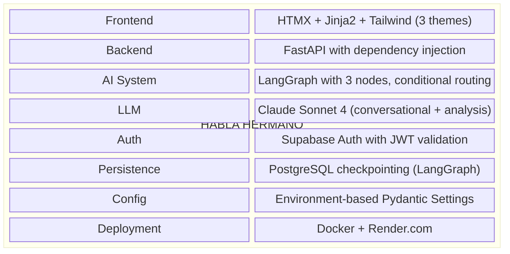
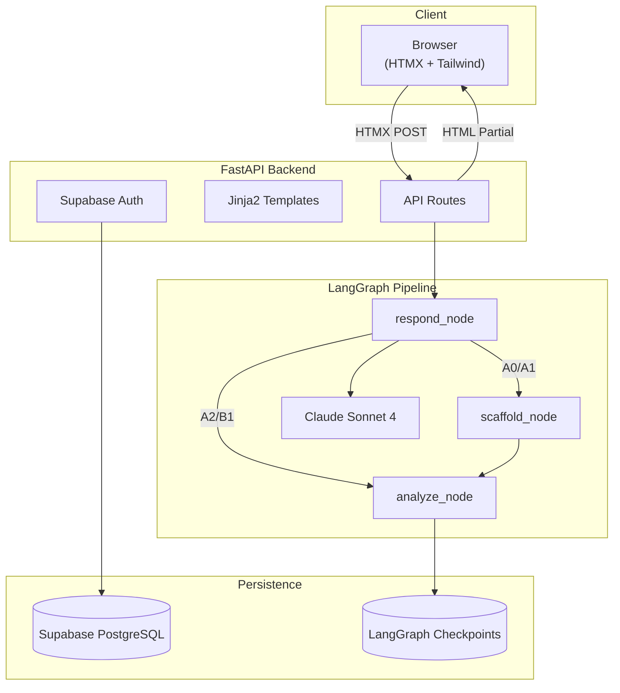
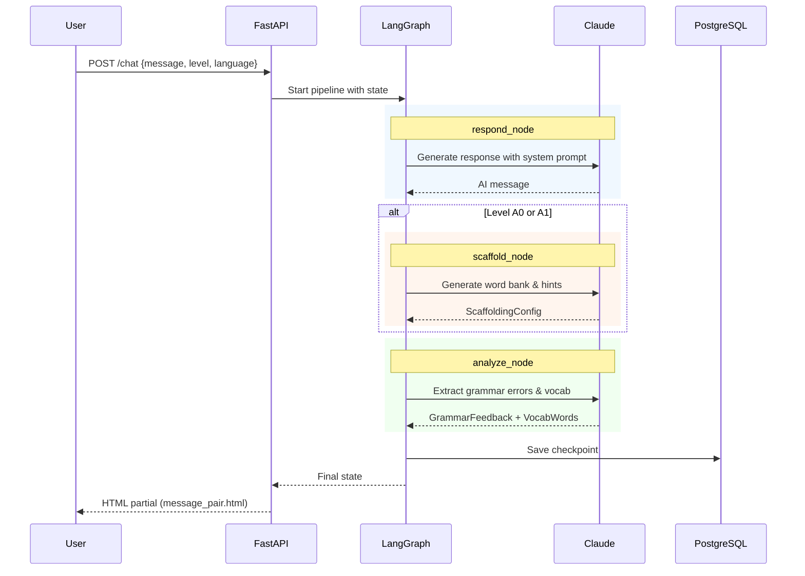
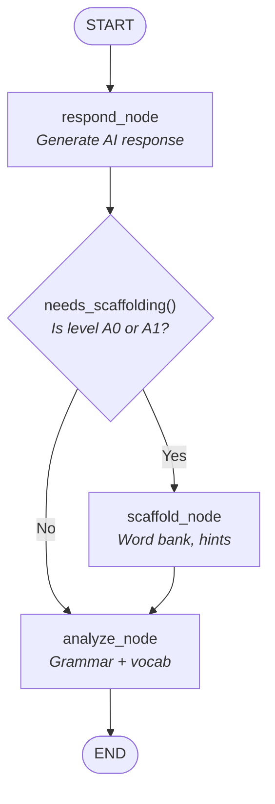

# Habla Hermano: Crash Course

**Version**: 1.0 | **Tests**: 829 | **Coverage**: 86%+ | **Date**: January 2026

> 📚 AI-powered conversational language tutor for Spanish, German, and French

---

## Executive Summary

This crash course documents everything about **Habla Hermano** — an AI-powered conversational language tutor that teaches languages from complete beginner (A0) to intermediate level (B1) through real conversations, not flashcards.

### What We Built



### Key Achievements

- ✅ 3-node LangGraph pipeline with conditional routing
- ✅ Hermano personality system (supportive "big brother" character)
- ✅ Level-adaptive scaffolding (word banks, hints, sentence starters)
- ✅ Grammar feedback with gentle corrections
- ✅ Supabase Auth with JWT validation
- ✅ PostgreSQL conversation persistence via LangGraph checkpointing
- ✅ Three languages: Spanish, German, French
- ✅ Four proficiency levels: A0, A1, A2, B1
- ✅ 829 tests with 86%+ coverage, strict typing
- ✅ 3 themes: Dark, Light, Ocean

---

## Table of Contents

1. [Architecture Overview](#1-architecture-overview)
2. [Technology Stack](#2-technology-stack)
3. [Project Structure](#3-project-structure)
4. [Data Flow Pipeline](#4-data-flow-pipeline)
5. [LangGraph Pipeline](#5-langgraph-pipeline)
6. [Hermano Personality System](#6-hermano-personality-system)
7. [API Design](#7-api-design)
8. [Database Schema](#8-database-schema)
9. [Frontend Architecture](#9-frontend-architecture)
10. [Configuration](#10-configuration)
11. [Testing Strategy](#11-testing-strategy)
12. [Development Workflow](#12-development-workflow)
13. [Deployment](#13-deployment)
14. [Quick Reference](#14-quick-reference)

---

## 1. Architecture Overview

### High-Level Flow



### Design Decisions

| Decision | Choice | Rationale |
|----------|--------|-----------|
| Pipeline Framework | LangGraph | StateGraph with conditional routing for level-based behavior |
| LLM | Claude Sonnet 4 | Superior language understanding for multiple languages |
| Frontend | HTMX + Jinja2 | Server-driven UI, no complex JS framework |
| Auth | Supabase Auth | Managed auth with JWT, easy integration |
| Persistence | PostgreSQL + LangGraph | Conversation checkpointing with AsyncPostgresSaver |
| Config | Pydantic Settings | Type-safe, environment-based configuration |

---

## 2. Technology Stack

### Backend

| Technology | Version | Purpose |
|------------|---------|---------|
| Python | 3.12 | Runtime |
| FastAPI | ≥0.110 | Web framework |
| LangGraph | ≥0.2 | Conversation orchestration |
| langchain-anthropic | ≥0.1 | Claude integration |
| Pydantic | ≥2.0 | Data validation |
| Supabase | ≥2.0 | Auth & PostgreSQL |
| langgraph-checkpoint-postgres | ≥2.0 | Conversation persistence |

### Frontend

| Technology | Purpose |
|------------|---------|
| HTMX | Server-driven HTML swapping |
| Jinja2 | Server-side templating |
| Tailwind CSS | Utility-first styling |
| CSS Variables | Theme system |
| Alpine.js | Lightweight reactivity |

### DevOps

| Technology | Purpose |
|------------|---------|
| Docker | Containerization |
| uv | Fast package management |
| ruff | Linting + formatting |
| mypy | Type checking |
| pytest | Testing framework |

---

## 3. Project Structure

```
habla-hermano/
├── src/
│   ├── api/                          # FastAPI application
│   │   ├── main.py                   # App creation, lifespan, routes
│   │   ├── config.py                 # Settings from env vars
│   │   ├── dependencies.py           # DI: templates, settings
│   │   ├── auth.py                   # JWT validation
│   │   ├── session.py                # Session management
│   │   ├── supabase_client.py        # Supabase client singleton
│   │   └── routes/
│   │       ├── chat.py               # POST /chat, GET /
│   │       ├── auth.py               # Signup, login, logout
│   │       ├── lessons.py            # Micro-lessons (planned)
│   │       └── progress.py           # Stats endpoints (planned)
│   │
│   ├── agent/                        # LangGraph conversation engine
│   │   ├── graph.py                  # StateGraph with routing
│   │   ├── state.py                  # ConversationState TypedDict
│   │   ├── prompts.py                # System prompts by level
│   │   ├── routing.py                # Conditional edge functions
│   │   ├── checkpointer.py           # Postgres/Memory checkpointer
│   │   └── nodes/
│   │       ├── respond.py            # Generate AI response
│   │       ├── scaffold.py           # Word banks & hints (A0-A1)
│   │       ├── analyze.py            # Grammar & vocab extraction
│   │       └── feedback.py           # Format corrections
│   │
│   ├── db/                           # Database layer
│   │   ├── models.py                 # Pydantic models
│   │   ├── repository.py             # Data access layer
│   │   └── seed.py                   # Initial data loader
│   │
│   ├── services/                     # Business logic
│   │   ├── vocabulary.py             # Vocab tracking
│   │   └── levels.py                 # Level detection
│   │
│   ├── templates/                    # Jinja2 HTML
│   │   ├── base.html                 # Layout with themes
│   │   ├── chat.html                 # Main chat interface
│   │   └── partials/
│   │       ├── message_pair.html     # User + AI message
│   │       ├── grammar_feedback.html # Collapsible tips
│   │       └── scaffold.html         # Word bank, hints
│   │
│   └── static/
│       ├── css/output.css            # Compiled Tailwind
│       └── js/app.js                 # HTMX handlers
│
├── tests/                            # 829 tests, 86%+ coverage
│   ├── conftest.py                   # Fixtures
│   ├── test_agent_*.py               # LangGraph tests
│   ├── test_api_*.py                 # API route tests
│   ├── test_auth*.py                 # Auth tests
│   ├── test_db_*.py                  # Database tests
│   └── test_services_*.py            # Service tests
│
├── docs/
│   ├── architecture.md
│   ├── api.md
│   ├── product.md
│   └── design/phase*.md
│
├── pyproject.toml
├── .env.example
├── Makefile
└── render.yaml
```

---

## 4. Data Flow Pipeline



---

## 5. LangGraph Pipeline

### Graph Structure



### State Schema

```python
class ConversationState(TypedDict):
    # Core conversation
    messages: Annotated[list[BaseMessage], add_messages]

    # User settings
    level: str              # A0, A1, A2, B1
    language: str           # es, de, fr

    # Analysis results
    grammar_feedback: NotRequired[list[GrammarFeedback]]
    new_vocabulary: NotRequired[list[VocabWord]]

    # Scaffolding (A0-A1 only)
    scaffolding: NotRequired[dict[str, Any]]
```

### Node Implementations

| Node | Purpose | Output |
|------|---------|--------|
| `respond_node` | Generate AI response using level prompt | AIMessage |
| `scaffold_node` | Create word bank, hints, sentence starters | ScaffoldingConfig |
| `analyze_node` | Extract grammar errors and vocabulary | GrammarFeedback[], VocabWord[] |

### Conditional Routing

```python
def needs_scaffolding(state: ConversationState) -> str:
    """Route based on learner level."""
    return "scaffold" if state["level"] in ["A0", "A1"] else "analyze"

graph.add_conditional_edges(
    "respond",
    needs_scaffolding,
    {"scaffold": "scaffold", "analyze": "analyze"},
)
```

---

## 6. Hermano Personality System

### The "Big Brother" Character

Hermano is a consistent personality adapted to each proficiency level:
- **Supportive**: Patient, encouraging, celebrates progress
- **Authentic**: Makes mistakes feel normal
- **Adaptive**: Language mix changes by level
- **Natural**: Conversations feel like chatting with a friend

### Language Adapter Pattern

```python
LANGUAGE_ADAPTER: dict[str, dict[str, str]] = {
    "es": {
        "language_name": "Spanish",
        "hello": "Hola",
        "my_name_is": "Me llamo",
    },
    "de": {
        "language_name": "German",
        "hello": "Hallo",
        "my_name_is": "Ich heiße",
    },
    "fr": {
        "language_name": "French",
        "hello": "Bonjour",
        "my_name_is": "Je m'appelle",
    },
}
```

### Personality by Level

| Level | Hermano's Approach | Language Mix | Topics |
|-------|-------------------|--------------|--------|
| **A0** | Heavy encouragement | 80% English, 20% target | Greetings, numbers, colors |
| **A1** | Chill friend | 50/50 mix | Daily routine, family, food |
| **A2** | Challenges while fun | 80% target, 20% English | Travel, shopping, experiences |
| **B1** | Peer conversation | 95%+ target | News, opinions, culture |

---

## 7. API Design

### Core Endpoints

| Method | Endpoint | Purpose |
|--------|----------|---------|
| GET | `/` | Render chat page |
| POST | `/chat` | Send message, get AI response |
| POST | `/new` | Start new conversation |
| POST | `/auth/signup` | Register user |
| POST | `/auth/login` | Authenticate |
| POST | `/auth/logout` | Sign out |
| GET | `/lessons` | List lessons |
| GET | `/progress` | User statistics |

### Chat Request/Response

```python
# Request (Form Data)
message: str          # User's message
level: str = "A1"     # CEFR level
language: str = "es"  # Language code

# Response (HTML Partial)
# Returns message_pair.html with:
# - user_message
# - ai_response
# - grammar_feedback (list)
# - new_vocabulary (list)
# - scaffolding (dict, A0-A1 only)
```

---

## 8. Database Schema

### Supabase Tables

**user_profiles**
```sql
id: UUID (FK to auth.users)
display_name: TEXT
preferred_language: TEXT DEFAULT 'es'
current_level: TEXT DEFAULT 'A1'
created_at: TIMESTAMP
updated_at: TIMESTAMP
```

**vocabulary**
```sql
id: SERIAL PRIMARY KEY
user_id: UUID
word: TEXT
translation: TEXT
language: TEXT
part_of_speech: TEXT
first_seen_at: TIMESTAMP
times_seen: INT DEFAULT 1
times_correct: INT DEFAULT 0
```

**learning_sessions**
```sql
id: SERIAL PRIMARY KEY
user_id: UUID
started_at: TIMESTAMP
ended_at: TIMESTAMP
language: TEXT
level: TEXT
messages_count: INT
words_learned: INT
```

**lesson_progress**
```sql
user_id: UUID
lesson_id: TEXT
completed_at: TIMESTAMP
score: INT
```

---

## 9. Frontend Architecture

### Technologies

| Component | Technology |
|-----------|------------|
| HTML Swapping | HTMX |
| Templating | Jinja2 |
| Styling | Tailwind CSS |
| Themes | CSS Variables |
| Reactivity | Alpine.js |

### Theme System

```css
:root {
  --color-bg-primary: #ffffff;
  --color-text-primary: #000000;
  --color-accent: #3b82f6;
}

.theme-dark {
  --color-bg-primary: #1f2937;
  --color-text-primary: #f3f4f6;
}

.theme-ocean {
  --color-bg-primary: #0f3460;
  --color-text-primary: #e0e0e0;
}
```

### HTMX Pattern

```html
<form hx-post="/chat"
      hx-target="#chat-container"
      hx-swap="beforeend">
    <input name="message" />
    <button type="submit">Send</button>
</form>
```

---

## 10. Configuration

### Environment Variables

```bash
# Required
ANTHROPIC_API_KEY=sk-ant-...

# Supabase
SUPABASE_URL=https://xxx.supabase.co
SUPABASE_ANON_KEY=eyJ...
SUPABASE_DB_URL=postgresql://...  # For checkpointing
SUPABASE_SERVICE_KEY=eyJ...       # For admin ops

# Application
APP_NAME="Habla Hermano"
DEBUG=false
LLM_MODEL=claude-sonnet-4-20250514
LLM_TEMPERATURE=0.7
HOST=127.0.0.1
PORT=8000
```

### Pydantic Settings

```python
class Settings(BaseSettings):
    ANTHROPIC_API_KEY: str
    SUPABASE_URL: str | None = None
    SUPABASE_ANON_KEY: str | None = None
    SUPABASE_DB_URL: str | None = None

    APP_NAME: str = "Habla Hermano"
    DEBUG: bool = False
    LLM_MODEL: str = "claude-sonnet-4-20250514"

    model_config = SettingsConfigDict(
        env_file=".env",
        env_file_encoding="utf-8",
    )
```

---

## 11. Testing Strategy

### Coverage: 86%+ (829 tests)

### Test Categories

| Category | Files | Focus |
|----------|-------|-------|
| Agent | 8 | LangGraph nodes, state, routing |
| API | 5 | FastAPI endpoints |
| Auth | 3 | JWT validation, auth flows |
| Database | 3 | Models, repository |
| Services | 2 | Vocabulary, levels |
| Integration | 3 | End-to-end flows |

### Key Fixtures

```python
@pytest.fixture
def mock_settings():
    """Mock settings for tests."""
    return Settings(ANTHROPIC_API_KEY="test-key")

@pytest.fixture
def mock_compiled_graph():
    """Mock LangGraph for API tests."""
    mock = MagicMock()
    mock.ainvoke.return_value = {...}
    return mock

@pytest.fixture
def auth_headers():
    """JWT auth headers for protected routes."""
    return {"Authorization": f"Bearer {test_token}"}
```

---

## 12. Development Workflow

### Quick Start

```bash
# Clone and setup
git clone https://github.com/darth-dodo/habla-hermano.git
cd habla-hermano
make install

# Configure
cp .env.example .env
# Edit .env with ANTHROPIC_API_KEY

# Run
make dev
# Visit http://localhost:8000
```

### Makefile Commands

| Command | Description |
|---------|-------------|
| `make install` | Install dependencies with uv |
| `make dev` | Run dev server (auto-reload) |
| `make test` | Run pytest with coverage |
| `make lint` | Run Ruff linting |
| `make format` | Auto-format code |
| `make typecheck` | Run MyPy |
| `make check` | All quality gates |

---

## 13. Deployment

### Render.com

```yaml
# render.yaml
services:
  - type: web
    name: habla-hermano
    env: python
    buildCommand: pip install uv && uv sync --frozen --no-dev
    startCommand: uv run uvicorn src.api.main:app --host 0.0.0.0 --port $PORT
    healthCheckPath: /health
    envVars:
      - key: ANTHROPIC_API_KEY
        sync: false
      - key: SUPABASE_URL
        sync: false
      - key: SUPABASE_ANON_KEY
        sync: false
```

### Docker

```dockerfile
FROM python:3.12-slim
WORKDIR /app

COPY --from=ghcr.io/astral-sh/uv:latest /uv /bin/uv
COPY pyproject.toml uv.lock ./
RUN uv sync --frozen --no-dev

COPY src ./src
EXPOSE 8000
CMD ["uv", "run", "uvicorn", "src.api.main:app", "--host", "0.0.0.0", "--port", "8000"]
```

---

## 14. Quick Reference

### Key Files

```
src/api/main.py              # FastAPI app entry
src/api/config.py            # Settings
src/api/routes/chat.py       # Chat endpoint
src/agent/graph.py           # LangGraph pipeline
src/agent/nodes/*.py         # Pipeline nodes
src/agent/prompts.py         # Level-specific prompts
```

### Commands

```bash
make dev          # Start server
make test         # Run tests
make check        # All quality gates
make format       # Auto-fix style
```

### API Quick Test

```bash
# Health check
curl http://localhost:8000/health

# Send message
curl -X POST http://localhost:8000/chat \
  -d "message=Hola&level=A1&language=es"
```

---

*Crash Course v1.0 — Habla Hermano (829 tests, 86%+ coverage, LangGraph Pipeline)*
