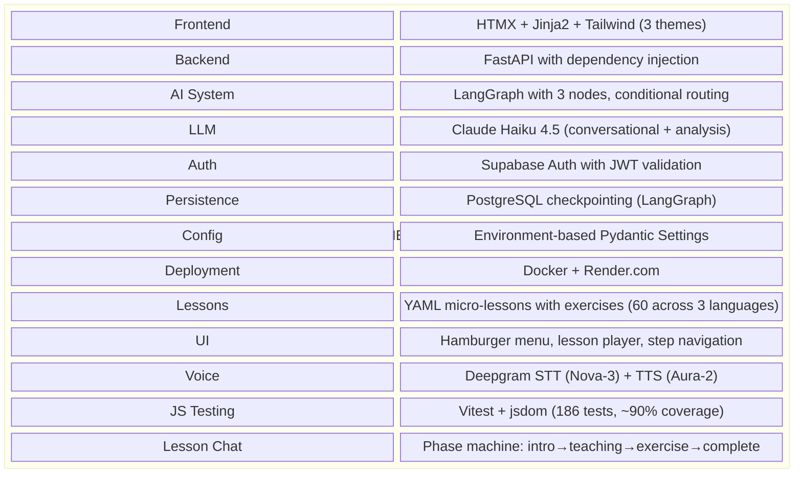
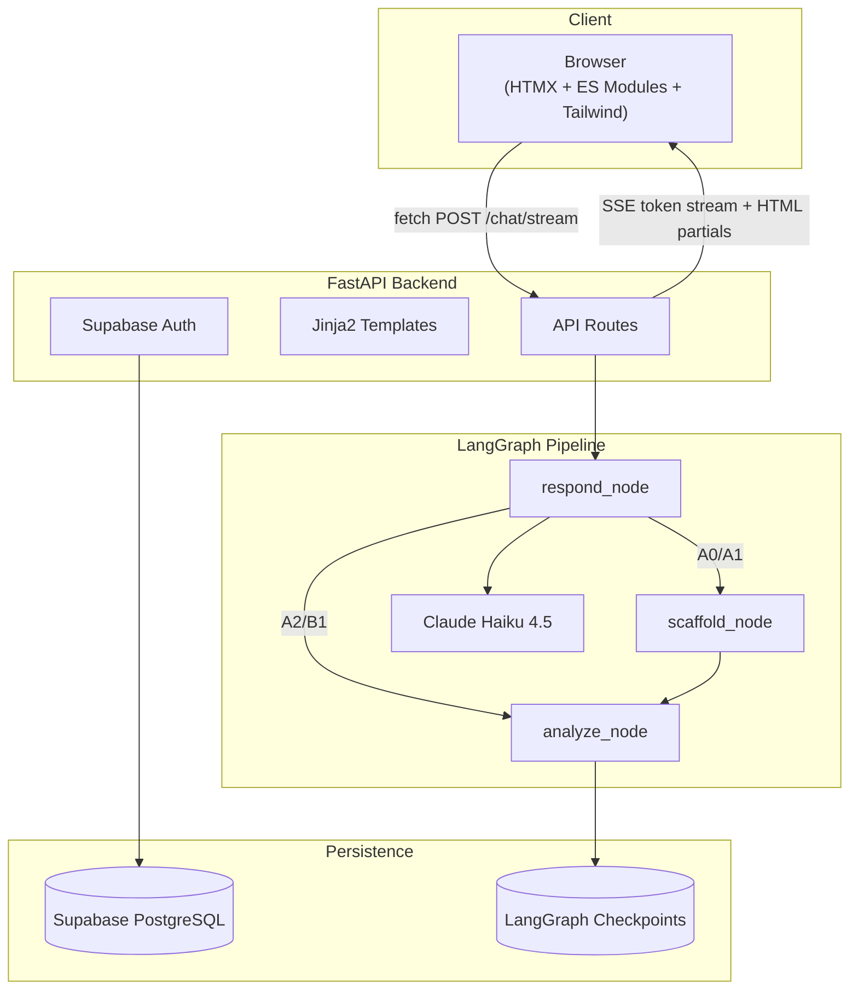
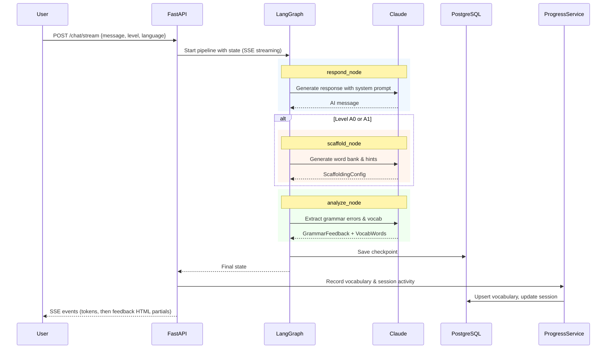
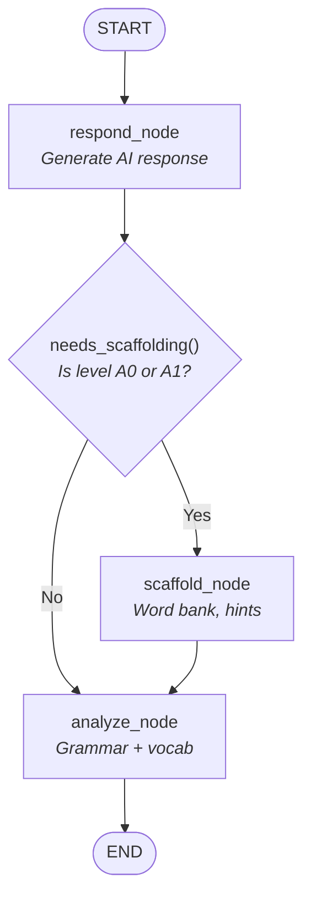

# Habla Hermano: Crash Course

**Version**: 2.0 | **Tests**: 2312+ | **Coverage**: 97% | **Date**: February 2026

> 📚 AI-powered conversational language tutor for Spanish, German, and French

---

## Executive Summary

This crash course documents everything about **Habla Hermano** — an AI-powered conversational language tutor that teaches languages from complete beginner (A0) to intermediate level (B1) through real conversations, structured micro-lessons, and interactive exercises.

### What We Built


```mermaid
block-beta
    columns 1
    block:stack["HABLA HERMANO"]
        columns 2
        A["Frontend"] B["HTMX + Jinja2 + Tailwind (3 themes)"]
        C["Backend"] D["FastAPI with dependency injection"]
        E["AI System"] F["LangGraph with 3 nodes, conditional routing"]
        G["LLM"] H["Claude Haiku 4.5 (conversational + analysis)"]
        I["Auth"] J["Supabase Auth with JWT validation"]
        K["Persistence"] L["PostgreSQL checkpointing (LangGraph)"]
        M["Config"] N["Environment-based Pydantic Settings"]
        O["Deployment"] P["Docker + Render.com"]
        Q["Lessons"] R["YAML micro-lessons with exercises (60 across 3 languages)"]
        S["UI"] T["Hamburger menu, lesson player, step navigation"]
        U["Voice"] V["Deepgram STT (Nova-3) + TTS (Aura-2)"]
        W["JS Testing"] X["Vitest + jsdom (186 tests, ~90% coverage)"]
        Y["Lesson Chat"] Z["Phase machine: intro→teaching→exercise→complete"]
    end
```

### Key Achievements

- ✅ 3-node LangGraph pipeline with conditional routing
- ✅ Hermano personality system (supportive "big brother" character)
- ✅ Level-adaptive scaffolding (word banks, hints, sentence starters)
- ✅ Grammar feedback with gentle corrections
- ✅ Supabase Auth with JWT validation
- ✅ PostgreSQL conversation persistence via LangGraph checkpointing
- ✅ Three languages: Spanish, German, French
- ✅ Four proficiency levels: A0, A1, A2, B1
- ✅ 2312+ tests (Python + JS) with 97% coverage, strict typing
- ✅ Nordic Minimal design with 3 themes: Light, Dark, Ocean
- ✅ Mobile-responsive: safe areas, dynamic viewport, touch optimization
- ✅ Collapsible pronunciation tips UI with level-based auto-expand
- ✅ Micro-lessons system: 60 lessons across all languages and levels
- ✅ Hamburger menu with Lessons, New Chat, Theme, Auth
- ✅ Guest access for chat (no persistence beyond LangGraph checkpointing)
- ✅ Progress tracking dashboard with Chart.js visualizations
- ✅ User-authenticated Supabase client for RLS compliance
- ✅ AI-enhanced lessons via LangGraph subgraphs (Phase 9)
- ✅ Learning paths with structured progression: PathService, AdaptiveService (Phase 14)
- ✅ Daily adaptive recommendations based on path progress, vocab accuracy, review schedules
- ✅ Learn routes (/learn/, /learn/recommendation) with HTMX lazy-loaded partial
- ✅ Voice conversation: Deepgram STT/TTS via WebSocket proxy with graceful degradation
- ✅ ES Module architecture: 6 JavaScript modules with Vitest test suite (186 tests)
- ✅ Mobile-first JS improvements: touch focus, scroll throttle, keyboard handling
- ✅ Floating TTS stop control with mutual exclusion (one TTS at a time)
- ✅ Conversational lesson delivery: Phase machine teaches lessons through chat UI (Phase 19)

---

## Table of Contents

1. [Architecture Overview](#1-architecture-overview)
2. [Technology Stack](#2-technology-stack)
3. [Project Structure](#3-project-structure)
4. [Data Flow Pipeline](#4-data-flow-pipeline)
5. [LangGraph Pipeline](#5-langgraph-pipeline)
6. [Hermano Personality System](#6-hermano-personality-system)
7. [Progress Tracking System](#7-progress-tracking-system)
8. [API Design](#8-api-design-continued)
9. [Database Schema](#9-database-schema)
10. [Frontend Architecture](#10-frontend-architecture)
11. [Configuration](#11-configuration)
12. [Testing Strategy](#12-testing-strategy)
13. [Development Workflow](#13-development-workflow)
14. [Deployment](#14-deployment)
15. [Quick Reference](#15-quick-reference)

---

## 1. Architecture Overview

### High-Level Flow


```mermaid
flowchart TB
    subgraph Client
        Browser["Browser<br/>(HTMX + ES Modules + Tailwind)"]
    end

    subgraph Server["FastAPI Backend"]
        API[API Routes]
        Templates[Jinja2 Templates]
        Auth[Supabase Auth]
    end

    subgraph Pipeline["LangGraph Pipeline"]
        Respond[respond_node]
        Scaffold[scaffold_node]
        Analyze[analyze_node]
        Claude["Claude Haiku 4.5"]
    end

    subgraph Storage["Persistence"]
        Supabase[(Supabase PostgreSQL)]
        Checkpoint[(LangGraph Checkpoints)]
    end

    Browser -->|fetch POST /chat/stream| API
    API -->|SSE token stream + HTML partials| Browser
    API --> Respond
    Respond --> Claude
    Respond -->|A0/A1| Scaffold
    Respond -->|A2/B1| Analyze
    Scaffold --> Analyze
    Analyze --> Checkpoint
    Auth --> Supabase
```

### Design Decisions

| Decision | Choice | Rationale |
|----------|--------|-----------|
| Pipeline Framework | LangGraph | StateGraph with conditional routing for level-based behavior |
| LLM | Claude Haiku 4.5 | Superior language understanding for multiple languages |
| Frontend | HTMX + Jinja2 + ES Modules | Server-driven UI; chat uses SSE streaming via modules/stream.js, other pages use HTMX |
| Auth | Supabase Auth | Managed auth with JWT, easy integration |
| Persistence | PostgreSQL + LangGraph | Conversation checkpointing with AsyncPostgresSaver |
| Config | Pydantic Settings | Type-safe, environment-based configuration |

---

## 2. Technology Stack

### Backend

| Technology | Version | Purpose |
|------------|---------|---------|
| Python | 3.12 | Runtime |
| FastAPI | ≥0.110 | Web framework |
| LangGraph | ≥0.2 | Conversation orchestration |
| langchain-anthropic | ≥0.1 | Claude integration |
| Pydantic | ≥2.0 | Data validation |
| Supabase | ≥2.0 | Auth & PostgreSQL |
| langgraph-checkpoint-postgres | ≥2.0 | Conversation persistence |

### Frontend

| Technology | Purpose |
|------------|---------|
| HTMX | Server-driven HTML swapping |
| Jinja2 | Server-side templating |
| Tailwind CSS | Utility-first styling |
| CSS Variables | Theme system |
| Alpine.js | Lightweight reactivity |

### Voice

| Technology | Purpose |
|------------|---------|
| Deepgram Nova-3 | Speech-to-text (STT) via WebSocket proxy |
| Deepgram Aura-2 | Text-to-speech (TTS) via REST proxy |

### JS Testing

| Technology | Purpose |
|------------|---------|
| Vitest | JavaScript unit test runner |
| jsdom | Browser environment simulation |

### DevOps

| Technology | Purpose |
|------------|---------|
| Docker | Containerization |
| uv | Fast package management |
| ruff | Linting + formatting |
| mypy | Type checking |
| pytest | Testing framework |

---

## 3. Project Structure

```
habla-hermano/
├── src/
│   ├── config.py                         # Canonical Settings + get_settings (inner layers import from here)
│   ├── validation.py                     # Canonical domain validation constants and helpers (VALID_LANGUAGES, VALID_LEVELS, etc.)
│   │
│   ├── api/                          # FastAPI application
│   │   ├── main.py                   # App creation, lifespan, routes
│   │   ├── config.py                 # Re-export shim → delegates to src/config.py
│   │   ├── dependencies.py           # DI: templates, settings
│   │   ├── auth.py                   # JWT validation
│   │   ├── session.py                # Session management
│   │   ├── supabase_client.py        # Re-export shim → delegates to src/db/client.py
│   │   ├── validation.py             # Re-export shim → delegates to src/validation.py
│   │   ├── middleware.py             # SecurityHeadersMiddleware + CSRFMiddleware
│   │   ├── streaming.py              # SSE streaming: StreamResult, stream_chat_events()
│   │   └── routes/
│   │       ├── chat.py               # POST /chat, POST /chat/stream (SSE), GET /
│   │       ├── auth.py               # Signup, login, logout
│   │       ├── lessons.py            # Micro-lessons (list, play, exercises, completion)
│   │       ├── progress.py           # Dashboard, vocabulary, chart-data endpoints
│   │       ├── review.py             # Spaced repetition review sessions (auth-only)
│   │       ├── learn.py              # Learning paths & adaptive recommendations
│   │       ├── voice.py              # WebSocket STT proxy + REST TTS endpoint (Deepgram)
│   │       └── lesson_chat.py        # Conversational lesson delivery (Phase 19)
│   │
│   ├── agent/                        # LangGraph conversation engine
│   │   ├── graph.py                  # StateGraph with routing
│   │   ├── state.py                  # ConversationState TypedDict
│   │   ├── prompts.py                # System prompts by level
│   │   ├── routing.py                # Conditional edge functions
│   │   ├── checkpointer.py           # Postgres/Memory checkpointer
│   │   └── nodes/
│   │       ├── respond.py            # Generate AI response
│   │       ├── scaffold.py           # Word banks & hints (A0-A1)
│   │       ├── analyze.py            # Grammar & vocab extraction
│   │       ├── lesson.py             # AI-enhanced lesson nodes
│   │       ├── feedback.py           # Format corrections
│   │       └── lesson_chat.py        # Lesson chat node (Phase 19)
│   │
│   ├── agent/
│   │   ├── lesson_state.py           # LessonState for lesson subgraph
│   │   ├── lesson_graph.py           # Lesson and exercise subgraphs
│   │   ├── lesson_chat_state.py      # LessonChatState for lesson chat graph (Phase 19)
│   │   ├── lesson_chat_graph.py      # Lesson chat graph builder (Phase 19)
│   │   └── prompts_lesson_chat.py    # Lesson chat system prompts (Phase 19)
│   │
│   ├── lessons/                      # Micro-lessons system
│   │   ├── models.py                 # Pydantic lesson, step, exercise models
│   │   └── service.py               # YAML loading, filtering, vocabulary extraction
│   │
│   ├── db/                           # Database layer
│   │   ├── client.py                 # Canonical Supabase client factory (get_supabase, get_supabase_admin)
│   │   ├── models.py                 # Pydantic models
│   │   ├── repository.py             # Data access layer
│   │   └── seed.py                   # Initial data loader
│   │
│   ├── services/                     # Business logic
│   │   ├── vocabulary.py             # Vocab tracking
│   │   ├── levels.py                 # Level detection
│   │   ├── progress.py               # ProgressService: dashboard aggregation
│   │   ├── review.py                 # ReviewService: spaced repetition (SM-2)
│   │   ├── paths.py                  # PathService: structured learning paths per language
│   │   ├── adaptive.py               # AdaptiveService: daily adaptive recommendations
│   │   └── lesson_completion.py      # Lesson completion logic (ExerciseFeedback, CompletionResult, check_exercise_answer, complete_lesson_and_persist)
│   │
│   ├── templates/                    # Jinja2 HTML
│   │   ├── base.html                 # Layout with themes, safe areas, dynamic viewport
│   │   ├── chat.html                 # Chat interface with hamburger menu, mobile-responsive
│   │   ├── lessons.html              # Lesson catalog page
│   │   ├── lesson_player.html        # Interactive lesson player
│   │   ├── progress.html             # Progress dashboard with charts
│   │   ├── learn.html                # Learning paths overview page
│   │   └── partials/
│   │       ├── message_pair.html     # User + AI message
│   │       ├── grammar_feedback.html # Collapsible grammar tips
│   │       ├── pronunciation_tips.html # Collapsible pronunciation tips
│   │       ├── scaffold.html         # Word bank, hints
│   │       ├── lesson_step.html      # Step content by type
│   │       ├── lesson_exercise.html  # Exercise forms
│   │       ├── lesson_complete.html  # Completion celebration
│   │       ├── progress_vocab.html   # Vocabulary list partial
│   │       ├── stats_summary.html    # Stats card partial
│   │       └── learn_recommendation.html # Adaptive recommendation partial (HTMX)
│   │
│   └── static/
│       ├── css/output.css            # Compiled Tailwind
│       └── js/
│           ├── main.js               # Entry point, imports all modules
│           ├── pcm-processor.js      # AudioWorklet for mobile STT
│           └── modules/
│               ├── dom.js            # DOM utilities, scroll, focus
│               ├── htmx-handlers.js  # HTMX event handlers
│               ├── scaffold.js       # Click-to-insert word bank
│               ├── shortcuts.js      # Keyboard shortcuts
│               ├── stream.js         # SSE streaming client (fetch + ReadableStream)
│               └── voice.js          # Deepgram STT/TTS (mic capture, playback)
│
├── tests/                            # 2312+ tests (Python + JS), 97% coverage
│   ├── conftest.py                   # Fixtures
│   ├── agent/
│   │   ├── test_graph.py             # LangGraph pipeline tests
│   │   ├── test_state.py             # ConversationState tests
│   │   ├── test_prompts.py           # System prompt tests
│   │   ├── test_routing.py           # Conditional routing tests
│   │   ├── test_checkpointer.py      # Checkpointer tests
│   │   ├── test_review_graph.py      # Review subgraph tests
│   │   ├── test_coverage.py          # Agent coverage tests
│   │   └── nodes/
│   │       ├── test_nodes.py         # Node integration tests
│   │       ├── test_analyze.py       # analyze_node tests
│   │       ├── test_scaffold.py      # scaffold_node tests
│   │       └── test_review.py        # Review node tests
│   ├── api/
│   │   ├── test_auth.py              # JWT validation tests
│   │   ├── test_config.py            # Settings tests
│   │   ├── test_csrf.py              # CSRF middleware tests (15 tests)
│   │   ├── test_session.py           # Session management tests
│   │   ├── test_supabase_client.py   # Supabase client tests
│   │   ├── test_data_capture.py      # Data capture tests
│   │   ├── test_persistence.py       # Persistence tests
│   │   └── routes/
│   │       ├── test_chat.py          # POST /chat endpoint tests
│   │       ├── test_auth.py          # Auth route tests
│   │       ├── test_learn.py         # Learn route tests
│   │       ├── test_lessons.py       # Lesson route tests
│   │       ├── test_progress.py      # Progress route tests
│   │       ├── test_review.py        # Review route tests
│   │       ├── test_validation.py    # Validation tests
│   │       ├── test_voice.py         # Voice STT/TTS route tests
│   │       └── test_e2e.py           # End-to-end route tests
│   ├── db/
│   │   ├── test_models.py            # Database model tests
│   │   └── test_repository.py        # Repository tests
│   ├── lessons/
│   │   ├── test_models.py            # Lesson data model tests
│   │   └── test_service.py           # Lesson service tests
│   └── services/
│       ├── test_adaptive.py          # AdaptiveService tests
│       ├── test_coverage.py          # Service coverage tests
│       ├── test_progress.py          # ProgressService tests
│       ├── test_review.py            # ReviewService tests
│       ├── test_paths.py             # PathService tests
│       ├── test_levels.py            # Level detection tests
│       └── test_vocabulary.py        # Vocabulary tracking tests
│
├── docs/
│   ├── architecture.md
│   ├── api.md
│   ├── product.md
│   └── design/phase*.md
│
├── data/
│   └── lessons/                      # YAML lesson content (60 total lessons)
│       ├── es/                       # Spanish lessons
│       │   ├── A0/                   # 5 lessons (greetings, introductions, numbers, colors, family)
│       │   ├── A1/                   # 5 lessons
│       │   ├── A2/                   # 5 lessons
│       │   └── B1/                   # 5 lessons
│       ├── de/                       # German lessons
│       │   ├── A0/                   # 5 lessons
│       │   ├── A1/                   # 5 lessons
│       │   ├── A2/                   # 5 lessons
│       │   └── B1/                   # 5 lessons
│       └── fr/                       # French lessons
│           ├── A0/                   # 5 lessons
│           ├── A1/                   # 5 lessons
│           ├── A2/                   # 5 lessons
│           └── B1/                   # 5 lessons
│
├── pyproject.toml
├── .env.example
├── Makefile
└── render.yaml
```

---

## 4. Data Flow Pipeline


```mermaid
sequenceDiagram
    participant U as User
    participant API as FastAPI
    participant G as LangGraph
    participant AI as Claude
    participant DB as PostgreSQL
    participant PS as ProgressService

    U->>API: POST /chat/stream {message, level, language}
    API->>G: Start pipeline with state (SSE streaming)

    rect rgb(240, 248, 255)
        Note over G,AI: respond_node
        G->>AI: Generate response with system prompt
        AI-->>G: AI message
    end

    alt Level A0 or A1
        rect rgb(255, 245, 238)
            Note over G,AI: scaffold_node
            G->>AI: Generate word bank & hints
            AI-->>G: ScaffoldingConfig
        end
    end

    rect rgb(240, 255, 240)
        Note over G,AI: analyze_node
        G->>AI: Extract grammar errors & vocab
        AI-->>G: GrammarFeedback + VocabWords
    end

    G->>DB: Save checkpoint
    G-->>API: Final state
    API->>PS: Record vocabulary & session activity
    PS->>DB: Upsert vocabulary, update session
    API-->>U: SSE events (tokens, then feedback HTML partials)
```

### Progress Capture (Authenticated Users Only)

For authenticated users, `ProgressService.record_chat_activity()` persists data after each chat interaction using a user-authenticated Supabase client (RLS-compliant):
- **Vocabulary**: New words extracted by analyze_node (upsert with times_seen counter)
- **Sessions**: Active learning session tracking (language, level, message count)

Guest users receive grammar feedback and pronunciation tips in the response but no data is persisted to the database.

---

## 5. LangGraph Pipeline

### Graph Structure


```mermaid
flowchart TB
    START([START])
    respond["respond_node<br/><i>Generate AI response</i>"]
    check{"needs_scaffolding()<br/><i>Is level A0 or A1?</i>"}
    scaffold["scaffold_node<br/><i>Word bank, hints</i>"]
    analyze["analyze_node<br/><i>Grammar + vocab</i>"]
    END([END])

    START --> respond
    respond --> check
    check -->|Yes| scaffold
    check -->|No| analyze
    scaffold --> analyze
    analyze --> END
```

### State Schema

```python
class ConversationState(TypedDict):
    # Core conversation
    messages: Annotated[list[BaseMessage], add_messages]

    # User settings
    level: str              # A0, A1, A2, B1
    language: str           # es, de, fr

    # Analysis results
    grammar_feedback: NotRequired[list[GrammarFeedback]]
    new_vocabulary: NotRequired[list[VocabWord]]
    pronunciation_tips: NotRequired[list[PronunciationTip]]  # Pronunciation guidance

    # Scaffolding (A0-A1 only)
    scaffolding: NotRequired[dict[str, Any]]
```

### Node Implementations

| Node | Purpose | Output |
|------|---------|--------|
| `respond_node` | Generate AI response using level prompt | AIMessage |
| `scaffold_node` | Create word bank, hints, sentence starters | ScaffoldingConfig |
| `analyze_node` | Extract grammar errors, vocabulary, and pronunciation tips | GrammarFeedback[], VocabWord[], PronunciationTip[] |

### Lesson Subgraph Nodes (Phase 9)

| Node | Purpose | Output |
|------|---------|--------|
| `load_step_node` | Load step data from YAML lessons | step_type, step_content, vocabulary |
| `enhance_step_node` | Hermano enhances with personalized content | enhanced_content, hermano_intro |
| `validate_exercise_node` | Validate answer with AI feedback | is_correct, exercise_feedback |

### Lesson Chat Graph (Phase 19)

```
START → lesson_respond → END
  Phase machine: intro → teaching → exercise_ask → exercise_eval → complete
```

### Conditional Routing

```python
def needs_scaffolding(state: ConversationState) -> str:
    """Route based on learner level."""
    return "scaffold" if state["level"] in ["A0", "A1"] else "analyze"

graph.add_conditional_edges(
    "respond",
    needs_scaffolding,
    {"scaffold": "scaffold", "analyze": "analyze"},
)
```

---

## 6. Hermano Personality System

### The "Big Brother" Character

Hermano is a consistent personality adapted to each proficiency level:
- **Supportive**: Patient, encouraging, celebrates progress
- **Authentic**: Makes mistakes feel normal
- **Adaptive**: Language mix changes by level
- **Natural**: Conversations feel like chatting with a friend

### Language Adapter Pattern

```python
LANGUAGE_ADAPTER: dict[str, dict[str, str]] = {
    "es": {
        "language_name": "Spanish",
        "hello": "Hola",
        "my_name_is": "Me llamo",
    },
    "de": {
        "language_name": "German",
        "hello": "Hallo",
        "my_name_is": "Ich heiße",
    },
    "fr": {
        "language_name": "French",
        "hello": "Bonjour",
        "my_name_is": "Je m'appelle",
    },
}
```

### Personality by Level

| Level | Hermano's Approach | Language Mix | Topics |
|-------|-------------------|--------------|--------|
| **A0** | Heavy encouragement | 80% English, 20% target | Greetings, numbers, colors |
| **A1** | Chill friend | 50/50 mix | Daily routine, family, food |
| **A2** | Challenges while fun | 80% target, 20% English | Travel, shopping, experiences |
| **B1** | Peer conversation | 95%+ target | News, opinions, culture |

---

## 7. Progress Tracking System

### ProgressService Architecture

The `ProgressService` aggregates data from vocabulary, session, and lesson repositories into dashboard-ready statistics and chart data structures.

```python
class ProgressService:
    """Read-heavy service for dashboard rendering. Authenticated users only."""

    def __init__(self, user_id: str, client: SupabaseClient | None = None):
        self._vocab_repo = VocabularyRepository(user_id, client=client)
        self._session_repo = LearningSessionRepository(user_id, client=client)
        self._lesson_repo = LessonProgressRepository(user_id, client=client)

    def get_dashboard_stats(self, language: str = "es") -> DashboardStats
    def get_chart_data(self, language: str = "es", days: int = 30) -> ChartData
    def record_chat_activity(self, language: str, level: str, new_vocab: list) -> None
```

Routes pass a user-authenticated Supabase client (`get_supabase_for_user(sb_access_token)`) so that all database queries respect RLS.

### Dashboard Data Structures

| Structure | Fields | Purpose |
|-----------|--------|---------|
| `DashboardStats` | total_words, total_sessions, lessons_completed, current_streak, accuracy_rate, words_learned_today, messages_today | Summary cards |
| `ChartData` | vocab_growth[], accuracy_trend[] | Chart.js visualization |
| `VocabGrowthPoint` | date, cumulative_words | Vocabulary growth line chart |
| `AccuracyPoint` | date, accuracy | Accuracy trend line chart |

### Guest Model (Simplified)

Guests get **chat only** with no persistent data tracking:

- **Chat**: Full conversational functionality via LangGraph checkpointing (session cookie)
- **Grammar feedback**: Returned inline in chat responses
- **Pronunciation tips**: Returned inline in chat responses
- **Scaffolding**: Word banks and hints for A0-A1 levels

Guests do **not** get: vocabulary tracking, progress dashboard, lesson progress, or spaced repetition review. These features require authentication.

### Auth Pattern for Data Operations

All data operations (progress, vocabulary, review) use a **user-authenticated Supabase client** so that PostgreSQL Row-Level Security (RLS) policies work via `auth.uid()`:

```python
from src.api.supabase_client import get_supabase_for_user

# In route handlers, read the token from the cookie:
sb_access_token: Annotated[str | None, Cookie(alias="sb-access-token")] = None

# Then create a user-scoped client:
user_client = get_supabase_for_user(sb_access_token)
service = ProgressService(user.id, client=user_client)
```

This replaced the earlier pattern of using `get_supabase_admin()` (service-role client that bypassed RLS) for guest operations. The admin client is no longer used in progress or review routes.

---

## 8. API Design (continued)

### Core Endpoints

| Method | Endpoint | Purpose |
|--------|----------|---------|
| GET | `/` | Render chat page |
| POST | `/chat` | Send message, get AI response (non-streaming fallback) |
| POST | `/chat/stream` | Send message, get SSE streaming response (used by modules/stream.js) |
| POST | `/new` | Start new conversation |
| POST | `/auth/signup` | Register user |
| POST | `/auth/login` | Authenticate |
| POST | `/auth/logout` | Sign out |
| GET | `/lessons/` | Lesson catalog |
| GET | `/lessons/{id}/play` | Lesson player |
| POST | `/lessons/{id}/step/next` | Next step navigation |
| POST | `/lessons/{id}/exercise/{id}/submit` | Submit exercise answer |
| POST | `/lessons/{id}/complete` | Mark lesson complete |
| POST | `/lessons/{id}/handoff` | Chat handoff |
| GET | `/progress/` | Progress dashboard page |
| GET | `/progress/vocabulary` | Vocabulary list partial (HTMX) |
| GET | `/progress/stats` | Stats summary partial (HTMX) |
| GET | `/progress/chart-data` | JSON chart data for Chart.js |
| DELETE | `/progress/vocabulary/{id}` | Remove word from vocabulary |
| GET | `/learn/` | Learning paths overview page |
| GET | `/learn/recommendation` | Adaptive recommendation partial (HTMX) |

### Chat Request/Response

```python
# Request (Form Data)
message: str          # User's message
level: str = "A1"     # CEFR level
language: str = "es"  # Language code

# Response (HTML Partial)
# Returns message_pair.html with:
# - user_message
# - ai_response
# - grammar_feedback (list)
# - new_vocabulary (list)
# - scaffolding (dict, A0-A1 only)
```

---

## 9. Database Schema

### Supabase Tables

**user_profiles**
```sql
id: UUID (FK to auth.users)
display_name: TEXT
preferred_language: TEXT DEFAULT 'es'
current_level: TEXT DEFAULT 'A1'
created_at: TIMESTAMP
updated_at: TIMESTAMP
```

**vocabulary**
```sql
id: SERIAL PRIMARY KEY
user_id: UUID
word: TEXT
translation: TEXT
language: TEXT
part_of_speech: TEXT
first_seen_at: TIMESTAMP
times_seen: INT DEFAULT 1
times_correct: INT DEFAULT 0
```

**learning_sessions**
```sql
id: SERIAL PRIMARY KEY
user_id: UUID
started_at: TIMESTAMP
ended_at: TIMESTAMP
language: TEXT
level: TEXT
messages_count: INT
words_learned: INT
```

**lesson_progress**
```sql
user_id: UUID
lesson_id: TEXT
completed_at: TIMESTAMP
score: INT
```

---

## 10. Frontend Architecture

### Technologies

| Component | Technology |
|-----------|------------|
| HTML Swapping | HTMX |
| Templating | Jinja2 |
| Styling | Tailwind CSS |
| Themes | CSS Variables |
| Reactivity | Alpine.js |

### Theme System

```css
:root {
  --color-bg-primary: #ffffff;
  --color-text-primary: #000000;
  --color-accent: #3b82f6;
}

.theme-dark {
  --color-bg-primary: #1f2937;
  --color-text-primary: #f3f4f6;
}

.theme-ocean {
  --color-bg-primary: #0f3460;
  --color-text-primary: #e0e0e0;
}
```

### JavaScript ES Module Architecture

The frontend JavaScript is organized as ES Modules loaded via `main.js`:

| Module | Path | Purpose |
|--------|------|---------|
| `main.js` | `src/static/js/main.js` | Entry point, imports and initializes all modules |
| `dom.js` | `src/static/js/modules/dom.js` | DOM utilities, scroll throttle, touch focus |
| `htmx-handlers.js` | `src/static/js/modules/htmx-handlers.js` | HTMX event handlers (afterSwap, etc.) |
| `scaffold.js` | `src/static/js/modules/scaffold.js` | Click-to-insert word bank interactions |
| `shortcuts.js` | `src/static/js/modules/shortcuts.js` | Keyboard shortcuts (Ctrl+Enter, etc.) |
| `stream.js` | `src/static/js/modules/stream.js` | SSE streaming client (fetch + ReadableStream) |
| `voice.js` | `src/static/js/modules/voice.js` | Deepgram STT/TTS (mic capture, playback, floating stop control) |
| `pcm-processor.js` | `src/static/js/pcm-processor.js` | AudioWorklet for mobile STT PCM encoding |

### Chat Form Submission

The chat form uses **modules/stream.js** (fetch + ReadableStream) to POST to `/chat/stream` and parse SSE events for real-time token streaming. The form submit is intercepted by JavaScript; HTMX is **not** used for chat submission. Other parts of the UI (lessons, progress, review, learn) continue to use HTMX for partial updates.

### HTMX Pattern (non-chat pages)

```html
<!-- Used for lessons, progress, review, learn — NOT for chat submission -->
<form hx-post="/lessons/{id}/step/next"
      hx-target="#step-content"
      hx-swap="innerHTML">
    ...
</form>
```

---

## 11. Configuration

### Environment Variables

```bash
# Required
ANTHROPIC_API_KEY=sk-ant-...

# Supabase
SUPABASE_URL=https://xxx.supabase.co
SUPABASE_ANON_KEY=eyJ...
SUPABASE_DB_URL=postgresql://...  # For checkpointing
SUPABASE_SERVICE_KEY=eyJ...       # For admin ops

# Application
APP_NAME="Habla Hermano"
DEBUG=false
LLM_MODEL=claude-haiku-4-5-20251001
LLM_TEMPERATURE=0.7
HOST=127.0.0.1
PORT=8000
```

### Pydantic Settings

```python
class Settings(BaseSettings):
    ANTHROPIC_API_KEY: str
    SUPABASE_URL: str | None = None
    SUPABASE_ANON_KEY: str | None = None
    SUPABASE_DB_URL: str | None = None

    APP_NAME: str = "Habla Hermano"
    DEBUG: bool = False
    LLM_MODEL: str = "claude-haiku-4-5-20251001"

    model_config = SettingsConfigDict(
        env_file=".env",
        env_file_encoding="utf-8",
    )
```

---

## 12. Testing Strategy

### Coverage: 97% (2312+ tests: Python + JS)

### Test Categories

| Category | Directory | Focus |
|----------|-----------|-------|
| Agent | `tests/agent/` | LangGraph nodes, state, routing, checkpointer |
| Agent Nodes | `tests/agent/nodes/` | Individual node tests (analyze, scaffold, review) |
| API | `tests/api/` | Auth, config, CSRF, session, supabase client |
| API Routes | `tests/api/routes/` | Chat, auth, learn, lessons, progress, review, e2e |
| Database | `tests/db/` | Models, repository |
| Lessons | `tests/lessons/` | Lesson models, lesson service |
| Services | `tests/services/` | Adaptive, coverage, progress, review, paths, levels, vocabulary |

### Key Fixtures

```python
@pytest.fixture
def mock_settings():
    """Mock settings for tests."""
    return Settings(ANTHROPIC_API_KEY="test-key")  # pragma: allowlist secret

@pytest.fixture
def mock_compiled_graph():
    """Mock LangGraph for API tests."""
    mock = MagicMock()
    mock.ainvoke.return_value = {...}
    return mock

@pytest.fixture
def auth_headers():
    """JWT auth headers for protected routes."""
    return {"Authorization": f"Bearer {test_token}"}
```

---

## 13. Development Workflow

### Quick Start

```bash
# Clone and setup
git clone https://github.com/darth-dodo/habla-hermano.git
cd habla-hermano
make install

# Configure
cp .env.example .env
# Edit .env with ANTHROPIC_API_KEY

# Run
make dev
# Visit http://localhost:8000
```

### Makefile Commands

| Command | Description |
|---------|-------------|
| `make install` | Install dependencies with uv |
| `make dev` | Run dev server (auto-reload) |
| `make test` | Run pytest with coverage |
| `make lint` | Run Ruff linting |
| `make format` | Auto-format code |
| `make typecheck` | Run MyPy |
| `make check` | All quality gates |

---

## 14. Deployment

### Render.com

```yaml
# render.yaml
services:
  - type: web
    name: habla-hermano
    env: python
    buildCommand: pip install uv && uv sync --frozen --no-dev
    startCommand: uv run uvicorn src.api.main:app --host 0.0.0.0 --port $PORT
    healthCheckPath: /health
    envVars:
      - key: ANTHROPIC_API_KEY
        sync: false
      - key: SUPABASE_URL
        sync: false
      - key: SUPABASE_ANON_KEY
        sync: false
```

### Docker

```dockerfile
FROM python:3.12-slim
WORKDIR /app

COPY --from=ghcr.io/astral-sh/uv:latest /uv /bin/uv
COPY pyproject.toml uv.lock ./
RUN uv sync --frozen --no-dev

COPY src ./src
EXPOSE 8000
CMD ["uv", "run", "uvicorn", "src.api.main:app", "--host", "0.0.0.0", "--port", "8000"]
```

---

## 15. Quick Reference

### Key Files

```
src/config.py                # Canonical Settings + get_settings
src/validation.py            # Canonical domain validation (VALID_LANGUAGES, VALID_LEVELS)
src/api/main.py              # FastAPI app entry
src/api/config.py            # Re-export shim → src/config.py
src/api/middleware.py         # SecurityHeadersMiddleware + CSRFMiddleware
src/api/routes/chat.py       # Chat endpoints (POST /chat, POST /chat/stream)
src/api/streaming.py         # SSE streaming logic
src/static/js/main.js        # JS entry point (imports all modules)
src/static/js/modules/stream.js  # SSE client (fetch + ReadableStream)
src/static/js/modules/voice.js   # Deepgram STT/TTS client
src/api/routes/voice.py      # WebSocket STT proxy + REST TTS endpoint
src/api/routes/progress.py   # Progress dashboard endpoints
src/db/client.py             # Canonical Supabase client factory
src/agent/graph.py           # LangGraph pipeline
src/agent/nodes/*.py         # Pipeline nodes
src/agent/prompts.py         # Level-specific prompts
src/services/progress.py     # ProgressService: dashboard aggregation
src/services/lesson_completion.py  # Lesson completion business logic
src/services/review.py       # ReviewService: spaced repetition (SM-2)
src/services/paths.py        # PathService: structured learning paths per language
src/services/adaptive.py     # AdaptiveService: daily adaptive recommendations
src/api/routes/learn.py      # Learn routes: paths overview, recommendation partial
```

### Commands

```bash
make dev          # Start server
make test         # Run tests
make check        # All quality gates
make format       # Auto-fix style
```

### API Quick Test

```bash
# Health check
curl http://localhost:8000/health

# Send message
curl -X POST http://localhost:8000/chat \
  -d "message=Hola&level=A1&language=es"
```

---

*Crash Course v2.0 — Habla Hermano (2312+ tests, 97% coverage, LangGraph Pipeline + Micro-Lessons + AI-Enhanced Lessons + Progress Tracking + Collapsible Pronunciation Tips + Mobile Responsive + Learning Paths & Adaptive Recommendations + Voice Conversation + ES Module Architecture + Conversational Lessons)*
