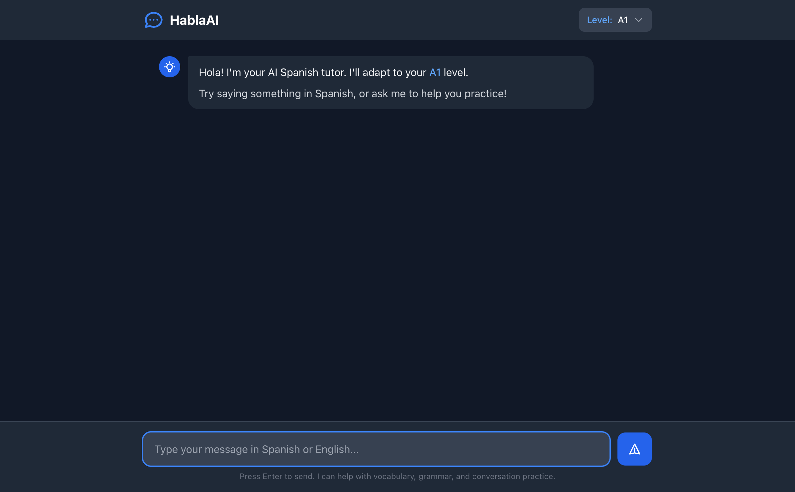
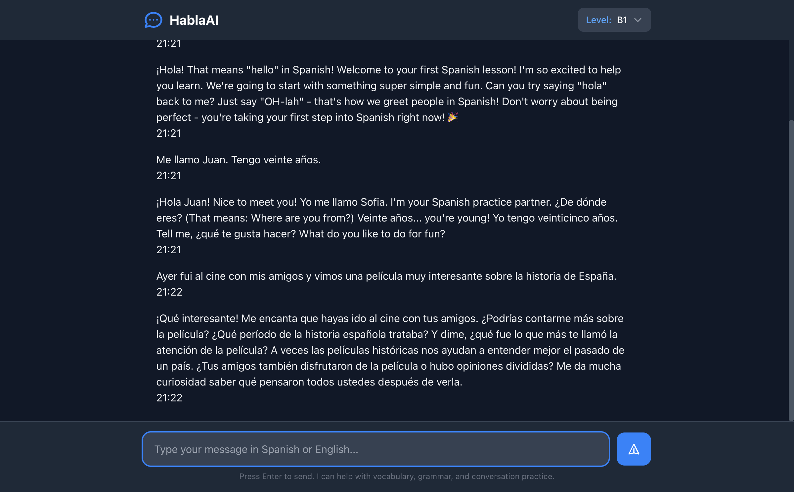

# Habla Hermano E2E Testing with Playwright

> End-to-end test documentation for the Habla Hermano language tutor application.

## Test Summary

| Test | Status | Description |
|------|--------|-------------|
| Chat Page Load | ✅ Pass | Homepage loads with correct elements |
| Level Selector | ✅ Pass | Dropdown shows all 4 CEFR levels |
| A0 Chat Flow | ✅ Pass | Absolute beginner gets English-heavy response |
| A1 Chat Flow | ✅ Pass | Beginner gets 50/50 Spanish/English mix |
| B1 Chat Flow | ✅ Pass | Intermediate gets 95%+ Spanish response |
| Grammar Feedback | ✅ Pass | Analyze node detects errors, feedback UI works |
| A0 Scaffold | ✅ Pass | Auto-expanded scaffold with word bank + translations |
| A1 Scaffold | ✅ Pass | Collapsed scaffold, expandable on click |
| B1 No Scaffold | ✅ Pass | Conditional routing skips scaffold for higher levels |
| Word Bank Insert | ✅ Pass | Click word to insert into input field |
| Lesson Catalog | ✅ Pass | Lessons page renders with grouped lesson cards |
| Lesson Player | ✅ Pass | Step navigation, progress bar, content rendering |
| Exercise Submission | ✅ Pass | Multiple choice, fill blank answer validation |
| Lesson Completion | ✅ Pass | Completion view with score and handoff option |
| Hamburger Menu | ✅ Pass | Menu opens with Lessons, New Chat, Theme, Auth links |

---

## Test Environment

- **URL**: http://127.0.0.1:8000
- **Browser**: Chromium (via Playwright MCP)
- **Date**: 2026-01-27 (Phase 6 + UI update)
- **Previous Dates**: 2025-01-18 (Phase 3), 2025-01-17 (Phase 2), 2025-01-16 (Phase 1)

---

## Test Flows

### 1. Chat Page Initial Load

**Steps**:
1. Navigate to http://127.0.0.1:8000/
2. Verify page loads with title "Chat - Habla Hermano"

**Expected Elements**:
- Header with "Habla Hermano" branding
- Level selector dropdown (default: A1)
- Welcome message adapting to selected level
- Message input field with placeholder
- Send button

**Screenshot**:


**Result**: ✅ Pass

---

### 2. Level Selector Functionality

**Steps**:
1. Click level selector dropdown
2. Verify all 4 options displayed

**Expected Options**:
- A0 Complete Beginner
- A1 Beginner
- A2 Elementary
- B1 Intermediate

**Behavior**:
- Selecting a level updates the dropdown display
- Welcome message updates to reflect new level
- Hidden form input syncs with selection

**Result**: ✅ Pass

---

### 3. A0 (Complete Beginner) Chat Flow

**Purpose**: Verify absolute beginners receive English-heavy responses with minimal Spanish.

**Steps**:
1. Select "A0 Complete Beginner" from dropdown
2. Type: "Hello, I want to learn Spanish!"
3. Click Send

**Expected Response Characteristics**:
- ~80% English, ~20% Spanish
- Introduces only one Spanish word at a time
- Celebratory and encouraging tone
- Pronunciation guidance (e.g., "OH-lah")
- Simple yes/no or single-word practice

**Actual Response**:
> ¡Hola! That means "hello" in Spanish! Welcome to your first Spanish lesson! I'm so excited to help you learn. We're going to start with something super simple and fun. Can you try saying "hola" back to me? Just say "OH-lah" - that's how we greet people in Spanish! Don't worry about being perfect - you're taking your first step into Spanish right now! 🎉

**Screenshot**:


**Result**: ✅ Pass - Response is mostly English with only "hola" introduced

---

### 4. A1 (Beginner) Chat Flow

**Purpose**: Verify beginners receive balanced Spanish/English responses.

**Steps**:
1. Select "A1 Beginner" from dropdown
2. Type: "Me llamo Juan. Tengo veinte años."
3. Click Send

**Expected Response Characteristics**:
- ~50% Spanish, ~50% English
- Short sentences (5-8 words)
- Present tense focus
- Translation provided when needed
- Natural conversation flow

**Actual Response**:
> ¡Hola Juan! Nice to meet you! Yo me llamo Sofia. I'm your Spanish practice partner. ¿De dónde eres? (That means: Where are you from?) Veinte años... you're young! Yo tengo veinticinco años. Tell me, ¿qué te gusta hacer? What do you like to do for fun?

**Screenshot**:


**Result**: ✅ Pass - Good 50/50 mix with translations for new phrases

---

### 5. B1 (Intermediate) Chat Flow

**Purpose**: Verify intermediate learners receive nearly all-Spanish responses.

**Steps**:
1. Select "B1 Intermediate" from dropdown
2. Type: "Ayer fui al cine con mis amigos y vimos una película muy interesante sobre la historia de España."
3. Click Send

**Expected Response Characteristics**:
- ~95%+ Spanish
- Complex sentences and questions
- Use of subjunctive, conditionals
- Idiomatic expressions
- Asks for opinions and elaboration

**Actual Response**:
> ¡Qué interesante! Me encanta que hayas ido al cine con tus amigos. ¿Podrías contarme más sobre la película? ¿Qué período de la historia española trataba? Y dime, ¿qué fue lo que más te llamó la atención de la película? A veces las películas históricas nos ayudan a entender mejor el pasado de un país. ¿Tus amigos también disfrutaron de la película o hubo opiniones divididas? Me da mucha curiosidad saber qué pensaron todos ustedes después de verla.

**Screenshot**:


**Result**: ✅ Pass - Response is 100% Spanish with subjunctive ("hayas ido", "que pensaron")

---

### 6. Grammar Feedback (Phase 2)

**Purpose**: Verify analyze node detects grammar errors and feedback UI displays correctly.

**Steps**:
1. Select "A1 Beginner" from dropdown
2. Type message with intentional grammar error: "Yo soy muy bueno hoy. Me gusta el agua frio."
3. Click Send
4. Verify AI response appears
5. Verify grammar feedback section appears below response
6. Click to expand feedback

**Expected Behavior**:
- Grammar feedback section shows "1 grammar tip" badge
- Collapsible section expands on click
- Error details show original vs correction
- Severity color-coded (minor=sky, moderate=amber, significant=rose)
- Explanation is friendly and educational

**Actual Response**:

AI Response:
> ¡Hola! ¡Qué bueno que te sientes bien hoy! You're doing great with your Spanish! When you say "el agua," remember that agua is actually feminine (starts with "a" sound, so we use "el" but adjectives are still feminine). So it's "el agua fría" (cold water). ¿Te gusta el agua fría cuando hace calor? (Do you like cold water when it's hot?) Keep practicing!

Grammar Feedback (1 tip):
- **Original**: "el agua frio"
- **Correction**: "el agua fría"
- **Explanation**: "While 'agua' uses the article 'el' (because it starts with a stressed 'a'), it's still a feminine noun. The adjective 'frío' should agree with the feminine noun, so it becomes 'fría'."
- **Severity**: minor (sky blue)

**UI Behavior**:
- ✅ Feedback section appears collapsed by default
- ✅ Shows count badge: "1 grammar tip"
- ✅ Expands with smooth animation on click
- ✅ Color-coded severity (sky-400 for minor)
- ✅ Displays original → correction with arrow
- ✅ Accessible with ARIA labels

**Result**: ✅ Pass - Grammar feedback displays correctly with level-appropriate analysis

---

### 7. Scaffold Node (Phase 3)

**Purpose**: Verify scaffold node provides word banks and hints to A0-A1 learners, and that conditional routing correctly skips scaffold for higher levels.

#### 7a. A0 Scaffold (Auto-Expanded)

**Steps**:
1. Select "A0 Complete Beginner" from dropdown
2. Type: "Hello, I want to learn Spanish!"
3. Click Send
4. Verify AI response appears
5. Verify scaffold section appears below response

**Expected Behavior**:
- Scaffold section auto-expands for A0 learners
- Word bank shows 4-6 words with English translations in parentheses
- Hint text provides guidance in English
- Sentence starter (optional) helps begin response

**Actual Response**:

Scaffold Section (Auto-Expanded):
- **Word Bank**: "hola (hello)", "sí (yes)", "gracias (thank you)", "bien (good/well)"
- **Hint**: "Try responding to the greeting! You can say 'hola' back or answer a simple yes/no question."
- **Sentence Starter**: "Hola, yo..."

**UI Behavior**:
- ✅ Scaffold section appears automatically expanded
- ✅ Word bank displays as clickable chips/buttons
- ✅ Words include translations for A0 level
- ✅ Hint is displayed in clear English
- ✅ Sentence starter shown in italics

**Screenshot**:


**Result**: ✅ Pass - A0 scaffold auto-expands with translated word bank

---

#### 7b. A1 Scaffold (Collapsed by Default)

**Steps**:
1. Select "A1 Beginner" from dropdown
2. Type: "Hola, me llamo Maria"
3. Click Send
4. Verify scaffold section appears collapsed
5. Click to expand scaffold

**Expected Behavior**:
- Scaffold section collapsed by default for A1
- Shows "Need help responding?" prompt
- Expands to reveal word bank and hints on click
- Word bank may have fewer translations than A0

**Actual Response**:

Scaffold Section (Collapsed):
- Header shows "Need help responding?" with expand icon
- Click reveals word bank, hint, and optional sentence starter

Scaffold Section (Expanded):
- **Word Bank**: "también (also)", "mucho gusto (nice to meet you)", "¿cómo estás? (how are you?)", "bien (well)"
- **Hint**: "Try responding to the greeting and ask the tutor something about themselves!"
- **Sentence Starter**: "Mucho gusto, yo..."

**UI Behavior**:
- ✅ Scaffold section collapsed by default
- ✅ Shows "Need help responding?" header
- ✅ Expands with smooth animation on click
- ✅ Word bank chips are clickable
- ✅ Chevron icon rotates on expand/collapse

**Screenshots**:
- Collapsed: 
- Expanded: 

**Result**: ✅ Pass - A1 scaffold collapsed by default, expandable on click

---

#### 7c. B1 No Scaffold (Conditional Routing)

**Steps**:
1. Select "B1 Intermediate" from dropdown
2. Type: "Hola, quiero practicar mi español contigo"
3. Click Send
4. Verify AI response appears
5. Verify NO scaffold section appears

**Expected Behavior**:
- AI response displays normally
- No scaffold section rendered
- Grammar feedback may appear (Phase 2)
- Conditional routing in graph skips scaffold node for A2-B1

**Actual Response**:
- ✅ AI response in mostly Spanish (appropriate for B1)
- ✅ No scaffold section visible
- ✅ Grammar feedback section present (if errors detected)

**Screenshot**:


**Result**: ✅ Pass - B1 correctly skips scaffold via conditional routing

---

#### 7d. Word Bank Click-to-Insert

**Steps**:
1. Complete A0 or A1 chat flow with scaffold visible
2. Locate word bank section with clickable words
3. Click a word (e.g., "hola (hello)")
4. Verify word is inserted into message input field

**Expected Behavior**:
- Clicking word inserts it at cursor position in input
- Word is inserted without the translation portion
- Multiple words can be inserted
- Input field gains focus after insertion

**Actual Behavior**:
- ✅ Clicking "hola (hello)" inserts "hola" into input
- ✅ Translation "(hello)" is stripped before insertion
- ✅ Input field receives focus
- ✅ User can continue typing after insertion

**Result**: ✅ Pass - Word bank click-to-insert works correctly

---

## HTMX Integration Tests

### Form Submission

**Mechanism**: `hx-post="/chat"` with `hx-swap="beforeend"` on `#chat-messages`

**Verified Behaviors**:
- ✅ Form submits without page reload
- ✅ User message appears immediately
- ✅ AI response appends below user message
- ✅ Input field clears after submission
- ✅ Timestamps display correctly

### Level Selection

**Mechanism**: Alpine.js state management with hidden form input

**Verified Behaviors**:
- ✅ Dropdown opens/closes correctly
- ✅ Selection updates visual display
- ✅ Hidden `level` input syncs with selection
- ✅ Correct level sent with chat request

---

## UI/UX Observations

### Positive
- Dark theme is easy on the eyes
- Level selector is intuitive
- Messages are clearly distinguished (user vs AI)
- Timestamps provide conversation context

### Areas for Future Improvement
- Add message bubbles with avatars (currently plain text)
- Show loading indicator during AI response
- Add typing indicator for AI
- Mobile responsive testing needed

---

## Running Tests

### Prerequisites
```bash
# Start the dev server
make dev

# Or manually
source .venv/bin/activate
uvicorn src.api.main:app --reload
```

### Using Playwright MCP
Tests were run using the Playwright MCP server which provides:
- `browser_navigate` - Navigate to URLs
- `browser_snapshot` - Get accessibility tree
- `browser_click` - Click elements by ref
- `browser_type` - Type text in inputs
- `browser_take_screenshot` - Capture screenshots

---

## Test Data

### Messages by Level

| Level | Input Language | Expected Output Ratio |
|-------|---------------|----------------------|
| A0 | English | 80% EN / 20% ES |
| A1 | Basic Spanish | 50% EN / 50% ES |
| A2 | Elementary Spanish | 20% EN / 80% ES |
| B1 | Intermediate Spanish | 5% EN / 95% ES |

### Sample Inputs Used

```
A0: "Hello, I want to learn Spanish!"
A1: "Me llamo Juan. Tengo veinte años."
B1: "Ayer fui al cine con mis amigos y vimos una película muy interesante sobre la historia de España."
```

---

### 8. Lesson Catalog and Player (Phase 6)

**Purpose**: Verify micro-lessons system renders correctly with browsing, navigation, exercises, and completion.

**Steps**:
1. Navigate to http://127.0.0.1:8765/lessons/
2. Verify lesson cards render grouped by difficulty (Beginner/Intermediate)
3. Click a lesson card to open the player
4. Navigate through steps using Next/Previous buttons
5. Complete an exercise with correct answer
6. Reach completion view

**Expected Behavior**:
- Lesson cards show title, icon, level badge
- Player renders step content based on type (instruction, vocabulary, example, tip, practice)
- Progress bar updates on each step
- Exercises validate answers with feedback
- Completion view shows score and vocabulary count
- "Practice with Hermano" button redirects to chat

**Result**: ✅ Pass

---

### 9. Hamburger Menu Navigation

**Purpose**: Verify the consolidated header with hamburger menu works correctly.

**Steps**:
1. Navigate to http://127.0.0.1:8765/
2. Click the hamburger menu icon (3 horizontal lines)
3. Verify dropdown contains: Lessons, New Chat, Theme options, Login/Logout
4. Click "Lessons" link
5. Verify navigation to /lessons/ page

**Expected Behavior**:
- Hamburger icon renders on the left side of header
- Menu dropdown appears with smooth transition on click
- Menu items: 📚 Lessons, New Chat, Theme (Dark/Light/Ocean), Login
- Active theme is highlighted
- Click outside closes the menu
- Logo centered: 🗣️ Habla Hermano
- Language and Level selectors on the right side

**Result**: ✅ Pass

---

## Next Steps

1. **Automated Test Suite**: Convert manual tests to Playwright test scripts
2. **Mobile Testing**: Test on 375px viewport
3. **Error Handling**: Test API failures, network issues
4. ~~**Conversation Persistence**: Test when checkpointing is added (Phase 4)~~ ✅ Complete
5. ~~**Grammar Feedback**: Test analyze node when added (Phase 2)~~ ✅ Complete
6. ~~**Scaffold Node**: Test word bank and scaffolding UI (Phase 3)~~ ✅ Complete
7. ~~**Micro-Lessons**: Test lesson player and exercises (Phase 6)~~ ✅ Complete
8. ~~**Hamburger Menu**: Test navigation consolidation~~ ✅ Complete
9. **Vocabulary Tracking**: Test vocabulary display and persistence
10. **German/French Lessons**: Test lesson content for additional languages
