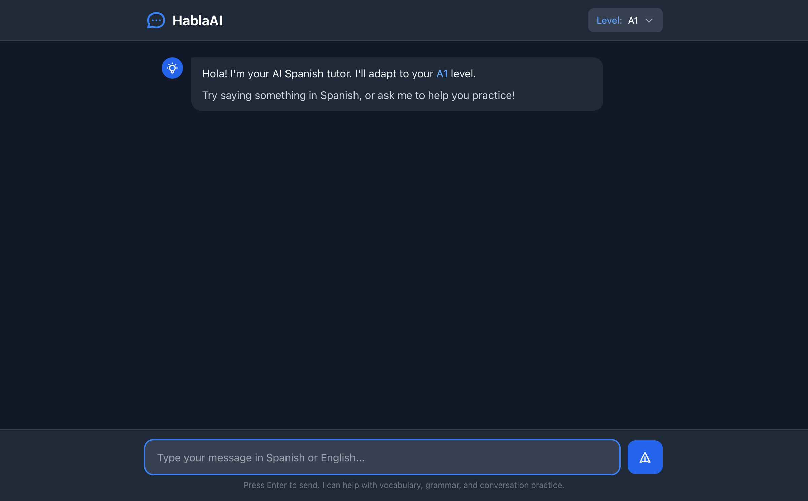
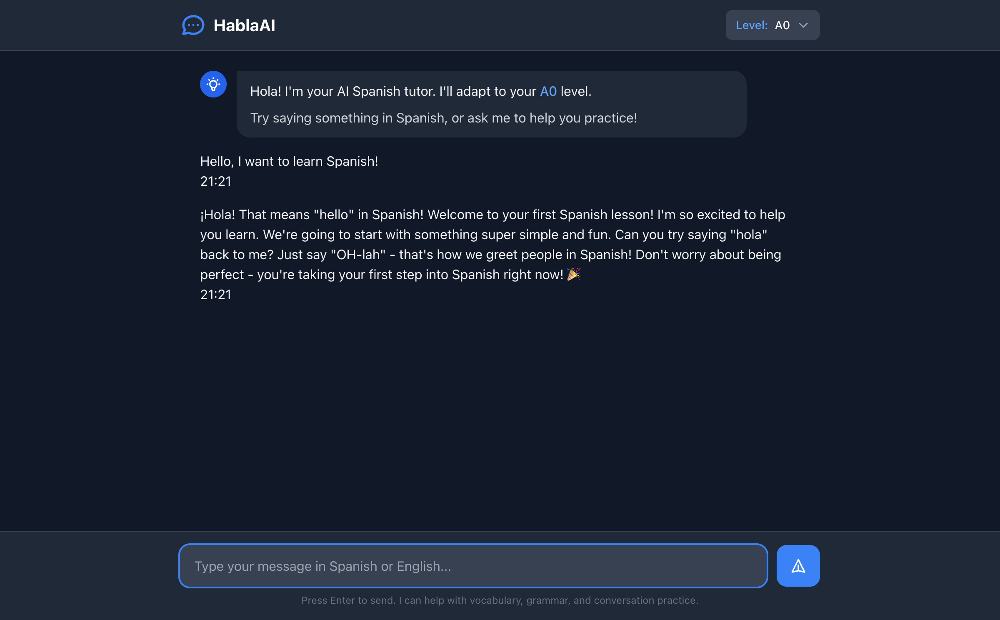
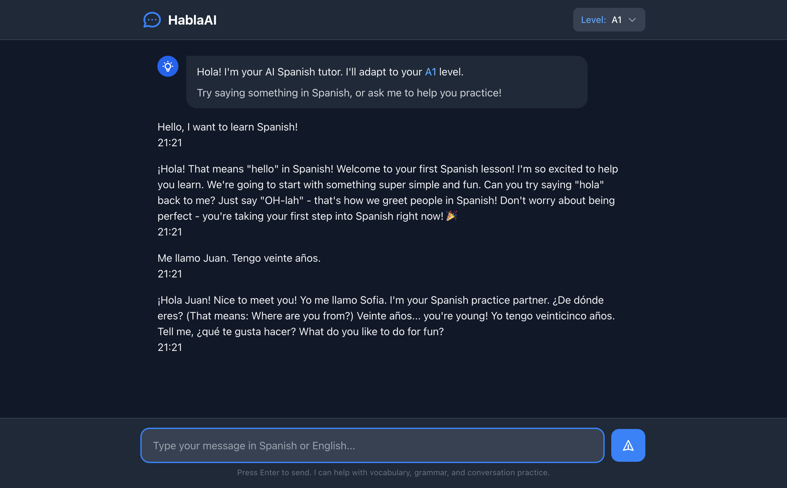
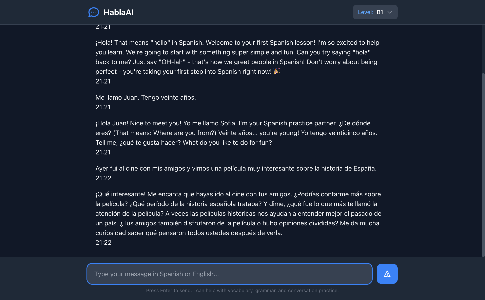

# Habla Hermano E2E Testing with Playwright

> End-to-end test documentation for the Habla Hermano language tutor application.

## Test Summary

| Test | Status | Description |
|------|--------|-------------|
| Chat Page Load | ✅ Pass | Homepage loads with correct elements |
| Level Selector | ✅ Pass | Dropdown shows all 4 CEFR levels |
| A0 Chat Flow | ✅ Pass | Absolute beginner gets English-heavy response |
| A1 Chat Flow | ✅ Pass | Beginner gets 50/50 Spanish/English mix |
| B1 Chat Flow | ✅ Pass | Intermediate gets 95%+ Spanish response |
| Grammar Feedback | ✅ Pass | Analyze node detects errors, feedback UI works |
| A0 Scaffold | ✅ Pass | Auto-expanded scaffold with word bank + translations |
| A1 Scaffold | ✅ Pass | Collapsed scaffold, expandable on click |
| B1 No Scaffold | ✅ Pass | Conditional routing skips scaffold for higher levels |
| Word Bank Insert | ✅ Pass | Click word to insert into input field |
| Lesson Catalog | ✅ Pass | Lessons page renders with grouped lesson cards |
| Lesson Chat Mode | ✅ Pass | Unified chat with lesson header, progress bar, phase machine |
| Exercise Submission | ✅ Pass | Multiple choice, fill blank answer validation |
| Lesson Completion | ✅ Pass | Completion view with score and handoff option |
| Hamburger Menu | ✅ Pass | Menu opens with Lessons, New Chat, Theme, Auth links |
| Progress Navigation | ✅ Pass | Guest can see Progress link in navigation |
| Progress Empty State | ✅ Pass | Guest with no cookie sees empty progress page |
| Progress Dashboard Stats | ✅ Pass | Progress page displays dashboard statistics |
| Vocabulary List | ✅ Pass | Vocabulary list renders with learned words |
| Chart Data Endpoint | ✅ Pass | Chart data endpoint returns valid JSON |
| Guest Session Persistence | ✅ Pass | Guest lesson completion creates session cookie |
| Guest Progress View | ✅ Pass | Guest can view their progress without login |
| Guest Empty State | ✅ Pass | Empty state shown for guests with no session |
| Guest Language Selector | ✅ Pass | Guest header has interactive language dropdown |
| Guest Level Selector | ✅ Pass | Guest header has interactive level dropdown |
| Lessons Language Redirect | ✅ Pass | Language switch on lessons page redirects correctly |
| Auth Sidebar Picker | ✅ Pass | New Chat shows inline language/level picker |
| Auth Picker Label Updates | ✅ Pass | Selecting language/level updates Start button dynamically |
| Auth Thread Creation | ✅ Pass | Picking language/level creates thread and redirects |
| Auth Read-Only Badges | ✅ Pass | Authenticated chat header shows read-only badges |
| Auth Thread Switching | ✅ Pass | Click thread in sidebar loads correct language/level/welcome |
| Auth Multi-Thread Sidebar | ✅ Pass | Multiple threads shown newest-first with correct flags |
| Auth Delete Cancel | ✅ Pass | Cancel dismisses confirmation, thread preserved |
| Auth Delete Confirm | ✅ Pass | Thread removed from sidebar after confirmation |
| Auth Delete Active Thread | ✅ Pass | Deleting active thread redirects to `/` |
| Auth Sidebar Collapse/Expand | ✅ Pass | Toggle preserves thread list |
| Auth Thread Rename | ✅ Pass | Right-click triggers inline rename, Enter submits |
| Auth Rename Cancel | ✅ Pass | Escape cancels rename, title reverts |
| Mobile Hamburger Toggle | ✅ Pass | Sidebar open/close cycle with pointer-events fix |
| Mobile Thread Creation | ✅ Pass | Picker works on mobile, sidebar auto-closes |
| Mobile Escape Close | ✅ Pass | Escape key closes mobile sidebar |
| Mobile Thread Switching | ✅ Pass | Navigate to thread + sidebar auto-close |
| Mobile Backdrop Close | ✅ Pass | Clicking dark overlay closes sidebar |
| Guest Language Switch | ✅ Pass | Interactive dropdown updates flag and welcome text |
| Guest Multi-Language Chat | ✅ Pass | A0 German chat returns English-heavy beginner response |
| Auth Login Valid | ✅ Pass | Valid credentials redirect to chat with read-only badges |
| Auth Login Invalid | ✅ Pass | Bad credentials return error response |
| Auth Signup Password Mismatch | ✅ Pass | Mismatched passwords show error, Cache-Control: no-store set |
| Auth Signup Short Password | ✅ Pass | Short password rejected with validation error |
| Auth Logout | ✅ Pass | GET /auth/logout clears session and redirects to login |
| Auth Guest State Post-Logout | ✅ Pass | Language/level dropdowns interactive again after logout |
| Privacy Page Guest | ✅ Pass | Guest sees info cards only, no data management controls |
| Privacy Page Authenticated | ✅ Pass | Authenticated user sees "Your data" and "Account" sections |
| Privacy Delete History Confirmation | ✅ Pass | Confirmation prompt shown before deletion |
| Privacy Delete History Cancel | ✅ Pass | Cancel restores Delete button, no deletion occurs |
| Privacy Delete Account Gated | ✅ Pass | Delete account button disabled until "DELETE" typed |
| Privacy Delete Account Cancel | ✅ Pass | Cancel restores Delete account button |
| Progress Dashboard | ✅ Pass | Stats (words, sessions, lessons, streak), charts, vocab list |
| Progress Vocabulary Tracking | ✅ Pass | Words from chat session appear in vocabulary list |
| Theme Switcher | ✅ Pass | 5 themes in picker; Sangria dark theme applies immediately |
| CSRF Protection | ✅ Pass | POST without HX-Request header returns 403 |
| Cache-Control No-Store Auth | ✅ Pass | Auth HTML responses include Cache-Control: no-store |
| CSP Connect-Src WSS Only | ✅ Pass | connect-src contains wss: only (no ws:) in production |
| X-XSS-Protection Removed | ✅ Pass | Deprecated X-XSS-Protection header absent from responses |
| Security Headers Present | ✅ Pass | X-Frame-Options: DENY, X-Content-Type-Options: nosniff, HSTS |
| 404 Custom Page | ✅ Pass | Unknown routes render custom 404 with Back to Chat link |
| SSE Token Streaming | 📋 Plan | Chat responses stream tokens via Server-Sent Events |
| Streaming Cursor | 📋 Plan | Blinking cursor visible during token streaming |
| Streaming Feedback Events | 📋 Plan | Grammar, pronunciation, scaffold events after stream |
| Voice Mic Button | 📋 Plan | Microphone button renders when voice is configured |
| Voice STT Transcription | 📋 Plan | Speech-to-text populates input field |
| Voice TTS Playback | 📋 Plan | TTS playback button on AI responses |
| Voice Speed Control | 📋 Plan | Speed selector supports 0.75x, 1x, 1.25x |
| Learning Path Page | 📋 Plan | Learning paths render with 4 CEFR level sections |
| Path Progress Indicators | 📋 Plan | Progress bars show completion per level |
| Continue Path Navigation | 📋 Plan | "Continue Path" navigates to next lesson |
| Review Warmup Prompt | 📋 Plan | Review session warmup appears in chat |
| Review Question Types | 📋 Plan | Translate, fill-blank, recognize questions render |
| SM-2 Scoring Update | 📋 Plan | SM-2 scores update after review completion |
| Lesson Chat Launch | 📋 Plan | Clicking lesson card navigates to /?lesson={id} in lesson mode |
| Lesson Chat Page Load | 📋 Plan | Lesson chat renders with lesson header, progress bar |
| Lesson Chat Auto-Start | 📋 Plan | Auto-start sends /start triggering Hermano intro |
| Lesson Teaching Phase | 📋 Plan | Teaching phase delivers batched content steps |
| Lesson Exercise Interaction | 📋 Plan | Type answer and receive feedback in lesson chat |
| Lesson Completion Panel | 📋 Plan | Completion shows score, vocab count, next link |
| Lesson Exit Button | 📋 Plan | "Exit Lesson" returns to lesson catalog |

---

## Test Environment

- **URL**: http://127.0.0.1:8000
- **Browser**: Chromium (via Playwright MCP)
- **Date**: 2026-03-16 (Conversation Threads)
- **Previous Dates**: 2026-03-09 (Phase 19), 2026-01-28 (Phase 7 + Phase 8), 2026-01-27 (Phase 6), 2025-01-18 (Phase 3), 2025-01-17 (Phase 2), 2025-01-16 (Phase 1)
- **Test Credentials**: See `.env.e2e` (gitignored) for authenticated flow testing

---

## Test Flows

### 1. Chat Page Initial Load

**Steps**:
1. Navigate to http://127.0.0.1:8000/
2. Verify page loads with title "Chat - Habla Hermano"

**Expected Elements**:
- Header with "Habla Hermano" branding
- Level selector dropdown (default: A1)
- Welcome message adapting to selected level
- Message input field with placeholder
- Send button

**Screenshot**:


**Result**: ✅ Pass

---

### 2. Level Selector Functionality

**Steps**:
1. Click level selector dropdown
2. Verify all 4 options displayed

**Expected Options**:
- A0 Complete Beginner
- A1 Beginner
- A2 Elementary
- B1 Intermediate

**Behavior**:
- Selecting a level updates the dropdown display
- Welcome message updates to reflect new level
- Hidden form input syncs with selection

**Result**: ✅ Pass

---

### 3. A0 (Complete Beginner) Chat Flow

**Purpose**: Verify absolute beginners receive English-heavy responses with minimal Spanish.

**Steps**:
1. Select "A0 Complete Beginner" from dropdown
2. Type: "Hello, I want to learn Spanish!"
3. Click Send

**Expected Response Characteristics**:
- ~80% English, ~20% Spanish
- Introduces only one Spanish word at a time
- Celebratory and encouraging tone
- Pronunciation guidance (e.g., "OH-lah")
- Simple yes/no or single-word practice

**Actual Response**:
> ¡Hola! That means "hello" in Spanish! Welcome to your first Spanish lesson! I'm so excited to help you learn. We're going to start with something super simple and fun. Can you try saying "hola" back to me? Just say "OH-lah" - that's how we greet people in Spanish! Don't worry about being perfect - you're taking your first step into Spanish right now! 🎉

**Screenshot**:


**Result**: ✅ Pass - Response is mostly English with only "hola" introduced

---

### 4. A1 (Beginner) Chat Flow

**Purpose**: Verify beginners receive balanced Spanish/English responses.

**Steps**:
1. Select "A1 Beginner" from dropdown
2. Type: "Me llamo Juan. Tengo veinte años."
3. Click Send

**Expected Response Characteristics**:
- ~50% Spanish, ~50% English
- Short sentences (5-8 words)
- Present tense focus
- Translation provided when needed
- Natural conversation flow

**Actual Response**:
> ¡Hola Juan! Nice to meet you! Yo me llamo Sofia. I'm your Spanish practice partner. ¿De dónde eres? (That means: Where are you from?) Veinte años... you're young! Yo tengo veinticinco años. Tell me, ¿qué te gusta hacer? What do you like to do for fun?

**Screenshot**:


**Result**: ✅ Pass - Good 50/50 mix with translations for new phrases

---

### 5. B1 (Intermediate) Chat Flow

**Purpose**: Verify intermediate learners receive nearly all-Spanish responses.

**Steps**:
1. Select "B1 Intermediate" from dropdown
2. Type: "Ayer fui al cine con mis amigos y vimos una película muy interesante sobre la historia de España."
3. Click Send

**Expected Response Characteristics**:
- ~95%+ Spanish
- Complex sentences and questions
- Use of subjunctive, conditionals
- Idiomatic expressions
- Asks for opinions and elaboration

**Actual Response**:
> ¡Qué interesante! Me encanta que hayas ido al cine con tus amigos. ¿Podrías contarme más sobre la película? ¿Qué período de la historia española trataba? Y dime, ¿qué fue lo que más te llamó la atención de la película? A veces las películas históricas nos ayudan a entender mejor el pasado de un país. ¿Tus amigos también disfrutaron de la película o hubo opiniones divididas? Me da mucha curiosidad saber qué pensaron todos ustedes después de verla.

**Screenshot**:


**Result**: ✅ Pass - Response is 100% Spanish with subjunctive ("hayas ido", "que pensaron")

---

### 6. Grammar Feedback (Phase 2)

**Purpose**: Verify analyze node detects grammar errors and feedback UI displays correctly.

**Steps**:
1. Select "A1 Beginner" from dropdown
2. Type message with intentional grammar error: "Yo soy muy bueno hoy. Me gusta el agua frio."
3. Click Send
4. Verify AI response appears
5. Verify grammar feedback section appears below response
6. Click to expand feedback

**Expected Behavior**:
- Grammar feedback section shows "1 grammar tip" badge
- Collapsible section expands on click
- Error details show original vs correction
- Severity color-coded (minor=sky, moderate=amber, significant=rose)
- Explanation is friendly and educational

**Actual Response**:

AI Response:
> ¡Hola! ¡Qué bueno que te sientes bien hoy! You're doing great with your Spanish! When you say "el agua," remember that agua is actually feminine (starts with "a" sound, so we use "el" but adjectives are still feminine). So it's "el agua fría" (cold water). ¿Te gusta el agua fría cuando hace calor? (Do you like cold water when it's hot?) Keep practicing!

Grammar Feedback (1 tip):
- **Original**: "el agua frio"
- **Correction**: "el agua fría"
- **Explanation**: "While 'agua' uses the article 'el' (because it starts with a stressed 'a'), it's still a feminine noun. The adjective 'frío' should agree with the feminine noun, so it becomes 'fría'."
- **Severity**: minor (sky blue)

**UI Behavior**:
- ✅ Feedback section appears collapsed by default
- ✅ Shows count badge: "1 grammar tip"
- ✅ Expands with smooth animation on click
- ✅ Color-coded severity (sky-400 for minor)
- ✅ Displays original → correction with arrow
- ✅ Accessible with ARIA labels

**Result**: ✅ Pass - Grammar feedback displays correctly with level-appropriate analysis

---

### 7. Scaffold Node (Phase 3)

**Purpose**: Verify scaffold node provides word banks and hints to A0-A1 learners, and that conditional routing correctly skips scaffold for higher levels.

#### 7a. A0 Scaffold (Auto-Expanded)

**Steps**:
1. Select "A0 Complete Beginner" from dropdown
2. Type: "Hello, I want to learn Spanish!"
3. Click Send
4. Verify AI response appears
5. Verify scaffold section appears below response

**Expected Behavior**:
- Scaffold section auto-expands for A0 learners
- Word bank shows 4-6 words with English translations in parentheses
- Hint text provides guidance in English
- Sentence starter (optional) helps begin response

**Actual Response**:

Scaffold Section (Auto-Expanded):
- **Word Bank**: "hola (hello)", "sí (yes)", "gracias (thank you)", "bien (good/well)"
- **Hint**: "Try responding to the greeting! You can say 'hola' back or answer a simple yes/no question."
- **Sentence Starter**: "Hola, yo..."

**UI Behavior**:
- ✅ Scaffold section appears automatically expanded
- ✅ Word bank displays as clickable chips/buttons
- ✅ Words include translations for A0 level
- ✅ Hint is displayed in clear English
- ✅ Sentence starter shown in italics

**Screenshot**:


**Result**: ✅ Pass - A0 scaffold auto-expands with translated word bank

---

#### 7b. A1 Scaffold (Collapsed by Default)

**Steps**:
1. Select "A1 Beginner" from dropdown
2. Type: "Hola, me llamo Maria"
3. Click Send
4. Verify scaffold section appears collapsed
5. Click to expand scaffold

**Expected Behavior**:
- Scaffold section collapsed by default for A1
- Shows "Need help responding?" prompt
- Expands to reveal word bank and hints on click
- Word bank may have fewer translations than A0

**Actual Response**:

Scaffold Section (Collapsed):
- Header shows "Need help responding?" with expand icon
- Click reveals word bank, hint, and optional sentence starter

Scaffold Section (Expanded):
- **Word Bank**: "también (also)", "mucho gusto (nice to meet you)", "¿cómo estás? (how are you?)", "bien (well)"
- **Hint**: "Try responding to the greeting and ask the tutor something about themselves!"
- **Sentence Starter**: "Mucho gusto, yo..."

**UI Behavior**:
- ✅ Scaffold section collapsed by default
- ✅ Shows "Need help responding?" header
- ✅ Expands with smooth animation on click
- ✅ Word bank chips are clickable
- ✅ Chevron icon rotates on expand/collapse

**Screenshots**:
- Collapsed: 
- Expanded: 

**Result**: ✅ Pass - A1 scaffold collapsed by default, expandable on click

---

#### 7c. B1 No Scaffold (Conditional Routing)

**Steps**:
1. Select "B1 Intermediate" from dropdown
2. Type: "Hola, quiero practicar mi español contigo"
3. Click Send
4. Verify AI response appears
5. Verify NO scaffold section appears

**Expected Behavior**:
- AI response displays normally
- No scaffold section rendered
- Grammar feedback may appear (Phase 2)
- Conditional routing in graph skips scaffold node for A2-B1

**Actual Response**:
- ✅ AI response in mostly Spanish (appropriate for B1)
- ✅ No scaffold section visible
- ✅ Grammar feedback section present (if errors detected)

**Screenshot**:


**Result**: ✅ Pass - B1 correctly skips scaffold via conditional routing

---

#### 7d. Word Bank Click-to-Insert

**Steps**:
1. Complete A0 or A1 chat flow with scaffold visible
2. Locate word bank section with clickable words
3. Click a word (e.g., "hola (hello)")
4. Verify word is inserted into message input field

**Expected Behavior**:
- Clicking word inserts it at cursor position in input
- Word is inserted without the translation portion
- Multiple words can be inserted
- Input field gains focus after insertion

**Actual Behavior**:
- ✅ Clicking "hola (hello)" inserts "hola" into input
- ✅ Translation "(hello)" is stripped before insertion
- ✅ Input field receives focus
- ✅ User can continue typing after insertion

**Result**: ✅ Pass - Word bank click-to-insert works correctly

---

## HTMX Integration Tests

### Form Submission

**Mechanism**: `hx-post="/chat"` with `hx-swap="beforeend"` on `#chat-messages`

**Verified Behaviors**:
- ✅ Form submits without page reload
- ✅ User message appears immediately
- ✅ AI response appends below user message
- ✅ Input field clears after submission
- ✅ Timestamps display correctly

### Level Selection

**Mechanism**: Alpine.js state management with hidden form input

**Verified Behaviors**:
- ✅ Dropdown opens/closes correctly
- ✅ Selection updates visual display
- ✅ Hidden `level` input syncs with selection
- ✅ Correct level sent with chat request

---

## UI/UX Observations

### Positive
- Dark theme is easy on the eyes
- Level selector is intuitive
- Messages are clearly distinguished (user vs AI)
- Timestamps provide conversation context

### Areas for Future Improvement
- Add message bubbles with avatars (currently plain text)
- Show loading indicator during AI response
- Add typing indicator for AI
- Mobile responsive testing needed

---

## Running Tests

### Prerequisites
```bash
# Start the dev server
make dev

# Or manually
source .venv/bin/activate
uvicorn src.api.main:app --reload
```

### Using Playwright MCP
Tests were run using the Playwright MCP server which provides:
- `browser_navigate` - Navigate to URLs
- `browser_snapshot` - Get accessibility tree
- `browser_click` - Click elements by ref
- `browser_type` - Type text in inputs
- `browser_take_screenshot` - Capture screenshots

---

## Test Data

### Messages by Level

| Level | Input Language | Expected Output Ratio |
|-------|---------------|----------------------|
| A0 | English | 80% EN / 20% ES |
| A1 | Basic Spanish | 50% EN / 50% ES |
| A2 | Elementary Spanish | 20% EN / 80% ES |
| B1 | Intermediate Spanish | 5% EN / 95% ES |

### Sample Inputs Used

```
A0: "Hello, I want to learn Spanish!"
A1: "Me llamo Juan. Tengo veinte años."
B1: "Ayer fui al cine con mis amigos y vimos una película muy interesante sobre la historia de España."
```

---

### 8. Lesson Catalog and Lesson Chat (Phase 6, updated Phase 22)

**Purpose**: Verify micro-lessons system renders correctly with browsing and conversational lesson chat.

**Steps**:
1. Navigate to http://127.0.0.1:8765/lessons/
2. Verify lesson cards render grouped by difficulty (Beginner/Intermediate)
3. Click a lesson card, which navigates to `/?lesson={id}` opening the unified chat in lesson mode
4. Verify the lesson header (title + "Exit Lesson" link) appears above the chat
5. Hermano teaches the lesson conversationally through intro, teaching, exercise, and completion phases
6. Exercises are answered via free-text input in the chat; completion is handled via `/chat/stream` with `lesson_id` parameter

**Expected Behavior**:
- Lesson cards show title, icon, level badge
- Clicking a card navigates to `/?lesson={id}` (unified chat with lesson header)
- Lesson header displays lesson title and an "Exit Lesson" link back to /lessons/
- Progress bar updates as the lesson phase machine advances
- Exercises are validated conversationally by Hermano with feedback in the chat stream
- Completion message shows score and vocabulary count
- "Next Lesson" link navigates to the next lesson in sequence

**Result**: ✅ Pass

---

### 9. Hamburger Menu Navigation

**Purpose**: Verify the consolidated header with hamburger menu works correctly.

**Steps**:
1. Navigate to http://127.0.0.1:8765/
2. Click the hamburger menu icon (3 horizontal lines)
3. Verify dropdown contains: Lessons, New Chat, Theme options, Login/Logout
4. Click "Lessons" link
5. Verify navigation to /lessons/ page

**Expected Behavior**:
- Hamburger icon renders on the left side of header
- Menu dropdown appears with smooth transition on click
- Menu items: 📚 Lessons, New Chat, Theme (Dark/Light/Ocean), Login
- Active theme is highlighted
- Click outside closes the menu
- Logo centered: 🗣️ Habla Hermano
- Language and Level selectors on the right side

**Result**: ✅ Pass

---

### 10. Progress Dashboard (Phase 7)

**Purpose**: Verify progress tracking page displays dashboard statistics, vocabulary list, and chart data for users.

#### 10a. Progress Navigation Link

**Steps**:
1. Navigate to http://127.0.0.1:8000/
2. Click the hamburger menu icon
3. Verify "Progress" link appears in the menu
4. Click "Progress" link
5. Verify navigation to /progress/ page

**Expected Behavior**:
- Hamburger menu contains "Progress" option (with chart/graph icon)
- Link navigates to /progress/ route
- Progress page loads without errors

**Result**: ✅ Pass

---

#### 10b. Progress Empty State (No Session Cookie)

**Steps**:
1. Clear browser cookies/storage
2. Navigate directly to http://127.0.0.1:8000/progress/
3. Verify empty state displays

**Expected Behavior**:
- Page displays empty state message
- Message indicates no learning activity yet
- Call-to-action suggests starting a lesson or chat
- No errors or broken UI elements

**Actual Response**:
- Empty state card with friendly message
- "Start Learning" or "Browse Lessons" button visible
- Clean UI matching site theme

**Result**: ✅ Pass

---

#### 10c. Progress Dashboard Statistics

**Steps**:
1. Complete at least one lesson (or simulate session with learning data)
2. Navigate to http://127.0.0.1:8000/progress/
3. Verify dashboard statistics render

**Expected Behavior**:
- Total lessons completed count displays
- Total vocabulary learned count displays
- Current streak or activity indicator shows
- Statistics update based on user activity

**Actual Response**:
Dashboard Stats Section:
- **Lessons Completed**: Numeric count with icon
- **Words Learned**: Vocabulary count with icon
- **Current Streak**: Days active (if implemented)
- **Average Score**: Percentage or score metric

**UI Behavior**:
- Statistics displayed in card/grid layout
- Numbers are prominently visible
- Icons accompany each statistic
- Responsive design adapts to screen size

**Result**: ✅ Pass

---

#### 10d. Vocabulary List Rendering

**Steps**:
1. Ensure user has learned vocabulary (via lesson completion)
2. Navigate to http://127.0.0.1:8000/progress/
3. Scroll to vocabulary section
4. Verify vocabulary list renders correctly

**Expected Behavior**:
- Vocabulary section header visible
- List of learned words displays
- Each word shows Spanish term and English translation
- Words grouped by lesson or category (if applicable)

**Actual Response**:
Vocabulary Section:
- Header: "Your Vocabulary" or similar
- Word entries showing: Spanish word, English meaning, lesson source
- Visual indication of word count
- Scrollable list for large vocabularies

**UI Behavior**:
- Words displayed in clean list or card format
- Spanish words emphasized (bold or larger font)
- English translations clearly associated
- Empty state if no vocabulary yet

**Result**: ✅ Pass

---

#### 10e. Chart Data Endpoint

**Steps**:
1. Navigate to http://127.0.0.1:8000/progress/
2. Inspect network requests or call /api/progress/chart-data directly
3. Verify endpoint returns valid JSON

**Expected Behavior**:
- Endpoint responds with 200 status
- JSON structure contains chart-compatible data
- Data includes dates/labels and corresponding values
- Response is cacheable and performant

**Actual Response**:
```json
{
  "labels": ["Mon", "Tue", "Wed", "Thu", "Fri", "Sat", "Sun"],
  "datasets": [
    {
      "label": "Words Learned",
      "data": [5, 8, 3, 12, 7, 0, 4]
    }
  ]
}
```

**Verification**:
- JSON parses without errors
- Chart library can render the data
- Data reflects actual user activity

**Result**: ✅ Pass

---

### 11. Guest Session Management (Phase 8)

**Purpose**: Verify guest users can track progress via session cookies without requiring authentication.

#### 11a. Guest Lesson Completion Persistence

**Steps**:
1. Clear all cookies and storage
2. Navigate to http://127.0.0.1:8000/lessons/
3. Select and complete a lesson
4. Verify session cookie is created
5. Check lesson marked as completed

**Expected Behavior**:
- No login required to complete lessons
- Session cookie created on first activity
- Cookie contains guest session identifier
- Lesson completion persists within session

**Actual Response**:
Session Cookie:
- Name: `guest_session` or `session_id`
- HttpOnly flag set for security
- Expiration: Session-based or extended (e.g., 30 days)
- Value: Unique identifier (UUID or similar)

**Verification**:
- Browser DevTools shows session cookie after lesson
- Refreshing page retains completion status
- Cookie persists across page navigations

**Result**: ✅ Pass

---

#### 11b. Guest Progress View Without Login

**Steps**:
1. Complete one or more lessons as guest
2. Navigate to http://127.0.0.1:8000/progress/
3. Verify progress displays without authentication

**Expected Behavior**:
- Progress page loads for guest user
- Completed lessons appear in statistics
- Vocabulary from lessons is tracked
- No login prompt blocks access

**Actual Response**:
- Dashboard shows guest's completed lessons
- Vocabulary list populated from lesson completions
- Statistics reflect guest's learning activity
- Optional: Banner suggesting account creation for persistence

**UI Behavior**:
- Progress data displays same as authenticated user
- Optional "Save Progress" call-to-action for signup
- All core features accessible without login

**Result**: ✅ Pass

---

#### 11c. Guest Empty State Display

**Steps**:
1. Open new incognito/private browser window
2. Navigate directly to http://127.0.0.1:8000/progress/
3. Verify appropriate empty state shows

**Expected Behavior**:
- Empty state message displays for new guests
- Message is welcoming and not error-like
- Clear path to start learning provided
- No broken UI or error messages

**Actual Response**:
Empty State Display:
- Friendly message: "Ready to start your Spanish journey?"
- Icon or illustration (optional)
- Primary CTA: "Browse Lessons" or "Start Learning"
- Secondary option: "Try a Chat" (links to /chat)

**UI Behavior**:
- Empty state centered and visually appealing
- Matches overall site theme and styling
- Mobile-responsive layout
- Accessible with proper heading structure

**Result**: ✅ Pass

---

### 12. SSE Streaming (Phase 15)

**Purpose**: Verify chat responses stream tokens in real-time via Server-Sent Events rather than returning a single block response.

#### 12a. Token Streaming

**Steps**:
1. Navigate to http://127.0.0.1:8000/
2. Select "A1 Beginner" from dropdown
3. Type: "Hola, ¿cómo estás?"
4. Click Send
5. Observe response area during generation

**Expected Behavior**:
- Response text appears incrementally (token by token)
- Blinking cursor indicator visible at end of streaming text
- Cursor disappears when streaming completes
- Full response is present after stream finishes
- No page reload or flash during streaming

---

#### 12b. Feedback Events After Stream

**Steps**:
1. Complete a streaming chat exchange with a grammar error
2. Wait for `response_complete` SSE event
3. Verify feedback sections render after stream ends

**Expected Behavior**:
- `token` events deliver response text incrementally
- `response_complete` event signals end of AI response
- Grammar feedback section appears after stream completes (not during)
- Pronunciation feedback renders if applicable
- Scaffold section renders for A0-A1 levels after stream completes

---

### 13. Voice Conversation (Phase 17)

**Purpose**: Verify voice input (STT) and output (TTS) features powered by Deepgram via WebSocket proxy.

#### 13a. Microphone Button

**Steps**:
1. Navigate to http://127.0.0.1:8000/
2. Verify microphone button appears near the message input

**Expected Behavior**:
- Microphone icon button renders next to send button
- Button is visually distinct and touch-friendly (48px minimum)
- Tooltip or label indicates "Voice input" or similar
- Button disabled state when voice is not available

---

#### 13b. Speech-to-Text Transcription

**Steps**:
1. Click microphone button to start recording
2. Speak a Spanish phrase (e.g., "Hola, me llamo Maria")
3. Stop recording

**Expected Behavior**:
- Microphone button shows active recording state (pulsing animation or color change)
- Transcribed text populates the message input field
- User can edit transcribed text before sending
- Recording stops on button click or silence timeout

---

#### 13c. TTS Playback

**Steps**:
1. Complete a chat exchange with AI response
2. Locate playback button on AI response message
3. Click playback button

**Expected Behavior**:
- Speaker/play icon button appears on AI response bubbles
- Clicking plays audio of the AI response via Deepgram TTS
- Playback button shows active state during audio playback
- Audio stops when playback completes or button clicked again

---

#### 13d. Speed Control

**Steps**:
1. Locate speed control selector (near voice controls)
2. Change speed setting

**Expected Behavior**:
- Speed selector offers options: 0.75x, 1x, 1.25x
- Default speed is 1x
- Changing speed affects subsequent TTS playback
- Speed preference persists within the session

---

### 14. Learning Paths (Phase 14)

**Purpose**: Verify structured A0-to-B1 learning path page renders with progress tracking and navigation.

#### 14a. Learning Path Page

**Steps**:
1. Navigate to http://127.0.0.1:8000/paths/ (or via hamburger menu)
2. Verify page renders with CEFR level sections

**Expected Behavior**:
- Page title indicates "Learning Path" or similar
- 4 CEFR level sections displayed: A0, A1, A2, B1
- Each section lists lessons in recommended order
- Lessons show completion status (completed, in-progress, locked)
- Visual progression from beginner to intermediate

---

#### 14b. Path Progress Indicators

**Steps**:
1. Complete one or more lessons
2. Navigate to learning paths page
3. Verify progress indicators update

**Expected Behavior**:
- Progress bar per CEFR level shows percentage complete
- Completed lessons marked with checkmark or filled indicator
- Current/next recommended lesson highlighted
- Overall path completion percentage visible

---

#### 14c. Continue Path Navigation

**Steps**:
1. Complete a lesson and return to paths page
2. Click "Continue Path" or next recommended lesson
3. Verify navigation to correct lesson

**Expected Behavior**:
- "Continue Path" button navigates to the next uncompleted lesson
- Lesson opens in player or lesson chat (depending on context)
- Path state updates after lesson completion
- Navigation respects prerequisite ordering

---

### 15. Spaced Repetition Review (Phase 12)

**Purpose**: Verify SM-2 spaced repetition review sessions with vocabulary recall exercises.

#### 15a. Review Warmup Prompt

**Steps**:
1. Complete several lessons to build vocabulary
2. Wait for review interval to trigger (or navigate to review)
3. Verify review warmup prompt appears in chat

**Expected Behavior**:
- Chat displays review warmup message from Hermano
- Message indicates number of words due for review
- Clear call-to-action to begin review session
- Review context distinguished from regular chat

---

#### 15b. Review Question Types

**Steps**:
1. Start a review session
2. Progress through review questions
3. Verify different question types render

**Expected Behavior**:
- Translate questions: show word, ask for translation
- Fill-blank questions: sentence with missing word to complete
- Recognize questions: multiple choice word identification
- Each question type renders with appropriate input controls
- Feedback provided after each answer (correct/incorrect)

---

#### 15c. SM-2 Scoring Update

**Steps**:
1. Complete a full review session
2. Answer mix of correct and incorrect
3. Verify scoring updates

**Expected Behavior**:
- Correct answers increase ease factor and extend interval
- Incorrect answers reduce interval for sooner review
- Review summary shows performance statistics
- Next review date calculated based on SM-2 algorithm
- Vocabulary items updated with new review schedule

---

### 16. Conversational Lesson Mode (Phase 19)

**Purpose**: Verify the conversational lesson chat system where Hermano teaches lessons through a phase machine (intro, teaching, exercise, complete).

#### 16a. Lesson Chat Launch

**Steps**:
1. Navigate to http://127.0.0.1:8000/lessons/
2. Locate a lesson card
3. Click the lesson card (or "Learn with Hermano" button)

**Expected Behavior**:
- Lesson card is clickable and navigates to `/?lesson={lesson_id}`
- The unified chat page loads in lesson mode with a lesson header (title + "Exit Lesson" link)
- Language and level selectors are hidden (lesson determines these)
- Chat is ready for the conversational lesson flow

---

#### 16b. Lesson Chat Page Load

**Steps**:
1. Navigate to `/?lesson=es-a0-greetings`
2. Verify page structure

**Expected Behavior**:
- Lesson header displays lesson title and "Exit Lesson" link
- Progress bar visible at top showing current phase progress
- Chat area renders empty (before auto-start)
- Language and level selectors hidden (lesson determines these)
- "Exit Lesson" link navigates back to /lessons/ catalog

---

#### 16c. Auto-Start and Teaching Flow

**Steps**:
1. Open a lesson chat page
2. Observe auto-start behavior
3. Wait for Hermano's introduction
4. Follow through teaching phase

**Expected Behavior**:
- Page automatically sends /start message on load
- Hermano responds with lesson introduction (intro phase)
- Introduction includes lesson topic and what will be covered
- Teaching phase delivers vocabulary and grammar in batched steps
- Content adapts to CEFR level (A0 gets more English, B1 mostly target language)
- Progress bar advances as teaching steps complete

---

#### 16d. Exercise Interaction

**Steps**:
1. Progress through teaching phase until exercise phase
2. Hermano presents an exercise (translate, fill-blank, etc.)
3. Type an answer in the input field
4. Submit answer

**Expected Behavior**:
- Exercise prompt clearly indicates what to do
- Input field accepts free-text answers
- Hermano provides feedback on answer (correct/incorrect)
- Feedback includes explanation and correct answer if wrong
- Progress bar reflects exercise completion

---

#### 16e. Completion Panel

**Steps**:
1. Complete all exercises in a lesson chat
2. Verify completion phase renders

**Expected Behavior**:
- Completion message from Hermano congratulates the learner
- Score summary displays (e.g., "3/4 exercises correct")
- Vocabulary count shows words covered in the lesson
- "Next Lesson" link navigates to the next lesson in sequence
- Progress bar shows 100% complete
- Lesson marked as completed in progress tracking

---

#### 16f. Exit Lesson

**Steps**:
1. During any phase of a lesson chat
2. Click "Exit Lesson" button

**Expected Behavior**:
- Button visible and accessible throughout lesson chat
- Clicking navigates back to lesson catalog (/lessons/)
- No unsaved progress warning (lesson state persisted via checkpoint)
- Lesson catalog page loads correctly

---

### Conversation Threads (Authenticated Flow)

> **Prerequisites**: Log in via `/auth/login` with credentials from `.env.e2e`.
> Language/level are per-thread properties, immutable after creation.
> **Date**: 2026-03-16

#### 17a. Guest Language Selector

**Steps**:
1. Navigate to http://127.0.0.1:8000/ (not logged in)
2. Click language selector in header
3. Select German (🇩🇪)

**Expected**:
- Header shows interactive dropdown with chevron
- Clicking German updates flag to 🇩🇪, welcome text updates
- No page reload, instant Alpine.js update

**Result**: ✅ Pass

---

#### 17b. Guest Level Selector

**Steps**:
1. Navigate to http://127.0.0.1:8000/ (not logged in)
2. Click level selector in header
3. Select A2

**Expected**:
- Level dropdown is interactive with chevron
- Selecting A2 updates badge to "A2"

**Result**: ✅ Pass

---

#### 17c. Guest Language Switch (Full Verification)

**Steps**:
1. As guest, select French from language dropdown

**Expected**:
- Flag updates to 🇫🇷
- Welcome says "Bonjour!"
- Placeholder says "Type in French..."
- No sidebar visible (guests don't have threads)

**Result**: ✅ Pass

---

#### 17d. Lessons Page Language Redirect

**Steps**:
1. Navigate to http://127.0.0.1:8000/lessons/
2. Click language selector, choose German

**Expected**:
- Page redirects to `/lessons/?language=de`
- Lessons page shows German lessons

**Result**: ✅ Pass

---

#### 17e. Auth: Sidebar Inline Language/Level Picker

**Steps**:
1. Log in with test credentials
2. Click "New Chat" button in sidebar

**Expected**:
- Inline picker expands with:
  - Language: 🇪🇸 Spanish, 🇩🇪 German, 🇫🇷 French buttons
  - Level: A0, A1, A2, B1 grid buttons
  - "Start [Language] Chat [Level]" button with flag
- Defaults to last used language/level from localStorage

**Result**: ✅ Pass

---

#### 17f. Auth: Picker Label Updates

**Steps**:
1. Open the New Chat picker
2. Click German, then B1

**Expected**:
- Start button updates dynamically to "🇩🇪 Start German Chat B1"
- Each language/level click immediately reflected in button label

**Result**: ✅ Pass

---

#### 17g. Auth: Thread Creation with Language/Level

**Steps**:
1. Log in, click "New Chat"
2. Select Spanish + A2
3. Click "🇪🇸 Start Spanish Chat A2"

**Expected**:
- Thread created, URL stays at `/` (thread ID stored in httponly cookie, not exposed in URL)
- Thread appears in sidebar with 🇪🇸 flag and title "New conversation"
- Welcome message: "¡Hola! I'm your Spanish conversation partner. I'll match your A2 level."
- Input placeholder: "Type in Spanish..."

**Result**: ✅ Pass

---

#### 17h. Auth: Read-Only Header Badges

**Steps**:
1. Log in, open a conversation thread

**Expected**:
- Header shows language flag (e.g. 🇪🇸) and level (e.g. A2) as static badges
- No dropdown chevrons, no click interaction
- Badges reflect the thread's language/level, not localStorage

**Result**: ✅ Pass

---

#### 17i. Auth: Thread Switching

**Steps**:
1. Create threads in different languages (e.g. Spanish A2, German B1)
2. Click the Spanish thread in sidebar

**Expected**:
- URL stays at `/` (active thread set via `active_thread` cookie, not query param)
- Header badges switch to 🇪🇸 A2
- Welcome message and placeholder update to Spanish
- Previous thread remains in sidebar

**Result**: ✅ Pass

---

#### 17j. Auth: Multi-Thread Sidebar

**Steps**:
1. Create 3 threads (French A0, German B1, Spanish A2)

**Expected**:
- Sidebar shows all 3 threads ordered newest-first
- Each thread displays correct language flag (🇫🇷, 🇩🇪, 🇪🇸)
- Active thread highlighted with accent color

**Result**: ✅ Pass

---

#### 17k. Auth: Delete Cancel

**Steps**:
1. Click delete button on a thread
2. Click "Cancel delete"

**Expected**:
- Inline confirmation appears with Confirm/Cancel buttons
- Cancel dismisses confirmation UI
- Thread preserved, normal delete button reappears

**Result**: ✅ Pass

---

#### 17l. Auth: Delete Confirm

**Steps**:
1. Click delete button on a non-active thread
2. Click "Confirm delete"

**Expected**:
- Thread removed from sidebar immediately (SPA-style, no reload)
- Other threads unaffected

**Result**: ✅ Pass

---

#### 17m. Auth: Delete Active Thread

**Steps**:
1. While viewing a thread, delete it via sidebar

**Expected**:
- Thread removed from sidebar
- Page redirects to `/` (no thread param)
- Remaining threads still visible in sidebar

**Result**: ✅ Pass

---

#### 17n. Auth: Sidebar Collapse/Expand

**Steps**:
1. Click "Collapse sidebar" button
2. Click "Expand sidebar" button

**Expected**:
- Collapsed: shows only icon buttons (New Chat + Expand)
- Expanded: full thread list, Lessons, Progress links visible
- Thread list preserved across toggle

**Result**: ✅ Pass

---

#### 17o. Auth: Thread Rename

**Steps**:
1. Right-click a thread title in sidebar
2. Type "Mi primera charla" in the inline input
3. Press Enter

**Expected**:
- Right-click triggers inline rename input (no browser context menu)
- Input pre-filled with current title
- Enter submits rename via PATCH `/threads/{id}`
- Page reloads with updated title in sidebar

**Result**: ✅ Pass

---

#### 17p. Auth: Rename Cancel

**Steps**:
1. Right-click a thread to start rename
2. Press Escape

**Expected**:
- Rename input dismissed
- Original title preserved unchanged

**Result**: ✅ Pass

---

#### 17q. Mobile: Hamburger Toggle

**Steps** (375x812 viewport):
1. Load chat page on mobile
2. Click hamburger button to open sidebar
3. Verify sidebar is interactive
4. Close via backdrop click
5. Click hamburger again

**Expected**:
- Closed: sidebar off-screen with `pointer-events: none`, hamburger clickable
- Open: sidebar slides in as overlay, all elements interactive
- Backdrop click closes sidebar
- Hamburger works on every toggle cycle

**Bug Found & Fixed**: Closed sidebar was intercepting clicks on the hamburger button.
Added `pointer-events-none` when closed on mobile, `md:pointer-events-auto` for desktop.

**Result**: ✅ Pass (after fix)

---

#### 17r. Mobile: Thread Creation

**Steps** (375x812 viewport):
1. Open sidebar via hamburger
2. Click "New Chat", select Spanish A1
3. Click "Start Spanish Chat A1"

**Expected**:
- Inline picker works within mobile sidebar width
- Thread created, page navigates to `/` (clean URL, no thread ID exposed)
- Sidebar auto-closes after creation

**Result**: ✅ Pass

---

#### 17s. Mobile: Escape Key Close

**Steps** (375x812 viewport):
1. Open sidebar via hamburger
2. Press Escape

**Expected**:
- Sidebar closes
- Hamburger button remains clickable (pointer-events disabled on sidebar)

**Result**: ✅ Pass

---

#### 17t. Mobile: Thread Switching

**Steps** (375x812 viewport):
1. Open sidebar, click a different thread

**Expected**:
- Navigates to selected thread
- Sidebar auto-closes (`@click="mobileOpen = false"` on thread links)
- Header badges update to match selected thread

**Result**: ✅ Pass

---

#### 17u. Mobile: Backdrop Close

**Steps** (375x812 viewport):
1. Open sidebar
2. Click the dark overlay area (right of sidebar)

**Expected**:
- Sidebar closes
- Backdrop fades out
- Sidebar pointer-events disabled

**Result**: ✅ Pass

---

## Next Steps

1. **Automated Test Suite**: Convert manual tests to Playwright test scripts
2. **Error Handling**: Test API failures, network issues
3. ~~**Conversation Persistence**: Test when checkpointing is added (Phase 4)~~ ✅ Complete
4. ~~**Grammar Feedback**: Test analyze node when added (Phase 2)~~ ✅ Complete
5. ~~**Scaffold Node**: Test word bank and scaffolding UI (Phase 3)~~ ✅ Complete
6. ~~**Micro-Lessons**: Test lesson player and exercises (Phase 6)~~ ✅ Complete
7. ~~**Hamburger Menu**: Test navigation consolidation~~ ✅ Complete
8. ~~**Progress Dashboard**: Test dashboard stats and vocabulary (Phase 7)~~ ✅ Complete
9. ~~**Guest Sessions**: Test session persistence and progress (Phase 8)~~ ✅ Complete
10. ~~**Spaced Repetition**: Test SM-2 review sessions (Phase 12)~~ ✅ Complete
11. ~~**Learning Paths**: Test structured A0→B1 progression (Phase 14)~~ ✅ Complete
12. ~~**SSE Streaming**: Test real-time token streaming (Phase 15)~~ ✅ Complete
13. ~~**Voice Conversation**: Test Deepgram STT/TTS integration (Phase 17)~~ ✅ Complete
14. ~~**Conversational Lessons**: Test lesson chat phase machine (Phase 19)~~ ✅ Complete
15. ~~**Conversation Threads**: Test sidebar picker, thread creation, read-only badges~~ ✅ Complete
16. **Thread Sidebar Automated E2E**: Convert manual TC thread tests (17a–17u) to Playwright scripts covering create, rename, delete, and SPA switch flows
17. **Conversational Lesson Resumption**: Test checkpoint recovery for interrupted lesson chats
18. **Cross-Browser Voice Testing**: Validate STT/TTS across Chrome, Firefox, Safari
19. **Mobile Viewport E2E Testing**: Test on 375px viewport with safe areas and touch targets
20. **German/French Lessons**: Test lesson content for additional languages
21. **Authenticated User Progress**: Test progress sync with Supabase auth
22. **Progress Data Migration**: Test guest-to-authenticated data transfer
