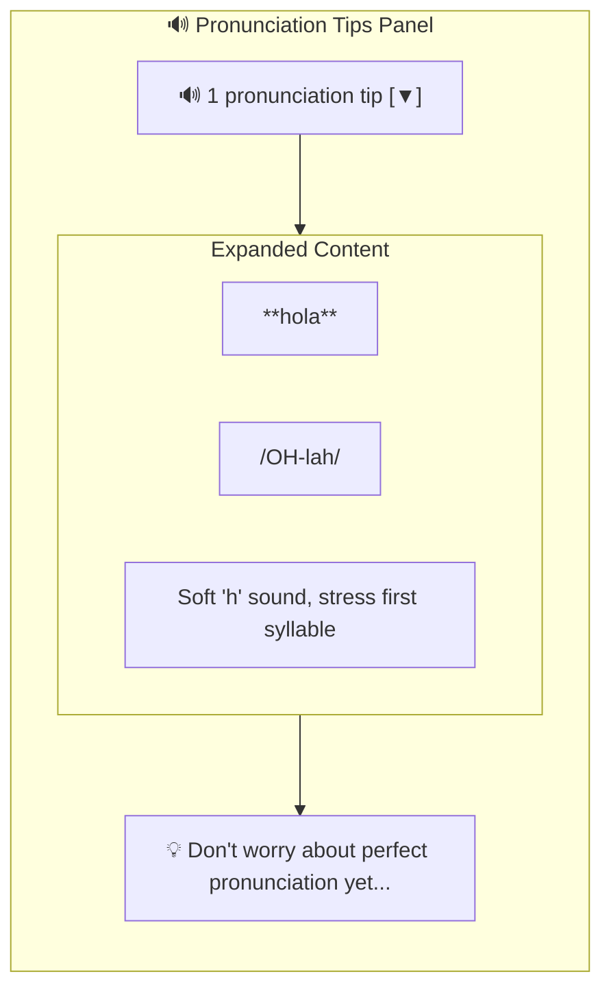
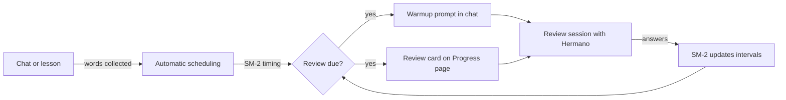

# Habla Hermano Product Specification

> Take someone from zero to conversational in Spanish, German, or French

---

## Vision

Habla Hermano introduces you to **Hermano** - a friendly, laid-back language buddy who takes absolute beginners (A0) to confident intermediate speakers (B1). Unlike apps that drill vocabulary or grammar in isolation, Hermano gets you talking from day one—with intelligent scaffolding that fades as you improve.

**Core Belief**: Conversation confidence comes from conversation practice. Grammar and vocabulary stick better when learned in context, not from flashcards.

---

## The Hermano Personality

Hermano is your supportive big brother in language learning. He's been through the journey himself and genuinely wants to help you succeed.

### Personality Traits

| Trait | How It Shows Up |
|-------|-----------------|
| **Patient** | Never rushes, never judges. If you struggle, he gives the answer and moves on positively. |
| **Encouraging** | Celebrates every attempt: "Nice!", "You got this!", "That's the spirit!" |
| **Casual** | Uses relaxed language like texting a friend, not lecture-y or formal. |
| **Relatable** | Shares moments: "This one tripped me up at first too" |
| **Warm** | Genuine enthusiasm when you succeed, not performative praise. |

### Hermano at Each Level

| Level | Hermano's Approach |
|-------|-------------------|
| **A0** | Supportive big brother for absolute beginners. Heavy encouragement, one concept at a time, celebrates tiny wins. |
| **A1** | Chill friend who spent a year abroad. Relaxed guidance, makes mistakes feel like no big deal. |
| **A2** | Knows you're ready for more. Challenges just enough while keeping things fun and conversational. |
| **B1** | Treats you as a peer who's just polishing skills. Natural conversation partner, gentle asides for corrections. |

### Example Interactions

**A0 Level:**
```
Hermano: "Hey! Let's start with the basics. 'Hola' means 'hello' - pretty easy, right? Give it a shot!"
You: "hola"
Hermano: "Nice! See, you're already speaking Spanish! Now here's a fun one..."
```

**B1 Level:**
```
Hermano: "¿Qué piensas de las noticias últimamente? Hay mucho de qué hablar..."
You: "Creo que es muy complicado..."
Hermano: "Sí, tienes razón. By the way, you could also say 'complejo' for a more nuanced meaning..."
```

---

## What's Built (Current State)

| Feature | Status | Description |
|---------|--------|-------------|
| **Hermano Personality** | ✅ Complete | Friendly big brother tutor with consistent voice |
| **Scaffolded Conversation** | ✅ Complete | Chat with Hermano who adapts to your level |
| **4 Proficiency Levels** | ✅ Complete | A0, A1, A2, B1 with distinct Hermano behavior |
| **3 Languages** | ✅ Complete | Spanish, German, French via LANGUAGE_ADAPTER |
| **Grammar Feedback** | ✅ Complete | Gentle corrections with expandable tips |
| **Pronunciation Tips** | ✅ Complete | Level-appropriate pronunciation guidance in conversations |
| **Spaced Repetition** | ✅ Complete | SM-2 algorithm with intelligent chat weaving and dedicated review mode (authenticated users only) |
| **Word Banks & Hints** | ✅ Complete | Contextual help for A0-A1 learners |
| **Sentence Starters** | ✅ Complete | Partial sentences to get beginners going |
| **5 Themes** | ✅ Complete | Spanish-inspired design with Azulejo, Terracotta, Flamenco, Sangria, and Jardín variants |
| **Mobile-First UI** | ✅ Complete | Safe areas, dynamic viewport, touch-optimized, works on all devices |
| **Micro-Lessons** | ✅ Complete | 60 lessons across 3 languages (es, de, fr) × 4 levels (A0-B1) with vocabulary, exercises, completion tracking |
| **Hamburger Menu** | ✅ Complete | Clean navigation: Lessons, New Chat, Theme, Login/Logout |
| **Guest Access** | ✅ Complete | Chat works without authentication; grammar feedback, pronunciation tips, and scaffolding included |
| **Progress Tracking** | ✅ Complete | Words learned, patterns mastered, conversation stats (authenticated users only) |
| **Learning Paths** | ✅ Complete | Structured progression from A0 to B1 with adaptive daily recommendations |
| **Voice Input/Output** | ✅ Complete | Deepgram STT (Nova-3) + TTS (Aura-2) via WebSocket proxy |
| **Conversational Lessons** | ✅ Complete | Hermano teaches lessons directly in the main chat via `/?lesson={id}`, with phase machine (intro→teaching→exercise→complete) |
| **Encryption at Rest** | ✅ Complete | PII fields and chat history encrypted with Fernet (AES-128-CBC + HMAC), row-level security on all checkpoint tables |

### Guest vs. Authenticated Experience

Guests can try Habla Hermano without creating an account. The chat experience works fully -- conversation persists via LangGraph checkpointing, and Hermano still provides grammar feedback, pronunciation tips, and scaffolding (word banks, sentence starters) in every response. All conversation data is encrypted at rest.

To unlock the full learning loop, guests need to sign up:

| Capability | Guest | Authenticated |
|------------|:-----:|:-------------:|
| Chat with Hermano | Yes | Yes |
| Grammar feedback | Yes | Yes |
| Pronunciation tips | Yes | Yes |
| Scaffolding (word banks, hints) | Yes | Yes |
| Vocabulary tracking | -- | Yes |
| Progress page and stats | -- | Yes |
| Spaced repetition and review | -- | Yes |
| Lesson completion tracking | -- | Yes |
| Conversational lessons | Yes | Yes (+ score persistence) |

---

## Pedagogical Approach

### Style: Communicative Language Teaching (CLT)

Habla Hermano uses a **Communicative Language Teaching** approach—learning by doing, not by studying rules.

| Principle | How We Implement It |
|-----------|---------------------|
| **Conversation-first** | You talk from day one, not after memorizing vocabulary |
| **Meaning over form** | Communication matters more than perfect grammar |
| **Implicit correction** | AI models correct form naturally, doesn't interrupt |
| **Authentic interaction** | Real conversations, not drill exercises |
| **Contextual learning** | Grammar and vocabulary learned in conversation context |

### What Habla Hermano Avoids

- **Grammar-Translation**: No rule memorization → practice sentences
- **Audio-Lingual**: No repetitive drills
- **Gamification**: No XP, streaks, leaderboards, or guilt
- **Flashcards**: Vocabulary in context, not isolation

---

## The "Gentle Nudge" Pattern

Instead of explicit corrections that interrupt flow, Hermano models the correct form naturally:

```
You:  "Yo soy cansado"
Hermano: "Ah, ¿estás cansado? Yo también después del trabajo."
         (Models correct form without saying "you made a mistake")

         💡 Quick tip: For feelings like tired or hungry,
            Spanish uses "estar" not "ser".
```

Hermano responds naturally first, embedding the correction. Expandable feedback provides deeper learning for those who want it.

---

## Pronunciation Tips

Hermano provides pronunciation guidance through two channels:
1. **Natural conversation**: Hermano weaves tips into responses
2. **Collapsible UI**: Structured tips appear below each response, expandable when ready

### Collapsible Pronunciation UI

After each exchange, pronunciation tips appear in a collapsible panel below Hermano's response:



**Level-based behavior**:
- **A0**: Auto-expands with beginner encouragement text
- **A1+**: Collapsed by default, click to expand

### Pronunciation by Level

| Level | Pronunciation Focus | UI Behavior |
|-------|---------------------|-------------|
| **A0** | Basic tricky sounds (rolled 'rr', 'ñ', 'j'), simple stress rules | Auto-expanded with encouragement |
| **A1** | Sounds that don't exist in English, stress patterns, common mistakes | Collapsed by default |
| **A2** | Linking sounds between words, rhythm differences, regional variations | Collapsed by default |
| **B1** | Subtle distinctions that mark fluency, emotional intonation | Collapsed by default |

### Language-Specific Guidance

Each language has its own pronunciation data:

**Spanish**: Rolled 'rr', 'ñ' (like 'ny' in canyon), 'j' (like English 'h'), stress on second-to-last syllable

**German**: 'ch' (clearing throat), umlauts (ä, ö, ü), 'w' sounds like 'v', stress on first syllable

**French**: French 'r' (back of throat), nasal vowels, silent final consonants, stress on last syllable

### Example Interaction

```
You: "How do I say 'thank you'?"
Hermano: "'Gracias' - it's pronounced GRAH-see-ahs.
          That 'c' before 'i' makes an 's' sound,
          and the stress is on the first syllable: GRA-cias.
          In Spain, that final 's' might sound more like 'th'!"

[🔊 1 pronunciation tip]  ← Collapsible panel with structured tip
```

---

## Spaced Repetition

> **Note**: Spaced repetition requires an authenticated account. Guest users can chat freely but do not accumulate vocabulary or review schedules.

Habla Hermano uses **conversation-first spaced repetition**. There are no flashcard decks and no decontextualized drills. Instead, words you have encountered in chat and lessons come back to you naturally — through Hermano himself.

### Philosophy

Traditional spaced repetition isolates words on cards. Habla Hermano keeps them in conversation where they belong. Every review is a chance to *use* the word, not just recognize it. The SM-2 algorithm decides **when** a word needs reinforcement; Hermano decides **how** to bring it back.

### Two Channels for Review

| Channel | What Happens | Learner Experience |
|---------|--------------|--------------------|
| **Chat weaving** | During normal conversation, Hermano naturally works due-for-review words into his responses and prompts. When you use the word correctly, SM-2 updates silently in the background. | Feels like a regular chat — you don't even notice you're reviewing. |
| **Dedicated review mode** | Conversational micro-quizzes where Hermano asks questions in his personality. Three question types keep things varied. | Feels like a quick game with Hermano, not a test. |

#### Chat Weaving Example

```
Hermano: "¿Recuerdas la palabra 'mercado'? I was just thinking about
          street markets. ¿Qué compras en el mercado?"
You:     "Yo compro frutas en el mercado."
Hermano: "Nice! 'Frutas en el mercado' — sounds like you'd fit right
          in at a Mexican tianguis."
          (SM-2 silently updates: mercado → next review in 6 days)
```

#### Dedicated Review Question Types

| Type | What Hermano Asks | Example |
|------|-------------------|---------|
| **Translate** | "How do you say ___ in Spanish?" | "How do you say 'market' in Spanish?" |
| **Fill in the blank** | A sentence with a missing word | "Yo compro frutas en el ___." |
| **Recognize** | "What does ___ mean?" | "What does 'mercado' mean?" |

Hermano gives feedback on every answer in his own voice — encouraging on correct answers, supportive and helpful on mistakes.

### How It Works (Learner Perspective)



1. **Words are collected automatically.** Every word you encounter in chat or lessons enters your personal review schedule.
2. **SM-2 determines timing.** The algorithm calculates when each word should come back based on how well you know it.
3. **Hermano prompts you when words are due.** A warmup message appears at the top of chat, or a review card shows on your Progress page.
4. **You pick your session size.** Quick (5 words), Regular (10 words), or all due words.
5. **Hermano gives feedback on every answer.** Correct? He celebrates. Wrong? He gives you the answer warmly and moves on.

### Session Sizes

| Size | Words | Best For |
|------|-------|----------|
| **Quick** | 5 | Between classes, on the bus, warming up |
| **Regular** | 10 | Daily practice, building a habit |
| **All due** | Everything scheduled | Weekend catch-up, dedicated study time |

### Entry Points

Learners can start a review session from three places:

- **Progress page** — A review card shows the number of words due and lets you pick a session size.
- **Chat warmup prompt** — When words are due, a prompt appears at the top of the chat: "You have 8 words to review. Want to warm up?"
- **Direct URL** — Navigate to the chat page with `?mode=review` to jump straight into a review session.

### What Makes This Different

| Traditional SRS | Habla Hermano SRS |
|-----------------|-------------------|
| Flashcard decks | Conversational review with Hermano |
| Isolated word recall | Words used in sentences and context |
| Binary right/wrong | Hermano-style encouragement and hints |
| Separate app or mode | Woven into the same chat you already use |
| Manual card creation | Automatic scheduling from chat and lessons |

---

## Learning Paths

> **Note**: Learning paths are visible to all users, but progress tracking and adaptive recommendations require an authenticated account.

Habla Hermano provides a structured progression through 20 lessons per language, organized into 4 CEFR level units (A0 → A1 → A2 → B1), each containing 5 category-ordered lessons (greetings → introductions → numbers → colors → family).

### Path Structure

| Level | Title | Lessons | Description |
|-------|-------|---------|-------------|
| **A0** | Absolute Beginner | 5 | Your first words and phrases |
| **A1** | Beginner | 5 | Basic conversations and introductions |
| **A2** | Elementary | 5 | Everyday situations and simple interactions |
| **B1** | Intermediate | 5 | Express opinions and handle most situations |

### Adaptive Recommendations

Each time you visit the learning page, Hermano analyzes three signals to recommend what to do next:

| Signal | What It Checks | Example |
|--------|---------------|---------|
| **Path progress** | Next uncompleted lesson in your path | "Continue with 'Basic Numbers' to keep your streak going." |
| **Vocabulary accuracy** | Categories where your accuracy is below 70% | "Your Greetings could use some practice." |
| **Review schedule** | Words due for spaced repetition | "You have 5 words ready for review." |
| **Level readiness** | Whether all lessons at your current level are complete | "You've completed A0 -- ready for A1!" |

### Lesson Completion Flow

After completing a lesson, the completion screen shows your score and a "Continue Path" button linking to the next lesson in the path. This creates a natural flow through the curriculum without rigid lock-in — you can always browse lessons freely.

---

## Voice Conversation

> **Phase 17**: Speak to Hermano and hear him reply — transforming a text chat into a spoken conversation.

Language learning demands speaking and listening. Text-based pronunciation tips can only go so far — learners need to *hear* correct pronunciation and *practice* producing sounds themselves. Voice conversation adds the missing sensory channel.

### How It Works (Learner Perspective)

1. **Tap the microphone button** next to the chat input
2. **Speak your message** — your words appear as live transcription in the input field
3. **Hermano replies in text** (streamed via SSE as before)
4. **Tap the speaker icon** on Hermano's response to hear it spoken aloud
5. **Repeat** — or type instead whenever you prefer

Voice is always optional. The text chat remains fully functional. Voice adds a layer on top, it doesn't replace anything.

### Voice at Each Level

| Level | STT Behavior | TTS Behavior |
|-------|-------------|--------------|
| **A0** | Multilingual mode — accepts mixed English/target language | Slower, clearer voice with target-language accent |
| **A1** | Multilingual mode — expects more target language | Natural pace, clear articulation |
| **A2** | Target language preferred — English still accepted | Natural conversational pace |
| **B1** | Target language expected | Full natural speed, native-like delivery |

### Voice + Existing Features

| Feature | How Voice Integrates |
|---------|---------------------|
| **Scaffolding** | Word bank still appears visually; TTS reads Hermano's spoken response only |
| **Grammar feedback** | Still text-based — corrections are better read than heard |
| **Pronunciation tips** | Now validated by real practice — "try saying it" becomes actionable |
| **Spaced repetition** | Review sessions can use voice — "How do you say 'market' in Spanish?" spoken aloud |
| **SSE streaming** | TTS triggers after SSE stream completes — Hermano's full response is synthesized as one utterance |

### Example Voice Interaction

```
You: [tap mic] "Hola, como estás?"
     → Live transcription: "Hola, ¿cómo estás?"

Hermano: "¡Muy bien! Me alegra oírte. ¿Qué hiciste hoy?"
         [🔊 Play] ← Tap to hear Hermano say it

You: [tap mic] "Yo... fui al mercado"
     → Live transcription: "Yo fui al mercado"

Hermano: "¡Genial! ¿Qué compraste en el mercado?"
         [🔊 Play]
```

### Guest vs. Authenticated Voice Access

| Capability | Guest | Authenticated |
|------------|:-----:|:-------------:|
| STT (speak to Hermano) | Yes | Yes |
| TTS (hear Hermano reply) | Yes | Yes |
| Voice in review sessions | -- | Yes |

Voice is available to guests — it's a core part of the conversation experience, not a premium feature. This matches the existing pattern where chat, grammar feedback, and scaffolding are all available without an account.

---

## The A0 → B1 Journey

### Language Mix by Level

| Level | Target Language | English | AI Behavior |
|-------|-----------------|---------|-------------|
| **A0** | 20% | 80% | Heavy scaffolding, celebrate every attempt |
| **A1** | 50% | 50% | Simple sentences, model correct forms |
| **A2** | 80% | 20% | Longer exchanges, past tense naturally |
| **B1** | 95%+ | 5% | Natural conversations, gentle asides |

### Scaffolding by Level

| Level | What You Get |
|-------|--------------|
| **A0** | Auto-expanded word bank with translations, hints, sentence starters |
| **A1** | Collapsed scaffold (click to expand), same helpful content |
| **A2** | No scaffold, occasional grammar tips only |
| **B1** | No scaffold, natural conversation flow |

### What Makes Each Level Feel Different

**A0 - First Steps**
- Hermano speaks 80% English, introduces one Spanish word at a time
- Word bank shows: "hola (hello)", "si (yes)", "gracias (thank you)"
- Sentence starter: "Hola, yo..."
- Celebrates tiny wins: "Nice! See, you're already speaking Spanish!"

**A1 - Building Blocks**
- Hermano speaks 50/50, offers translation casually when needed
- Word bank available on demand (collapsed by default)
- Topics: introductions, family, food, daily routine
- Grammar learned by doing, mistakes are no big deal

**A2 - Finding Your Voice**
- Hermano speaks 80% target language
- No scaffold, grammar tips when errors detected
- Topics: travel, shopping, describing experiences
- Hermano challenges you: "Here's one locals actually use..."

**B1 - Confident Conversations**
- Hermano speaks 95%+ target language
- Corrections are gentle asides: "By the way, you could also say..."
- Topics: opinions, news, hypotheticals
- Natural peer-to-peer conversation

---

## Target Users

- **Primary**: Complete beginners who want to actually speak, not just study
- **Secondary**: Lapsed learners who studied before but never got comfortable talking
- **Tertiary**: Anyone preparing for travel/work who needs practical conversation skills

**Sweet spot**: Someone who's intimidated by conversation but motivated to learn

---

## UX Principles

1. **Never Lost**: Beginners always have a lifeline (word bank, hint, translation)
2. **Always Progressing**: Every conversation teaches something, even mistakes
3. **Conversation First**: Everything exists to enable conversation
4. **Gentle Corrections**: Errors are learning moments, not failures
5. **Real Progress**: "I can order food in Spanish" beats "500 XP streak"

---

## Technical Architecture

Built with:
- **Backend**: FastAPI + Python 3.11
- **Frontend**: HTMX + Jinja2 + Tailwind CSS
- **AI Agent**: LangGraph StateGraph with conditional routing
- **LLM**: Claude API via langchain-anthropic

### LangGraph Flow

```
START
  ↓
respond (generate AI response)
  ↓
[needs_scaffold?]
  ├── A0/A1 → scaffold (generate word bank, hints)
  └── A2/B1 → skip
  ↓
analyze (detect grammar errors, extract vocabulary)
  ↓
END
```

See [Architecture Documentation](architecture.md) for details.

---

## Roadmap

### Completed

| Phase | Focus | Status |
|-------|-------|--------|
| **Phase 0** | Project setup, tooling, infrastructure | ✅ Complete |
| **Phase 1** | Basic chat with LangGraph respond node | ✅ Complete |
| **Phase 2** | Grammar feedback with analyze node | ✅ Complete |
| **Phase 3** | Scaffolding with conditional routing | ✅ Complete |
| **Phase 4** | Persistence | PostgreSQL checkpointing, conversation memory | ✅ Complete |
| **Phase 5** | Authentication | Supabase Auth, multi-user support, JWT tokens | ✅ Complete |
| **Phase 6** | Micro-Lessons | Structured lessons with exercises, guest access, chat handoff | ✅ Complete |
| **Phase 7** | Progress Tracking | Words learned, patterns mastered, conversation milestones, dashboard UI | ✅ Complete |
| **Phase 8** | Guest Access | Chat-only guest mode with grammar feedback and scaffolding; no data persistence | ✅ Complete |
| **Phase 9** | AI-Enhanced Lessons | LangGraph subgraphs for personalized lesson delivery | ✅ Complete |
| **Phase 10** | Lesson Content Expansion | 60 lessons across all languages and levels | ✅ Complete |
| **Phase 11** | Design + Pronunciation | Spanish-inspired design system (5 themes), pronunciation tips in chat | ✅ Complete |
| **Phase 12** | Spaced Repetition | SM-2 algorithm, intelligent chat weaving, dedicated review mode | ✅ Complete |
| **Phase 13** | Mobile Responsive | Safe areas, dynamic viewport, touch optimization, responsive layouts | ✅ Complete |
| **Phase 14** | Learning Paths | Structured A0→B1 progression with adaptive daily recommendations | ✅ Complete |
| **Phase 15** | SSE Streaming | Real-time token streaming via Server-Sent Events; POST /chat/stream endpoint, frontend ReadableStream with blinking cursor, feedback sections arrive as server-rendered HTML after response completes; existing POST /chat preserved as fallback | ✅ Complete |
| **Phase 16** | ES Module Refactor | 6 ES modules, 186 Vitest tests, mobile hardening, TTS UX improvements | ✅ Complete |
| **Phase 17** | Voice Conversation | Deepgram STT (Nova-3) + TTS (Aura-2), WebSocket proxy, browser microphone capture | ✅ Complete |
| **Phase 18** | JavaScript Testing | Vitest test suite (189 tests, ~90% coverage) | ✅ Complete |
| **Phase 19** | Conversational Lessons | Hermano teaches lessons through chat UI with phase machine (intro→teaching→exercise→complete), CEFR teaching adjustments, progress bar, checkpoint-aware inputs | ✅ Complete |
| **Phase 23** | Unified Lesson Experience | Lessons open in main chat via `/?lesson={id}`, old lesson player removed, LLM-based translation evaluation | ✅ Complete |
| **Phase 24** | Message Encryption & Privacy | Fernet encryption at rest for PII fields and checkpoint blobs, row-level security on checkpoint tables | ✅ Complete |
| **Phase 25** | Design System Revamp | Jardín theme, Plus Jakarta Sans typography, spacing tokens, Lucide SVG icons, WCAG AA contrast compliance, localStorage persistence for language/level | ✅ Complete |
| **P1 Audit** | Audit Remediation (HIGH) | 7 HIGH severity items — WebSocket auth, CSRF middleware, layer violations, SRP extraction | ✅ Complete |
| **P2 Audit** | Audit Remediation (MEDIUM) | 10 MEDIUM severity items — CSP nonce, rate limiting, caching, JSON logging | ✅ Complete |
| **P3 Audit** | Audit Remediation (LOW) | 7 LOW severity items — Cache-Control headers, voice docs, integration tests, cleanup | ✅ Complete |

### Future Ideas

- Scenario roleplay (ordering food, booking hotel)
- Multiple AI personas
- Offline mode

---

## Success Metrics

### Learning Effectiveness
- Time to first unassisted sentence (target: <5 min)
- Scaffolding usage decreases over time
- Level progression velocity

### Engagement
- Sessions per week
- Average session length
- Return rate after first session

### Satisfaction
- "I feel more confident speaking" (self-report)
- Would recommend to friend

### Phase 7: Progress Tracking Metrics
- Words learned per session (target: 5-10 new words)
- Grammar patterns mastered over time
- Conversation milestone completion rate
- Dashboard engagement (views per user per week)
- Progress data accuracy and consistency

### Phase 8: Guest Access Metrics
- Guest-to-authenticated conversion rate (target: >20%)
- Guest session retention (return within 7 days)
- Signup funnel: guests who attempt vocabulary/progress features and convert

### Phase 12: Spaced Repetition Metrics
- Review session completion rate (target: >70%)
- Words retained after 30 days (target: >80%)
- Chat weaving engagement (target: >50% of offered words used correctly)
- Time to first review prompt (automatic after first chat session)
- Review-to-chat conversion (users who start a regular chat after completing a review)

### Phase 17: Voice Conversation Metrics
- Voice adoption rate (target: >30% of sessions use mic at least once)
- TTS playback rate (target: >50% of Hermano responses played aloud)
- STT transcription accuracy (target: >90% for target language at user's level)
- Time to first spoken interaction (target: within first 3 messages)
- Voice session length vs. text-only session length (expect longer sessions)
- Pronunciation improvement signal (words pronounced correctly on subsequent attempts)

---

## What We're NOT Building

- **Grammar course**: We teach through practice, not lectures
- **Flashcard app**: Vocabulary learned in conversation context
- **Gamified experience**: No streaks, XP, leaderboards, or guilt
- **Translation tool**: Goal is to think in the language, not translate
- **Perfect pronunciation trainer**: Voice input helps practice, but we're not building clinical phoneme-level analysis

---

## Documentation

- [Architecture](architecture.md) — Technical design and LangGraph implementation
- [API Reference](api.md) — Endpoints and data structures
- [Testing](testing.md) — Test coverage and strategy
- [E2E Tests](playwright-e2e.md) — Playwright test documentation
- [Design Documents](design/) — Phase-by-phase implementation details
- [Phase 6 Design](design/phase6-micro-lessons.md) — Micro-lessons design document
- [Phase 12 Design](design/phase12-spaced-repetition.md) — Spaced repetition design document
- [Phase 13 Design](design/phase13-mobile-responsive.md) — Mobile responsive design document
- [Phase 17 Design](design/phase17-voice-conversation.md) — Voice STT/TTS with Deepgram
