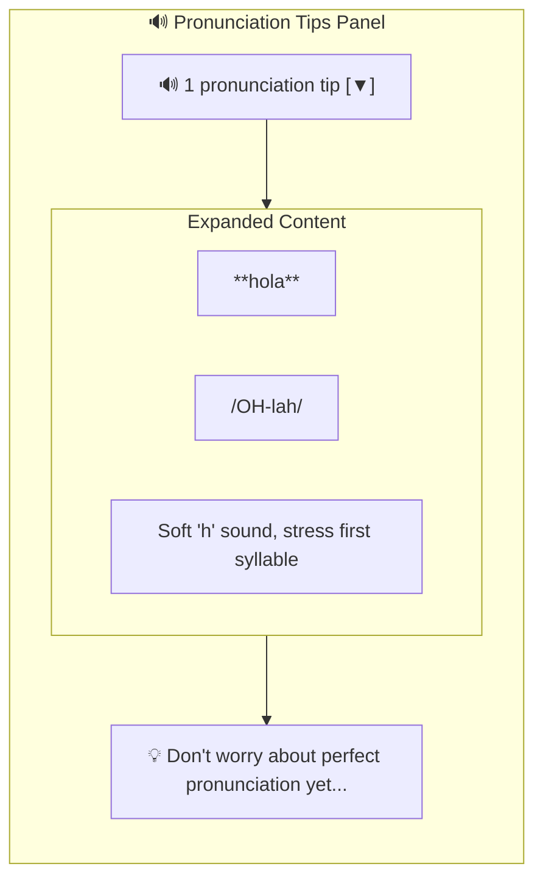

# Habla Hermano Product Specification

> Take someone from zero to conversational in Spanish, German, or French

---

## Vision

Habla Hermano introduces you to **Hermano** - a friendly, laid-back language buddy who takes absolute beginners (A0) to confident intermediate speakers (B1). Unlike apps that drill vocabulary or grammar in isolation, Hermano gets you talking from day one—with intelligent scaffolding that fades as you improve.

**Core Belief**: Conversation confidence comes from conversation practice. Grammar and vocabulary stick better when learned in context, not from flashcards.

---

## The Hermano Personality

Hermano is your supportive big brother in language learning. He's been through the journey himself and genuinely wants to help you succeed.

### Personality Traits

| Trait | How It Shows Up |
|-------|-----------------|
| **Patient** | Never rushes, never judges. If you struggle, he gives the answer and moves on positively. |
| **Encouraging** | Celebrates every attempt: "Nice!", "You got this!", "That's the spirit!" |
| **Casual** | Uses relaxed language like texting a friend, not lecture-y or formal. |
| **Relatable** | Shares moments: "This one tripped me up at first too" |
| **Warm** | Genuine enthusiasm when you succeed, not performative praise. |

### Hermano at Each Level

| Level | Hermano's Approach |
|-------|-------------------|
| **A0** | Supportive big brother for absolute beginners. Heavy encouragement, one concept at a time, celebrates tiny wins. |
| **A1** | Chill friend who spent a year abroad. Relaxed guidance, makes mistakes feel like no big deal. |
| **A2** | Knows you're ready for more. Challenges just enough while keeping things fun and conversational. |
| **B1** | Treats you as a peer who's just polishing skills. Natural conversation partner, gentle asides for corrections. |

### Example Interactions

**A0 Level:**
```
Hermano: "Hey! Let's start with the basics. 'Hola' means 'hello' - pretty easy, right? Give it a shot!"
You: "hola"
Hermano: "Nice! See, you're already speaking Spanish! Now here's a fun one..."
```

**B1 Level:**
```
Hermano: "¿Qué piensas de las noticias últimamente? Hay mucho de qué hablar..."
You: "Creo que es muy complicado..."
Hermano: "Sí, tienes razón. By the way, you could also say 'complejo' for a more nuanced meaning..."
```

---

## What's Built (Current State)

| Feature | Status | Description |
|---------|--------|-------------|
| **Hermano Personality** | ✅ Complete | Friendly big brother tutor with consistent voice |
| **Scaffolded Conversation** | ✅ Complete | Chat with Hermano who adapts to your level |
| **4 Proficiency Levels** | ✅ Complete | A0, A1, A2, B1 with distinct Hermano behavior |
| **3 Languages** | ✅ Complete | Spanish, German, French via LANGUAGE_ADAPTER |
| **Grammar Feedback** | ✅ Complete | Gentle corrections with expandable tips |
| **Pronunciation Tips** | ✅ Complete | Level-appropriate pronunciation guidance in conversations |
| **Word Banks & Hints** | ✅ Complete | Contextual help for A0-A1 learners |
| **Sentence Starters** | ✅ Complete | Partial sentences to get beginners going |
| **3 Themes** | ✅ Complete | Nordic Minimal design with Light, Dark, Ocean variants |
| **Mobile-First UI** | ✅ Complete | Works on all devices |
| **Micro-Lessons** | ✅ Complete | 5 Spanish A0 lessons with vocabulary, exercises, completion tracking |
| **Hamburger Menu** | ✅ Complete | Clean navigation: Lessons, New Chat, Theme, Login/Logout |
| **Guest Access** | ✅ Complete | Lessons and chat work without authentication |
| **Progress Tracking** | ✅ Complete | Words learned, patterns mastered, conversation stats |
| **Guest Sessions** | ✅ Complete | Full functionality for unauthenticated users with session persistence |

---

## Pedagogical Approach

### Style: Communicative Language Teaching (CLT)

Habla Hermano uses a **Communicative Language Teaching** approach—learning by doing, not by studying rules.

| Principle | How We Implement It |
|-----------|---------------------|
| **Conversation-first** | You talk from day one, not after memorizing vocabulary |
| **Meaning over form** | Communication matters more than perfect grammar |
| **Implicit correction** | AI models correct form naturally, doesn't interrupt |
| **Authentic interaction** | Real conversations, not drill exercises |
| **Contextual learning** | Grammar and vocabulary learned in conversation context |

### What Habla Hermano Avoids

- **Grammar-Translation**: No rule memorization → practice sentences
- **Audio-Lingual**: No repetitive drills
- **Gamification**: No XP, streaks, leaderboards, or guilt
- **Flashcards**: Vocabulary in context, not isolation

---

## The "Gentle Nudge" Pattern

Instead of explicit corrections that interrupt flow, Hermano models the correct form naturally:

```
You:  "Yo soy cansado"
Hermano: "Ah, ¿estás cansado? Yo también después del trabajo."
         (Models correct form without saying "you made a mistake")

         💡 Quick tip: For feelings like tired or hungry,
            Spanish uses "estar" not "ser".
```

Hermano responds naturally first, embedding the correction. Expandable feedback provides deeper learning for those who want it.

---

## Pronunciation Tips

Hermano provides pronunciation guidance through two channels:
1. **Natural conversation**: Hermano weaves tips into responses
2. **Collapsible UI**: Structured tips appear below each response, expandable when ready

### Collapsible Pronunciation UI

After each exchange, pronunciation tips appear in a collapsible panel below Hermano's response:



**Level-based behavior**:
- **A0**: Auto-expands with beginner encouragement text
- **A1+**: Collapsed by default, click to expand

### Pronunciation by Level

| Level | Pronunciation Focus | UI Behavior |
|-------|---------------------|-------------|
| **A0** | Basic tricky sounds (rolled 'rr', 'ñ', 'j'), simple stress rules | Auto-expanded with encouragement |
| **A1** | Sounds that don't exist in English, stress patterns, common mistakes | Collapsed by default |
| **A2** | Linking sounds between words, rhythm differences, regional variations | Collapsed by default |
| **B1** | Subtle distinctions that mark fluency, emotional intonation | Collapsed by default |

### Language-Specific Guidance

Each language has its own pronunciation data:

**Spanish**: Rolled 'rr', 'ñ' (like 'ny' in canyon), 'j' (like English 'h'), stress on second-to-last syllable

**German**: 'ch' (clearing throat), umlauts (ä, ö, ü), 'w' sounds like 'v', stress on first syllable

**French**: French 'r' (back of throat), nasal vowels, silent final consonants, stress on last syllable

### Example Interaction

```
You: "How do I say 'thank you'?"
Hermano: "'Gracias' - it's pronounced GRAH-see-ahs.
          That 'c' before 'i' makes an 's' sound,
          and the stress is on the first syllable: GRA-cias.
          In Spain, that final 's' might sound more like 'th'!"

[🔊 1 pronunciation tip]  ← Collapsible panel with structured tip
```

---

## The A0 → B1 Journey

### Language Mix by Level

| Level | Target Language | English | AI Behavior |
|-------|-----------------|---------|-------------|
| **A0** | 20% | 80% | Heavy scaffolding, celebrate every attempt |
| **A1** | 50% | 50% | Simple sentences, model correct forms |
| **A2** | 80% | 20% | Longer exchanges, past tense naturally |
| **B1** | 95%+ | 5% | Natural conversations, gentle asides |

### Scaffolding by Level

| Level | What You Get |
|-------|--------------|
| **A0** | Auto-expanded word bank with translations, hints, sentence starters |
| **A1** | Collapsed scaffold (click to expand), same helpful content |
| **A2** | No scaffold, occasional grammar tips only |
| **B1** | No scaffold, natural conversation flow |

### What Makes Each Level Feel Different

**A0 - First Steps**
- Hermano speaks 80% English, introduces one Spanish word at a time
- Word bank shows: "hola (hello)", "si (yes)", "gracias (thank you)"
- Sentence starter: "Hola, yo..."
- Celebrates tiny wins: "Nice! See, you're already speaking Spanish!"

**A1 - Building Blocks**
- Hermano speaks 50/50, offers translation casually when needed
- Word bank available on demand (collapsed by default)
- Topics: introductions, family, food, daily routine
- Grammar learned by doing, mistakes are no big deal

**A2 - Finding Your Voice**
- Hermano speaks 80% target language
- No scaffold, grammar tips when errors detected
- Topics: travel, shopping, describing experiences
- Hermano challenges you: "Here's one locals actually use..."

**B1 - Confident Conversations**
- Hermano speaks 95%+ target language
- Corrections are gentle asides: "By the way, you could also say..."
- Topics: opinions, news, hypotheticals
- Natural peer-to-peer conversation

---

## Target Users

- **Primary**: Complete beginners who want to actually speak, not just study
- **Secondary**: Lapsed learners who studied before but never got comfortable talking
- **Tertiary**: Anyone preparing for travel/work who needs practical conversation skills

**Sweet spot**: Someone who's intimidated by conversation but motivated to learn

---

## UX Principles

1. **Never Lost**: Beginners always have a lifeline (word bank, hint, translation)
2. **Always Progressing**: Every conversation teaches something, even mistakes
3. **Conversation First**: Everything exists to enable conversation
4. **Gentle Corrections**: Errors are learning moments, not failures
5. **Real Progress**: "I can order food in Spanish" beats "500 XP streak"

---

## Technical Architecture

Built with:
- **Backend**: FastAPI + Python 3.11
- **Frontend**: HTMX + Jinja2 + Tailwind CSS
- **AI Agent**: LangGraph StateGraph with conditional routing
- **LLM**: Claude API via langchain-anthropic

### LangGraph Flow

```
START
  ↓
respond (generate AI response)
  ↓
[needs_scaffold?]
  ├── A0/A1 → scaffold (generate word bank, hints)
  └── A2/B1 → skip
  ↓
analyze (detect grammar errors, extract vocabulary)
  ↓
END
```

See [Architecture Documentation](architecture.md) for details.

---

## Roadmap

### Completed

| Phase | Focus | Status |
|-------|-------|--------|
| **Phase 0** | Project setup, tooling, infrastructure | ✅ Complete |
| **Phase 1** | Basic chat with LangGraph respond node | ✅ Complete |
| **Phase 2** | Grammar feedback with analyze node | ✅ Complete |
| **Phase 3** | Scaffolding with conditional routing | ✅ Complete |
| **Phase 4** | Persistence | PostgreSQL checkpointing, conversation memory | ✅ Complete |
| **Phase 5** | Authentication | Supabase Auth, multi-user support, JWT tokens | ✅ Complete |
| **Phase 6** | Micro-Lessons | Structured lessons with exercises, guest access, chat handoff | ✅ Complete |
| **Phase 7** | Progress Tracking | Words learned, patterns mastered, conversation milestones, dashboard UI | ✅ Complete |
| **Phase 8** | Guest Session Support | Full guest functionality, session persistence, seamless auth upgrade | ✅ Complete |
| **Phase 9** | AI-Enhanced Lessons | LangGraph subgraphs for personalized lesson delivery | ✅ Complete |
| **Phase 10** | Lesson Content Expansion | 60 lessons across all languages and levels | ✅ Complete |
| **Phase 11** | Nordic Design + Pronunciation | Clean minimal design system, pronunciation tips in chat | ✅ Complete |

### Future Ideas

- Voice input/output
- Spaced repetition for vocabulary
- Scenario roleplay (ordering food, booking hotel)
- Multiple AI personas
- Offline mode

---

## Success Metrics

### Learning Effectiveness
- Time to first unassisted sentence (target: <5 min)
- Scaffolding usage decreases over time
- Level progression velocity

### Engagement
- Sessions per week
- Average session length
- Return rate after first session

### Satisfaction
- "I feel more confident speaking" (self-report)
- Would recommend to friend

### Phase 7: Progress Tracking Metrics
- Words learned per session (target: 5-10 new words)
- Grammar patterns mastered over time
- Conversation milestone completion rate
- Dashboard engagement (views per user per week)
- Progress data accuracy and consistency

### Phase 8: Guest Session Metrics
- Guest-to-authenticated conversion rate (target: >20%)
- Guest session retention (return within 7 days)
- Session data preservation rate during auth upgrade (target: 100%)
- Guest feature usage parity with authenticated users

---

## What We're NOT Building

- **Grammar course**: We teach through practice, not lectures
- **Flashcard app**: Vocabulary learned in conversation context
- **Gamified experience**: No streaks, XP, leaderboards, or guilt
- **Translation tool**: Goal is to think in the language, not translate
- **Perfect pronunciation trainer**: Text-based for now

---

## Documentation

- [Architecture](architecture.md) — Technical design and LangGraph implementation
- [API Reference](api.md) — Endpoints and data structures
- [Testing](testing.md) — Test coverage and strategy
- [E2E Tests](playwright-e2e.md) — Playwright test documentation
- [Design Documents](design/) — Phase-by-phase implementation details
- [Phase 6 Design](design/phase6-micro-lessons.md) — Micro-lessons design document
